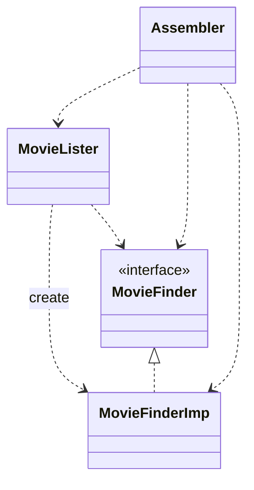

# inversion of Control IoC

## 概念

*控制反转”（Inversion of Control，IoC）*

*依赖注入”（Dependency Injection）*

*轻量级容器* *帮助开发者将来自不同项目的组件组装成为一个内聚的应用程序*

vs *服务定位器”（Service Locator）模式*

如何区分“服务”（service）和“组件”（component）

所谓“组件”是指这样一个软件单元：它将被作者无法控制的其他应用程序使用，但后者不能对组件进行修改。也就是说，使用一个组件的应用程序不能修改组件的源代码，但可以通过作者预留的某种途径对其进行扩展，以改变组件的行为。

服务和组件有某种相似之处：它们都将被外部的应用程序使用。在我看来，两者之间最大的差异在于：组件是在本地使用的（例如JAR文件、程序集、DLL、或者源码导入）；而服务是要通过——同步或异步的——远程接口来远程使用的（例如web service、消息系统、RPC，或者socket）。

例子

构造子注入（Constructor Injection）

设值方法注入（Setter Injection）

接口注入（Interface Injection）

ref:

[[转载][翻译] IoC 容器和 Dependency Injection 模式 - 东北风！ - 博客园](https://www.cnblogs.com/dongbeifeng/p/inversion-of-control-containers-and-the-dependency-injection-pattern.html)

[# 控制反转 —— 软件复用的解决方案。](https://www.cnblogs.com/dongbeifeng/p/inversion-of-control-containers-and-the-dependency-injection-pattern.html)

