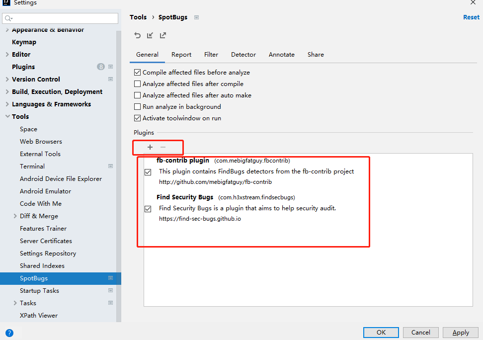
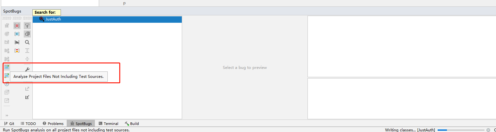

## idea + short key

打开文件 ctrl+shift +N

选中单词下一个 ctrl+F3

## idea + spring

Spring Boot 中文乱码问题解决方案汇总
https://developer.aliyun.com/article/627073

## idea 插件
Mac：IntelliJ IDEA -> Preferences -> Plugins;
Windows：File -> Settings -> Plugins.

详述 IntelliJ IDEA 插件的安装及使用方法
https://blog.csdn.net/qq_35246620/article/details/78289074

IntelliJ IDEA 常用插件一览，让效率成为习惯
https://juejin.im/entry/6844903769025560590

值得推荐的Idea十几大优秀插件
https://blog.csdn.net/win7system/article/details/83508313

## find-sec-bugs

https://find-sec-bugs.github.io/ 官方已经说明 `The SpotBugs plugin for security audits of Java web applications.`

安装：

1. File/settings/plugins 市场搜索 SpotBugs
如果安全不上，可以多安装几次

2. files/settings/tools/spotbugs, 点击 +

参考： [安装 find-sec-bugs](https://github.com/find-sec-bugs/find-sec-bugs/wiki/IntelliJ-Tutorial)

扫描：

[java代码审计手书(一）](https://xz.aliyun.com/t/3358)
[java代码审计手书(二）](https://xz.aliyun.com/t/3372)
[java代码审计手书(三）](https://xz.aliyun.com/t/3416)
[java代码审计手书(四）](https://xz.aliyun.com/t/3460)
findBug 错误修改指南
https://www.cnblogs.com/java-zone/articles/3118592.html

## alibaba

https://github.com/alibaba/p3c

File/settings/plugins 市场搜索 alibaba

https://plugins.jetbrains.com/plugin/10046-alibaba-java-coding-guidelines

使用： tools 阿里编程规范 扫描