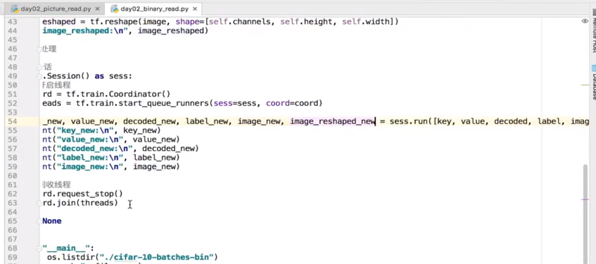
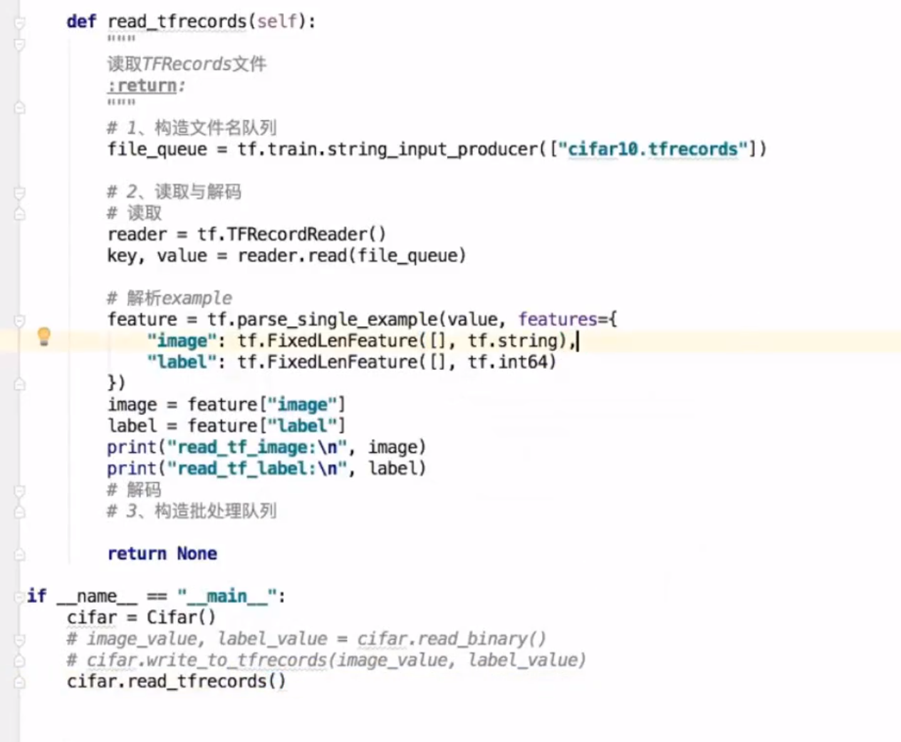
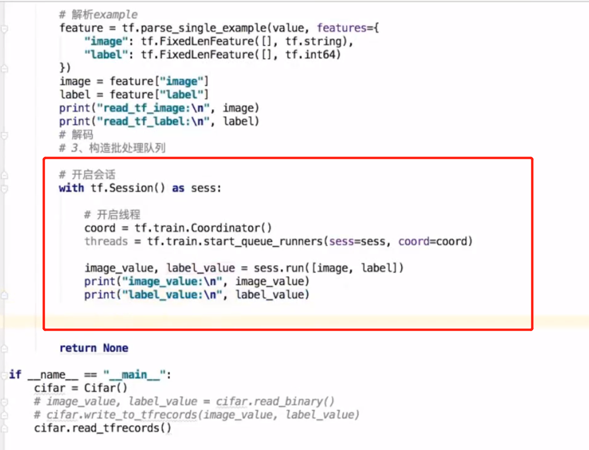

# ali大学.人工智能

## 人工智能学习路线
<https://edu.aliyun.com/roadmap/ai?spm=5176.11399608.aliyun-edu-index-banner.3.711746798HBI9Y&rel=banner>

### 保存与加载
saver = tf.train.Saver(var_list=None, max_to_keep=5)

ckpt = checkpoint
if i % 20 == 0:
    saver.save(session, "xxxx.ckpt")

if os.path.exists("xxxx.ckpt"):
    saver.restore(session, "xxxx.ckpt")
checkpoint = tf

tf.app.flags.DEFIND_integer("max_step", 0, "训练模型步数")
tf.app.flags.DEFIND_string("model_dir", 0, "训练模型保存目录")
FLAGs = tf.app.flags.FLAGS

QueueRunner
文件名队列
tf.train.string_input_producer(string_tensor, shuffle=True)

读取与解码
tf.TextLineReader()
tf.decode_csv()

tf.wholeFileReader()
tf.image.decode_jpeg(contents)
tf.image.decode_png(contents)

tf.FixedLengthRecordReader()
tf.decode_raw()

TFRecord
tf.TFRecordReader()

key, value = 读取器.read(file_queue)

批处理
tf.train.Batch(tensor, batch_size, num_threads = 1,..)
会话线程
tf.train.QueueRunner()
tf.train.start_queue_runners(sess=None, coord=None)

读取图片1

二进制

CIFIR10

转置

TFRecord

CIFAR-10数据集说明

https://www.cnblogs.com/Jerry-Dong/p/8109938.html

斯坦福大学的 CS231n（全称：面向视觉识别的卷积神经网络）
https://blog.csdn.net/weixin_42247762/article/details/80467503
http://cs231n.stanford.edu/

TensorFlow官方教程：https://www.tensorflow.org/tutorials/

斯坦福大学TensorFlow教程及示例代码：https://web.stanford.edu/class/cs20si/2017/

适合初学者的TensorFlow示例代码：https://github.com/aymericdamien/TensorFlow-Examples

PAI
