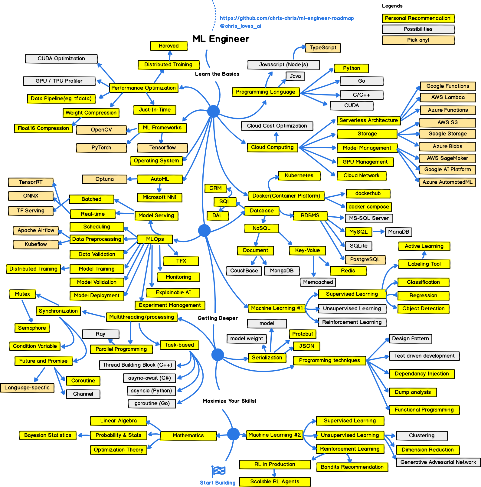

# readme

## [roadmap](https://github.com/chris-chris/ml-engineer-roadmap)



### ML 平台
#### TensorFlow
现在学这个 
### AutoML
Microsoft NNI

### 语言

语言差一个 CUDA编程, 尽可能理解下

[CUDA编程入门极简教程]https://zhuanlan.zhihu.com/p/34587739)

https://docs.nvidia.com/cuda/

linux 查看是否支持CUDA
```bash
sudo apt install pciutils
sudo apt install kmod
```

[Win10如何查看Nvidia支持的CUDA版本，显卡算力](https://blog.csdn.net/u013925378/article/details/103028921)
> Nvidia控制面板/帮助/系统信息/组件/3D设置/Nvcuda.dll

[wsl支持CUDA计算](https://developer.nvidia.com/cuda/wsl)

好像是6/17的一个内部版本
<https://blogs.windows.com/windowsexperience/2020/06/17/announcing-windows-10-insider-preview-build-20150/>

### Performance Optimization

#### 推荐 [horovod](https://github.com/horovod/horovod)

Distributed training framework for TensorFlow, Keras, PyTorch, and Apache MXNet.

## 其它引用

[web-roadmap](https://github.com/kamranahmedse/developer-roadmap)
