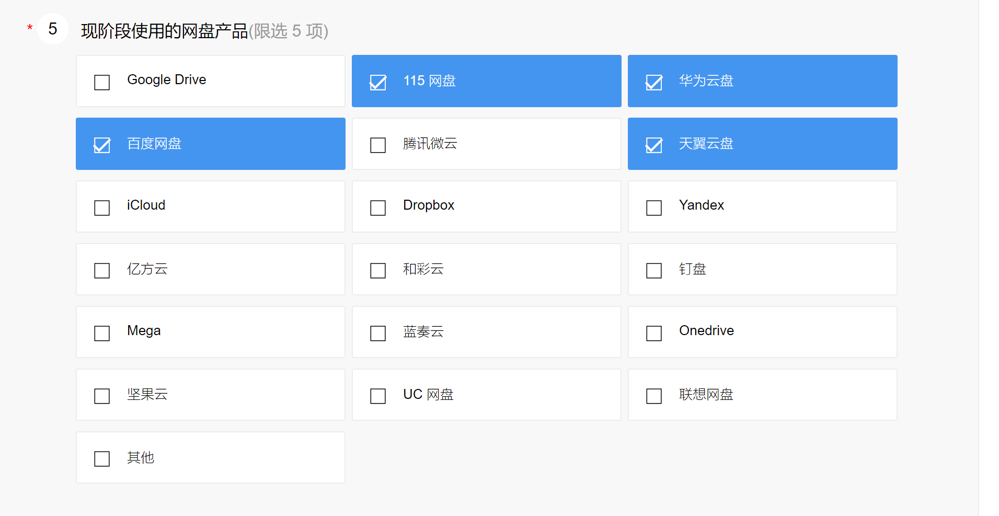

# 202009

## 20200930
All About NGINX Configuration, HTTPS/SSL, HTTP2, Caching
https://dev.to/hasone/all-about-nginx-configuration-https-ssl-http2-caching-1c0i

A SQL database implemented purely in TypeScript type annotations.
https://github.com/codemix/ts-sql

Wireflow - user flow chart real-time collaborative tool
https://github.com/vanila-io/wireflow

Learn the Basics of Redux by Writing Your Own Version in 30 Lines
https://dev.to/nas5w/learn-the-basics-of-redux-by-writing-your-own-version-in-30-lines-1if3

https://dev.to/acupoftee/nintendo-switch-box-shadow-gradient-practice-c4j

https://dev.to/evrtrabajo/solid-in-php-d8e

## 20200929
AI框架安全依旧堪忧：360 AI安全研究院披露Tensorflow 24个漏洞
https://www.anquanke.com/post/id/218839

Vue进阶面试必问，异步更新机制和nextTick原理
https://mp.weixin.qq.com/s/49SX3NkGiEuuRxHtf6ODzg

（送书）仅用18行JavaScript构建一个倒数计时器
https://mp.weixin.qq.com/s/Gw0Lmdm-FPXNk8GepHXqDQ

如何产出规范、安全、高质量的代码？
https://insights.thoughtworks.cn/security-high-quality-code/?hmsr=toutiao.io&utm_medium=toutiao.io&utm_source=toutiao.io

分布式事务解决方案常见误区与实用建议
https://mp.weixin.qq.com/s/ZjulO37KpoYn_vnJTJiUkg

记一次线上性能调优：火焰图是利器
https://mp.weixin.qq.com/s/smdpg0WPY_RIS2pH3Mh5-g

如何建立测试自动化策略？
https://www.qaseven.cn/posts/%E5%A6%82%E4%BD%95%E5%BB%BA%E7%AB%8B%E6%B5%8B%E8%AF%95%E8%87%AA%E5%8A%A8%E5%8C%96%E7%AD%96%E7%95%A5.html

两天，我把分布式事务搞完了
https://mp.weixin.qq.com/s/mpF3EqVnC7suoC8fYEihyg

一次压缩引发堆外内存过高的教训
https://club.perfma.com/article/1835499?hmsr=toutiao.io&utm_medium=toutiao.io&utm_source=toutiao.io

分布式事务精华总结篇，实打实的干货!
https://mp.weixin.qq.com/s/2itYxxeA8v4Tl09t8UGhnQ

还在担心服务挂掉？Sentinel Go 让服务稳如磐石
https://mp.weixin.qq.com/s/cdxnOCjD9VmaErmDvfekJg

荔枝微课基础架构的演进与实践
https://zhuanlan.zhihu.com/p/250271369?hmsr=toutiao.io&utm_medium=toutiao.io&utm_source=toutiao.io

干货 | 近万服务实例稳定运行0故障，携程微服务框架实践及思考
https://mp.weixin.qq.com/s/DKXnmdY7kpJKexwIqQag6A

## 20200928

The defined? keyword in Ruby
https://medium.com/rubycademy/the-defined-keyword-in-ruby-b7a5a5a48e1e

Modern Rails flash messages (part 2): The undo action for deleted items
https://dev.to/citronak/modern-rails-flash-messages-part-2-the-undo-action-for-deleted-items-2a50

Triage with Me - 11 issues & 2 PRs in 1.5 hours
https://schneems.com/2020/09/22/triage-with-me-11-issues-2-prs-in-15-hours/

[挖洞经验 | 绕过谷歌XSS修复措施收获翻倍赏金($10000)](https://www.freebuf.com/articles/web/249357.html)

name: ‘blabla’
CDATA，意为character data，是标记语言SGML与XML，表示文档的特定部分是普通的字符数据，而不是非字符数据或有特定、限定结构的字符数据。 
用‘]]>’字符配合svg格式，添加任意XML内容成为SVG XSS Payload，实现绕过CDATA
]]><svg version="1.1" baseProfile="full" xmlns="http://www.w3.org/2000/svg"> <polygon id="triangle" points="0,0 0,50 50,0" fill="#009900" stroke="#004400"></svg>
应该所有cdata都可以绕过

2019的？
[SQLite 内存错误引用漏洞（CVE-2019-5018）](http://www.nsfocus.net/vulndb/49183)
SQLite 3.26.0版本中的Window Functions功能存在内存错误引用漏洞。攻击者利用可该漏洞发送恶意SQL命令导致远程代码执行。
[SQLite 信息泄露漏洞（CVE-2019-9936）](http://www.nsfocus.net/vulndb/49191)
SQLite 3.27.2版本存在信息泄露漏洞。该漏洞源于事务内运行fts5前缀查询可能会导致sqlite3.c中fts5HashEntrySort中的堆栈缓冲区被过度读取。攻击者可利用该漏洞导致信息泄漏。
https://sqlite.org/
[SQLite 堆栈越界读取漏洞（CVE-2019-8457）](http://www.nsfocus.net/vulndb/49196)
SQLite 3.6.0至3.27.2版本存在堆栈越界读取漏洞。攻击者可利用该漏洞读取敏感信息。
https://www.sqlite.org/releaselog/3_28_0.html

## 20200927
微软轻量级系统监控工具sysmon原理与实现完全分析（续篇）
https://www.anquanke.com/post/id/218405

hackerone或PayPal转账到国内银行卡
https://blog.csdn.net/weixin_30629653/article/details/98855805

挖洞经验 | 劫持Firebase云消息传递服务实现恶意广播式用户消息推送
https://www.freebuf.com/articles/web/249248.html

xp leak

magnet:?xt=urn:btih:3D8B16242B56A3AAFB8DA7B5FC83EF993EBCF35B&dn=Microsoft leaked source code archive_2020-09-24

## 20200925

[Jenkins Script Security 插件 安全漏洞](http://www.cnnvd.org.cn/web/xxk/ldxqById.tag?CNNVD=CNNVD-202009-1359)

[Hacking All The Cars - Tesla 远程API分析与利用（上）](https://www.anquanke.com/post/id/218396)

[SMBGhost && SMBleed 漏洞深入研究](https://www.anquanke.com/post/id/218449)

[利用 macOS Dock 实现运行代码的执行](https://www.anquanke.com/post/id/218404)

[使用fuzzilli对Javascript引擎QuickJS进行Fuzzing和漏洞分析](https://www.anquanke.com/post/id/218427)

## 20200924

[从0开始聊聊自动化静态代码审计工具](https://www.anquanke.com/post/id/218235)

## 20200923

CrawlPhish：网络钓鱼中客户端伪装技术的大规模分析
https://www.anquanke.com/post/id/217528

红蓝对抗中的近源渗透
https://www.freebuf.com/articles/web/250224.html

重新思考风险分析与管理（二）
https://www.freebuf.com/articles/neopoints/249774.html
【安全通报】Spring Framework反射型文件下载漏洞（CVE-2020-5421）

https://nosec.org/home/detail/4577.html
官方已发布修复了漏洞的新版本，建议相关用户尽快升级进行防护。
下载链接：https://github.com/spring-projects/spring-framework/releases
检测到服务器存在漏洞风险，建议立即对相关主机进行快照备份，避免遭受损失。了解快照备份
https://s.tencent.com/research/bsafe/1131.html
VMware Tanzu发布安全公告，在Spring Framework版本5.2.0-5.2.8、5.1.0-5.1.17、5.0.0-5.0.18、4.3.0-4.3.28和较旧的不受支持的版本中，公布了一个存在于Spring Framework中的反射型文件下载（Reflected File Download,RFD）漏洞CVE-2020-5421。 CVE-2020-5421 可通过jsessionid路径参数，绕过防御RFD攻击的保护。先前针对RFD的防护是为应对 CVE-2015-5211 添加的。 攻击者通过向用户发送带有批处理脚本扩展名的URL，使用户下载并执行文件，从而危害用户系统。VMware Tanzu官方已发布修复漏洞的新版本。 Spring Framework是 Java 平台的一个开源全栈应用程序框架和控制反转容器实现，一般被直接称为 Spring。

http://www.cnnvd.org.cn/web/xxk/ldxqById.tag?CNNVD=CNNVD-202009-1272
Atlassian Jira 存在安全漏洞。该漏洞源于Jira Server and Data Center 允许远程攻击者通过JQL版本搜索中的基于正则表达式的拒绝服务（DoS）漏洞影响应用程序的可用性。以下是受影响的产品及版本：7.13.16版本之前，7.14.0版本至8.5.7版本， 8.6.0版本至8.10.2版本，8.11.0版本至8.11.1版本。

http://www.cnnvd.org.cn/web/xxk/ldxqById.tag?CNNVD=CNNVD-202009-1273
Atlassian Jira 存在安全漏洞。该漏洞源于Jira Server and Data Center允许远程、未经身份验证的攻击者通过/secure/QueryComponent!Default中的一个信息泄露漏洞查看定制字段名和定制SLA名。以下是受影响的产品及版本：8.5.8版本之前，8.6.0版本至8.11.1版本。

http://www.cnnvd.org.cn/web/xxk/ldxqById.tag?CNNVD=CNNVD-202009-1274
Atlassian Jira 4.12.0版本之前存在安全漏洞。该漏洞源于Jira Server and Data Center允许作为非管理员用户的远程攻击者查看项目请求类型和描述，通过editform请求类型字段资源中的一个信息泄露漏洞。

## 20200922

ATT&CK战术入门与案例解析​
https://www.anquanke.com/post/id/218143

## 20200921

[redox-os rust 操作系统](https://www.redox-os.org/zh/)

<https://github.com/redox-os/installer>

https://dev.to/atapas/10-useful-html5-features-you-may-not-be-using-2bk0

https://dev.to/willjohnsonio/how-i-switched-careers-into-tech-with-no-degree-in-my-mid-30-s-1n67

https://dev.to/valentinogagliardi/a-practical-complete-tutorial-on-http-cookies-1ofd
cookie security

## 20200919

Tensorflow2.0 🍎🍊 is delicious, just eat it! 😋😋
https://github.com/lyhue1991/eat_tensorflow2_in_30_days
https://github.com/lyhue1991/eat_pytorch_in_20_days

A little tool to play with Windows security
https://github.com/gentilkiwi/mimikatz
A Collection of application ideas which can be used to improve your coding skills.
https://github.com/florinpop17/app-ideas

[吐槽系列（二）：安全行业近五年之怪现状](https://www.anquanke.com/post/id/217856)
> 有坏现状，如何解决他们就是一个机遇

[Harbian-Audit：一款针对Debian GNULinux和CentOS的安全审计&强化工具](https://www.freebuf.com/sectool/245929.html)

国内CDN

https://www.bootcdn.cn/
http://www.staticfile.org/

[dom4j远程代码执行漏洞(CVE-2018-1000632)](http://www.nsfocus.net/vulndb/48907)
> 2018？ 更新
> POC: https://ihacktoprotect.com/post/dom4j-xml-injection/

## 20200918

https://github.com/MiniProfiler/rack-mini-profiler

remote code execution
https://blog.presidentbeef.com/blog/2020/09/14/another-reason-to-avoid-constantize-in-rails/

concers
https://blog.appsignal.com/2020/09/16/rails-concers-to-concern-or-not-to-concern.html

The Life-Changing Magic of Tidying Ruby Object Allocations
https://blog.heroku.com/tidying-ruby-object-allocations

将漏洞利用转换metasploit模块
https://www.anquanke.com/post/id/217638
qq doc url 泄露,百度一下果然有很多
https://docs.qq.com/sheet/xxx?tab=xx
https://docs.qq.com/sheet/DQWtoTXZKVWlJYkJO
const qqSheetUrl = 'https://docs.qq.com/sheet/BqI21X2yZIht1487cQ1mHxFy1TyDtE4E6MIS0zk6GT2sYPhU2IQmKC2Cjyb92FLz9g0PQHVH22S2IO11cq4u0';
各省求职者慎重公司参考名单(工作日更新)--豆瓣专版
https://docs.qq.com/sheet/DV0xPaXNDeGFnemxw?tab=bb08j4

全民阅读建设书香校园联系人信息采集表|有个人信息和电话
https://docs.qq.com/sheet/DQ29hWnViVnhjTEJP?tab=BB08J2
王者碰碰车主播名单收集  
https://docs.qq.com/sheet/DUERkVUxwbkRIZllk
附件3：管理学院本科课程教师教学形式统计表
https://docs.qq.com/sheet/DZkFMZEFxY3pJVmZ6?tab=bb08j2

各单位人事系统信息审核负责人基本信息表
https://docs.qq.com/sheet/DVWZJRE1Wd2xpQWVw?tab=BB08J2

（更新证书申领通知）2019年深圳市住院医师规范化培训第二阶段考核汇总表
https://docs.qq.com/sheet/DR25MSUlYcFB0dXZo?tab=BB08J2
[全国集中收寄营业网点表-.xlsx](http://www.cafa.edu.cn/library/dynamic.images/info/202071117223779.xlsx)
https://docs.qq.com/sheet/DZHp2RE1xWUdQamNI?tab=BB08J2
全国各城市新型肺炎疫情详情整理-新一线城市研究所×8点健闻
https://docs.qq.com/sheet/DR0p2U1pVaHRSaUtJ?tab=ifq4yt
各单位人事系统信息审核负责人基本信息表
https://docs.qq.com/sheet/DVWZJRE1Wd2xpQWVw?tab=BB08J2
 求职意向 
https://docs.qq.com/doc/DY1VGTnpWZHpBUlJT

信息科学与工程学院
http://siee.hitwh.edu.cn/note/496
腾讯文档】自动化类
https://docs.qq.com/sheet/DWGFnSll3dEx0eUFS
【腾讯文档】2019级电子信息类分专业录取结果（公示）
https://docs.qq.com/sheet/DWGF4eXhaTmNmV3FQ

bb08j2 是第一页，那应该是个多进制转换

澳大利亚前总理Tony Abbott个人隐私数据泄露
https://www.freebuf.com/news/250119.html
手把手教Security-Onion-Solutions安全洋葱安装方法
https://www.freebuf.com/articles/ics-articles/248260.html
BloodHound使用指南
https://www.freebuf.com/sectool/246589.html
《互联网医疗APP个人信息保护》线上沙龙精彩回顾
https://www.freebuf.com/fevents/250059.html
ETHBMC：智能合约的有界模型检查器
https://www.anquanke.com/post/id/217312

Windows TCPIP Finger Command - C2 Channel and Bypassing Security Software
https://www.exploit-db.com/exploits/48815
Qihoo 360 Speed Browser DLL劫持漏洞 (CVE-2020-24158)
http://www.nsfocus.net/vulndb/48892

xxl-job 跨站脚本执行漏洞 (CVE-2020-23814)
http://www.nsfocus.net/vulndb/48890

xxl-job 信息泄露漏洞 (CVE-2020-23811)
http://www.nsfocus.net/vulndb/48888

OpenSSL 信息泄露漏洞（CVE-2019-1551）
http://www.nsfocus.net/vulndb/48853

Linux kernel 拒绝服务漏洞（CVE-2020-12652）
http://www.nsfocus.net/vulndb/48847

【安全通报】Microsoft Exchange远程代码执行漏洞（CVE-2020-16875）
https://nosec.org/home/detail/4571.html

技术分享 | 自定义PoC对接插件，漏扫更强大
https://nosec.org/home/detail/4574.html

http://nginx.org/en/security_advisories.html
漏洞存在于ngx_http_v2_module模块之中(默认情况下不编译，编译时需要开启--with-http_v2_module，同时将listen http2添加到配置文件中)，当用户添加http2支持时，攻击者可以发送特制的HTTP/2请求，可能导致过多的CPU使用率(CVE-2019-9511,CVE-2019-9513)和内存消耗(CVE-2019-9516)，最终导致服务器DoS。

## 20200917

## 20200916

Kali-Linux-Tools-Interface：针对Kali Linux的图形化Web接口
https://www.freebuf.com/articles/system/245465.html

【FreeBuf字幕组】Hacker101白帽进阶之路：JavaScript for Hackers
https://www.freebuf.com/video/249999.html

Google Kubernetes API server拒绝服务漏洞（CVE-2020-8552）
http://www.nsfocus.net/vulndb/48834

Eclipse Jetty HTTP请求走私漏洞（CVE-2017-7658）
http://www.nsfocus.net/vulndb/48825

Eclipse Jetty HTTP请求走私漏洞（CVE-2017-7656）
http://www.nsfocus.net/vulndb/48824

## 20200915
甲方视角浅析MITRE ATT&CK
https://www.freebuf.com/articles/es/249278.html
内网渗透测试：Windows权限提升思路（上） 金币
https://www.freebuf.com/articles/network/247980.html

## 20200914

ruby table
http://tableprintgem.com/
https://github.com/tj/terminal-table
https://github.com/piotrmurach/tty-table

[Apache ActiveMQ 代码执行漏洞](http://www.cnnvd.org.cn/web/xxk/ldxqById.tag?CNNVD=CNNVD-202009-680)

[Apache ActiveMQ effect 安全漏洞](http://www.cnnvd.org.cn/web/xxk/ldxqById.tag?CNNVD=CNNVD-202009-681)
https://fonts.gstatic.com/s/opensans/v17/mem8YaGs126MiZpBA-UFVZ0b.woff2
读书馆类
https://news.ycombinator.com/item?id=24454221
https://openlibrary.org/
https://github.com/internetarchive/openlibrary
https://thebestbookon.com/
https://github.com/Open-Book-Genome-Project/TheBestBookOn.com

## 20200913
Jackson反序列化漏洞：2.9.10.6版本以前
https://www.freebuf.com/articles/web/248087.html

## 20200911

[开源VR](https://www.relativty.com/)
[1刀的控制器](https://jaycarlson.net/microcontrollers/)

https://dev.to/buildyourdevcareer/7-practices-of-excellent-developers-and-all-around-awesome-humans-e1n

https://dev.to/dailydotdev/my-5-practical-css-tips-1ilj
https://yanhaijing.com/css/2017/09/29/principle-of-rem-layout/

The simplest way to group temporal data
https://github.com/ankane/groupdate

一部手机失窃而揭露的窃取个人信息实现资金盗取的黑色产业链
https://www.freebuf.com/articles/network/249294.html
> 解锁SIM PIN的PUK码，很容易就能查到（运营商APP里就有），你确定设置SIM PIN有用？

[OpenSSL 安全漏洞](http://www.cnnvd.org.cn/web/xxk/ldxqById.tag?CNNVD=CNNVD-202009-585)

## 20200910
🎨 Diagram as Code for prototyping cloud system architectures
https://github.com/mingrammer/diagrams
https://diagrams.mingrammer.com/docs/getting-started/examples

Windows 入侵痕迹清理技巧  
https://my.oschina.net/bypass/blog/4554008

[ZeroMQ 安全漏洞](http://www.cnnvd.org.cn/web/xxk/ldxqById.tag?CNNVD=CNNVD-202009-311)

[通过欺骗性的React元素实现XSS](https://www.freebuf.com/vuls/247982.html)

https://gist.github.com/eliotsykes/ace0222174804372b51a
rails new rails_vuls --webpack=react
Could not find gem 'sqlite3' in any of the gem sources listed in your Gemfile.
sudo apt-get install sqlite3 libsqlite3-dev
gem install sqlite3

vscode
[redhat.vscode-rsp-ui]: View container 'serverView' does not exist and all views registered to it will be added to 'Explorer'.
rails
/home/azhao/.rbenv/versions/2.6.6/lib/ruby/gems/2.6.0/gems/railties-5.2.4.4/lib/rails/app_loader.rb:53: warning: Insecure world writable dir /home/azhao/.rbenv/versions/2.6.6 in PATH, mode 040777

gem install magic_frozen_string_literal 
magic_frozen_string_literal .

## 20200908

windows10安装ubuntu双系统教程（绝对史上最详细）
https://zhuanlan.zhihu.com/p/71588449
Ubuntu18.04(Gnome)环境，十分钟配置Mac OS主题
https://www.cnblogs.com/masbay/p/10745170.html

使用Vulhub快速搭建攻防环境靶场+tcpdump实行流量监测
https://www.freebuf.com/sectool/247698.html
手工搭建的Linux恶意脚本分析系统
https://www.freebuf.com/articles/system/247416.html
逃逸安全的模板沙箱（一）：FreeMarker（上）
https://www.freebuf.com/articles/web/247736.html
Docker-For-Pentest：一个带有大量预配置工具的渗透测试Docker镜像
https://www.freebuf.com/articles/system/245466.html
手把手教你自定义实现一个npm audit
https://www.freebuf.com/sectool/247889.html

[FFmpeg 堆缓冲区溢出漏洞（CVE-2020-12284）](http://www.nsfocus.net/vulndb/48513)
> 某个声明长度与实际长度不一致
> FFmpeg 4.2.2版本中的libavcodec/cbs_jpeg.c文件的cbs_jpeg_split_fragment存在堆缓冲区溢出漏洞。该漏洞源于程序未进行正确的长度检查。攻击者可利用该漏洞获取敏感信息。
> 小于4.2.2没有问题
> ffmpeg version 3.4.6-0ubuntu0.18.04.1 Copyright (c) 2000-2019 the FFmpeg developers
> https://ffmpeg.org/download.html#get-sources
> https://gitee.com/azhao-1981/ffmpeg
> https://www.cvedetails.com/vulnerability-list/vendor_id-3611/Ffmpeg.html
> git clone https://git.ffmpeg.org/ffmpeg.git ffmpeg

github 拒绝服务漏洞 (CVE-2020-7711)
http://www.nsfocus.net/vulndb/48530

## 20200905

MaskProcessor：一款功能强大的高性能字典生成器
https://www.freebuf.com/articles/database/245053.html

WebKit JIT漏洞分析及利用Part1
https://www.anquanke.com/post/id/216352
Netty拒绝服务漏洞（CVE-2020-11612）
http://www.nsfocus.net/vulndb/48468

Struts2-059 远程代码执行漏洞（CVE-2019-0230）分析
https://nosec.org/home/detail/4556.html
## 20200904

## 20200903

ruby
https://shopify.github.io/ruby-style-guide/

https://engineering.shopify.com/blogs/engineering/how-shopify-reduced-storefront-response-times-rewrite

https://rubyyagi.com/how-to-use-bootstrap-and-jquery-in-rails-6-with-webpacker/

Ruby gem to verify a pre-defined HTTP headers configurations.|OWASP
https://github.com/AvnerCohen/http-headers-verifier

https://hasura.io/blog/turn-your-ruby-on-rails-rest-api-to-graphql-using-hasura-actions/

https://www.codewithjason.com/understanding-ruby-blocks/

https://cn.aliyun.com/product/news/detail?msctype=email&mscareaid=cn&mscsiteid=cn&mscmsgid=3310120090300874064&id=18414&source_type=out_edm_feature_20200903
https://help.aliyun.com/product/175790.html?spm=5176.12418109.pc-particulars-shares4.1.3ba729b3xnQdOn

万字总结Vue(包含全家桶),希望这一篇可以帮到您
https://mp.weixin.qq.com/s/jcAWvAI1n5QdhJIW_WPhcg

Chrome DevTools 全攻略！助力高效开发
https://mp.weixin.qq.com/s/tGh3hsFC2qe4FUO3PH-3uw

Node.js入门系列（三）开发调试、全局内置函数和变量
https://juejin.im/post/6868083707383644168?from=groupmessage

从SDLC到DevOps下的广义应用安全管控体系
https://www.freebuf.com/articles/system/248418.html

httponly扩大成果之Websocket源码映射
https://www.freebuf.com/articles/web/247217.html

基于开源项目构建SIEM
https://www.freebuf.com/articles/es/247532.html

七夕-带你玩转 Linux Shellcode
https://www.anquanke.com/post/id/216207

## 20200902

CVE-2019-0230： S2-059 远程代码执行漏洞分析
https://www.anquanke.com/post/id/216266

CVE-2019-0233： S2-060 拒绝服务漏洞分析
https://www.anquanke.com/post/id/216270

从Webshell的视角谈攻防对抗
https://www.freebuf.com/articles/network/247359.html

## 20200901

Wireshark解密HTTPS流量
https://www.freebuf.com/articles/database/247667.html

信息收集和漏洞扫描的阶段性总结
https://www.freebuf.com/articles/web/247463.html

从代码角度看各类子域名收集工具
https://www.freebuf.com/articles/web/246555.html
关于Web点击劫持的一些实例
https://www.freebuf.com/articles/web/247215.html

Capsulecorp-Pentest：一个针对内网渗透测试的Vagrant虚拟机环境
https://www.freebuf.com/articles/system/245212.html

联盟链智能合约安全浅析
https://www.anquanke.com/post/id/215754
红队安全研发系列之字节序研究
https://www.anquanke.com/post/id/215823
物联网安全之MQTT渗透实战
https://www.anquanke.com/post/id/216074
Burp插件开发探索——Python版本
https://www.anquanke.com/post/id/215351

