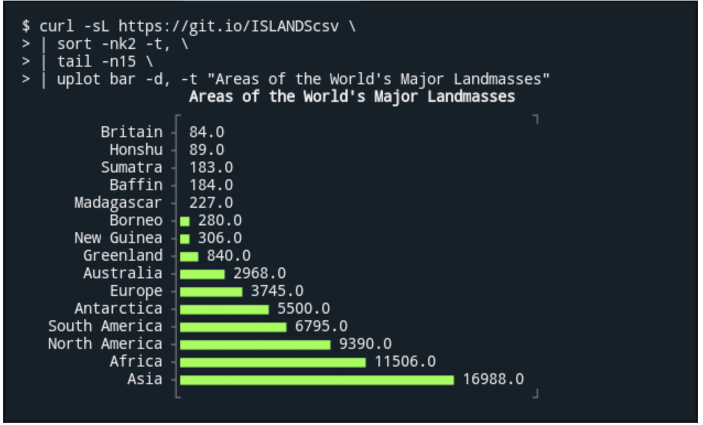

# 202107

## 20210727

[rust tool](https://gitee.com/azhao-1981/rustybox)

[c转rust](https://github.com/immunant/c2rust)

https://c2rust.com/

[如何利用API对AI发动攻击？](https://www.anquanke.com/post/id/247895)

[Java方法完整调用链生成工具](https://www.freebuf.com/sectool/279742.html)

[sqlmap源码解读（3）](https://www.anquanke.com/post/id/247452)

## 20210726

Win10中Vmmem程序资源占用过高解决办法
https://zhuanlan.zhihu.com/p/277825426

知识图谱
据Google称，知识图谱的信息来自许多来源，包括CIA的世界概况，Freebase和维基百科[1]。其功能与Ask.com和Wolfram Alpha等问题问答系统相似。

https://zh.wikipedia.org/wiki/世界概况

https://zh.wikipedia.org/wiki/Freebase

https://github.com/googlearchive/graphd

前员工揭内幕：10 年了，为何谷歌还搞不定知识图谱？
https://www.infoq.cn/article/cdyjlgpbef-mqmie9cf7

VPN 原理以及实现
https://paper.seebug.org/1648/

知识图谱及其在安全领域的应用
https://paper.seebug.org/1649/

## 20210723

应急漏洞：【安全通告】Jira Data Center等多个产品远程代码执行漏洞风险通告(CVE-2020-36239) (TCSA-2021-0109) 立即查看

https://console.cloud.tencent.com/sa/screen/info.html?skipWarning=true&id=TCSA-2021-0109

[sqlmap源码解读（1）](https://www.anquanke.com/post/id/247450)

[ISO27701个人隐私信息安全管理体系 认证经验](https://www.freebuf.com/articles/neopoints/280596.html)

[App安全合规的思考（六）SDK合规](https://www.freebuf.com/articles/compliance/280167.html)

## 20210722

[利用 Python3 来实现 Metasploit 自动化](https://zhuanlan.zhihu.com/p/78328450)

[前沿视角盘点：谷歌安全研究室都在研究什么？](https://www.freebuf.com/articles/network/280723.html)

1、实验性开源依赖性分析工具：[Open Source Insights](https://deps.dev/)

只有依赖包的

2、开源安全计分卡工具： [Scorecard v2](https://github.com/ossf/scorecard)
https://security.googleblog.com/2021/07/measuring-security-risks-in-open-source.html

## 20210721

## 20210720

[老生常谈的无字母数字 Webshell 总结](https://www.freebuf.com/articles/network/279563.html)


[区块链协议安全系列——当拜占庭将军犯错时，区块链共识还安全么？（上集）](https://paper.seebug.org/1643/)


[简易 Linux Rootkit 编写入门指北（一）：模块隐藏与进程提权](https://www.anquanke.com/post/id/246749)

## 20210719

[更适应DevOps的被动式漏洞检测产品技术研究及架构设计](https://www.freebuf.com/articles/es/280227.html)

## 20210716

https://github.com/apache/airflow
Apache Airflow - A platform to programmatically author, schedule, and monitor workflows

Record CS knowlegement with XMind, version 2.0. 使用 XMind 记录 Linux 操作系统，网络，C++，Golang 以及数据库的一些设计
https://github.com/SmartKeyerror/Psyduck
Record CS knowledge with XMind
https://github.com/SmartKeyerror/ZeroMind

这可能是史上功能最全的Java权限认证框架！目前已集成——登录认证、权限认证、分布式Session会话、微服务网关鉴权、单点登录、OAuth2.0、踢人下线、Redis集成、前后台分离、记住我模式、模拟他人账号、临时身份切换、账号封禁、多账号认证体系、注解式鉴权、路由拦截式鉴权、花式token生成、自动续签、同端互斥登录、会话治理、密码加密、jwt集成、Spring集成、WebFlux集成...
https://github.com/dromara/Sa-Token

⚡机器学习实战（Python3）：kNN、决策树、贝叶斯、逻辑回归、SVM、线性回归、树回归
https://github.com/Jack-Cherish/Machine-Learning

Active Record Encryption
https://hint.io/blog/Active-Record-Encryption

Gems, Plugins, Engines, and Mountable Engines: 4 ways to make a Gem.
https://existentialmutt.com/2021/07/01/4-ways-to-make-a-gem/

https://chartkick.com/

## 20210715

[廖雪峰 Spring开发](https://www.liaoxuefeng.com/wiki/1252599548343744/1266263217140032)

合规之风已起| 解读《网络产品安全漏洞管理规定》
https://www.freebuf.com/articles/neopoints/280670.html
网络运营者
要求：
建立健全网络产品安全漏洞信息接收渠道并保持畅通
留存网络产品安全漏洞信息接收日志不少于6个月

发现或者获知其网络、信息系统及其设备存在安全漏洞后，立即采取措施，及时对安全漏洞进行验证并完成修补。

## 20210714
sonarQube+ci
https://cloud.tencent.com/developer/article/1649610
https://www.cnblogs.com/zoujiaojiao/p/14480359.html
https://cloud.tencent.com/developer/article/1523270

## 20210713

DevOps流程中使用SonarQube推动代码质量优化
https://chinalhr.github.io/post/devops-sonar-practice/

基于Linux Namespaces 特性 实现的消音
https://www.anquanke.com/post/id/246601

https://github.com/dev-sec/ansible-collection-hardening
https://github.com/dev-sec/ansible-collection-hardening/tree/master/roles/os_hardening
https://github.com/dev-sec/ansible-collection-hardening/tree/master/roles/mysql_hardening
https://github.com/dev-sec/ansible-collection-hardening/tree/master/roles/nginx_hardening
https://github.com/dev-sec/ansible-collection-hardening/tree/master/roles/ssh_hardening
https://github.com/dev-sec/ansible-ssh-hardening

## 20210712

[中间件安全之WebLogic渗透](https://www.freebuf.com/vuls/278228.html)

## 20210709

[YApi管理平台任意代码执行漏洞](http://www.hackdig.com/07/hack-404183.htm)

<https://www.pwnwiki.org/index.php?title=YApi_未授權用戶創建%26Mock遠程命令執行漏洞>

[高级Mock可以获取到系统操作权限 #2099](https://github.com/YMFE/yapi/issues/2099)
  1.9.2 引入
  修复建议：关闭注册、关闭高级mock

[CVE-2021-31810: Trusting FTP PASV responses vulnerability in Net::FTP](https://www.ruby-lang.org/en/news/2021/07/07/trusting-pasv-responses-in-net-ftp/)

[CVE-2021-32066: A StartTLS stripping vulnerability in Net::IMAP](https://www.ruby-lang.org/en/news/2021/07/07/starttls-stripping-in-net-imap/)

Scour - AWS Exploitation Framework
https://www.kitploit.com/2021/07/scour-aws-exploitation-framework.html
TODO：
有哪些切入点？
阿里呢？是否也有这样的工具，或也有这样的漏洞

2019年黑客常用的漏洞扫描工具
https://zhuanlan.zhihu.com/p/76261350
openAVS

Java 供应链（依赖）安全检测实践
https://www.anquanke.com/post/id/246079

梨子带你刷burpsuite官方网络安全学院靶场(练兵场)系列之服务器端漏洞篇 - Sql注入专题
https://www.anquanke.com/post/id/245532

从 RFC 规范看如何绕过 waf 上传表单
https://paper.seebug.org/1631/

emp3r0r – Linux Post Exploitation Framework
https://reconshell.com/emp3r0r-linux-post-exploitation-framework/

## 20210708

机器学习Web安全原理探究之：为何隐马尔可夫模型可用于参数异常检测
https://www.anquanke.com/post/id/245954

从安全工程师转型安全研发3年来的小结
https://www.freebuf.com/articles/neopoints/279135.html

Rocket.Chat 3.12.1 - NoSQL Injection to RCE (Unauthenticated) (2)
https://www.exploit-db.com/exploits/50108
怎么注入NoSQL

## 20210707

SSH登录日志分析脚本（Python)
https://blog.csdn.net/Nocky/article/details/45200111

[Android工具] 阿里云盘上传任务（容量续命）助手     [复制链接]
https://www.52pojie.cn/thread-1469067-1-1.html

拥抱零信任你就站在安全行业的风口，理解和落地零信任你就走在成功的道路上
https://www.freebuf.com/articles/network/279695.html

精读--GMTC 2021 演讲《字节跳动的现代 Web 开发实践》
https://mp.weixin.qq.com/s/m3ISibvCEvAi5jJWaG8VtQ

## 20210706
150+ Website Templates
https://github.com/Captaindeve/website-templates
https://learning-zone.github.io/website-templates/

Thousands of Unauthenticated Databases Exposed on the Internet
https://redhuntlabs.com/blog/thousands-of-unauthenticated-databases-exposed-on-the-internet.html/amp?__twitter_impression=true

Bug bounty methodology V4.0 — Demonstrated
https://thexssrat.medium.com/bug-bounty-methodology-v4-0-demonstrated-8e9cb6ed1b12

Vinix is an effort to write a modern, fast, and useful operating system in the V programming language
https://github.com/vlang/vinix

https://paper.seebug.org/1628/
ATT&CK 初探 2 -- 资源开发利用阶段

linglong：一款 IP 资产巡航扫描系统
https://paper.seebug.org/1627/

越权检测系统从零开发之-Chrome插件开发
https://www.anquanke.com/post/id/245292

Active Directory 证书服务攻击与防御（一）
https://www.anquanke.com/post/id/245791

SSO中的身份账户不一致漏洞
https://www.anquanke.com/post/id/243938

## 20210705

python-magic installation challenges for 64-bit Windows 10 running 32-bit Python 2.7 build
https://stackoverflow.com/questions/41516138/python-magic-installation-challenges-for-64-bit-windows-10-running-32-bit-python

```bash
# 失败，拒绝访问
pip install python-libmagic
pip install python-magic-bin
```

React 的许可协议到底发生了什么问题？
https://zhuanlan.zhihu.com/p/28618630

https://github.com/RaRe-Technologies/smart_open

各个基础漏洞的top25易存在漏洞的参数
https://github.com/lutfumertceylan/top25-parameter
For basic researches, top 25 vulnerability parameters that can be used in automation tools or manual recon. 🛡️⚔️🧙

XSStrike 是用 Python3 编写的，快速检测跨站脚本漏洞的工具
https://blog.intigriti.com/2021/06/29/hacker-tools-xsstrike-hunting-for-low-hanging-fruits/

sqlmap4burp++是一款兼容Windows，mac，linux多个系统平台的Burp与sqlmap联动插件
https://github.com/c0ny1/sqlmap4burp-plus-plus/

数据安全探索者之路
https://www.freebuf.com/articles/database/279379.html

数据库安全之MongoDB渗透
https://www.freebuf.com/vuls/277847.html

你真的会用Nmap吗？一文读懂Nmap的正确使用方法
https://www.freebuf.com/sectool/277822.html

Krane：一款功能强大的Kubernetes RBAC静态分析与可视化工具
https://www.freebuf.com/articles/container/277697.html

## 20210703

RiskScanner 是开源的多云安全合规扫描平台，通过 Cloud Custodian 的 YAML DSL 定义扫描规则，实现对主流公(私)有云资源的安全合规扫描及使用优化建议。
https://github.com/riskscanner/riskscanner

https://github.com/cloud-custodian/cloud-custodian
https://gitee.com/mirrors/cloud-custodian
https://cloudcustodian.io/
对于云的安全性、合规性和成本管理解决方案而言，受欢迎的选择之一是 Cloud Custodian，一个由 Capital One 赞助的开源项目。
https://aws.amazon.com/cn/blogs/china/announcing-cloud-custodian-integration-aws-security-hub/
https://github.com/topics/cloud-custodian
用于云安全、成本优化和治理的规则引擎，yaml中的DSL用于查询、过滤和对资源采取操作的策略
https://www.5axxw.com/wiki/content/ed8hqv

A comprehensive list of books on Software Architecture.
https://github.com/mhadidg/software-architecture-books
:octocat:GitHub最全的前端资源汇总仓库（包括前端学习、开发资源、数据结构与算法、开发工具、求职面试等）
www.kwgg2020.com
https://github.com/FrontEndGitHub/FrontEndGitHub

Java 虚拟机底层原理知识总结
https://github.com/doocs/jvm

Next-generation ORM for Node.js & TypeScript | PostgreSQL, MySQL, MariaDB, SQL Server & SQLite
www.prisma.io
https://github.com/prisma/prisma

Clone a voice in 5 seconds to generate arbitrary speech in real-time
https://github.com/CorentinJ/Real-Time-Voice-Cloning
https://gitee.com/azhao-1981/Real-Time-Voice-Cloning
git clone https://gitee.com/azhao-1981/Real-Time-Voice-Cloning.git
https://www.anaconda.com/
https://pytorch.org/get-started/locally/

https://github.com/Byron/gitoxide
An idiomatic, lean, fast & safe pure Rust implementation of Git

## 20210702

开发团队必备的 9 款 DevSecOps 工具
https://www.infoq.cn/article/g4macu1dho9g6siy6rcf
安全开发你必须使用的28个DevSecOps工具
https://www.q578.com/s-5-202981-0/
DevSecOps Best Practices
https://www.clouddefense.ai/blog/devsecops-best-practices
DevSecOps - Embedded Security With Omni-Speed DevOps
http://devops21ce.blogspot.com/2021/05/devsecops-embedded-security-with-omni-speed-DevOps.html

A command line tool that draw plots in the terminal.
https://github.com/red-data-tools/YouPlot



Set Up A Docker Container To Test Your Rails App
https://www.honeybadger.io/blog/testing-rails-with-docker/

[Containerd 的前世今生和保姆级入门教程](https://cloud.tencent.com/developer/article/1766288)

https://github.com/containerd/containerd

Kubernetes 
shim
Docker 
[Containerd](https://containerd.io/) 
CRI 

sudo apt-get update
sudo apt-get install libseccomp2

华为：

4.3	设置合理的目录权限，防止未授权访问，比如.git/.svn等目录	建议
"安装镜像后，使用漏扫工具扫描。
建议工具：securecat，可根据建议的权限检查和设置"

[secureCat扫描jetty](https://blog.csdn.net/MoYanHanHuiLengMa/article/details/103484568)

但这个好像没有 secureCat?

[SecureCAT扫描结果及分析报告](https://support.huawei.com/enterprise/zh/doc/EDOC1000099507/44c9cddb)

华为欧拉服务器操作系统软件 V2.0 安全说明手册 03

EulerOS SecureCAT Report.xlsm

[盘点：14款顶级开源情报工具合集](https://www.freebuf.com/sectool/279085.html)

[等保2.0测评之Nginx 中间件](https://www.freebuf.com/articles/system/277306.html)

sec g nginx
生成一个表
各种配置和含义，如
版本：最新安全版本

default 站点

check
nginx -v

不适用选项
a）应对登录的用户进行身份标识和鉴别，身份标识具有唯一性，身份鉴别信息具有复杂度要求并定期更换
b）应具有登录失败处理功能，应配置并启用结束会话、限制非法登录次数和当登录连接超时自动退出等相关措施
c）当进行远程管理时，应采取必要措施防止鉴别信息在网络传输过程中被窃听
d）应采用口令、密码技术、生物技术等两种或两种以上组合的鉴别技术对用户进行身份鉴别，且其中一种鉴别技术至少应使用密码技术来实现

https://zhuanlan.zhihu.com/p/271898581
等保2.0涉及的Apache Tomcat中间件（上）
