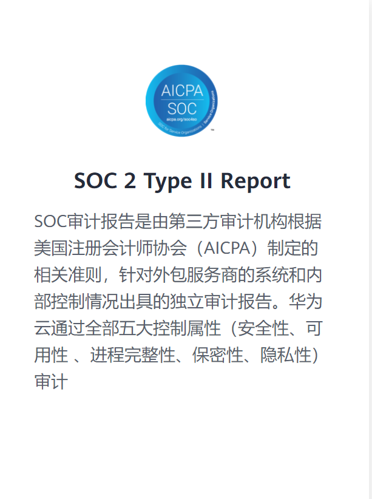

# 202108
## 20210823

https://www.baeldung.com/spring-request-param

人脸识别技术在民航机场应用现状分析
https://www.freebuf.com/articles/compliance/284758.html

Struts2-002 XSS漏洞浅析
https://www.anquanke.com/post/id/247828

Fastjson远程命令执行漏洞总结
https://www.freebuf.com/articles/web/283585.html


内网渗透基石篇——权限维持分析（上）
https://www.freebuf.com/articles/web/283870.html

内网渗透基石篇--权限维持分析（下）
https://www.freebuf.com/articles/web/284497.html

浅谈利用session绕过getshell
https://www.freebuf.com/articles/web/283729.html

## 20210820

小而全而美的第三方登录开源组件。目前已支持Github、Gitee、微博、钉钉、百度、Coding、腾讯云开发者平台、OSChina、支付宝、QQ、微信、淘宝、Google、Facebook、抖音、领英、小米、微软、今日头条、Teambition、StackOverflow、Pinterest、人人、华为、企业微信、酷家乐、Gitlab、美团、饿了么、推特、飞书、京东、阿里云、喜马拉雅、Amazon、Slack和 Line 等第三方平台的授权登录。 Login, so easy!
https://gitee.com/yadong.zhang/JustAuth
这可能是我想要的超级登录器 MIT

## 20210819
🔥🔥🔥 前端面试，独有前端面试题详解，前端面试刷题必备，1000+前端面试真题，Html、Css、JavaScript、Vue、React、Node、TypeScript、Webpack、算法、网络与安全、浏览器
https://github.com/lgwebdream/FE-Interview

😱 从源码层面，剖析挖掘互联网行业主流技术的底层实现原理，为广大开发者 “提升技术深度” 提供便利。目前开放 Spring 全家桶，Mybatis、Netty、Dubbo 框架，及 Redis、Tomcat 中间件等
https://github.com/doocs/source-code-hunter
Spring源码阅读
https://github.com/seaswalker/spring-analysis

GoKart is a static analysis tool for Go that finds vulnerabilities using the SSA (single static assignment) form of Go source code. 
It is capable of tracing the source of variables and function arguments to determine whether input sources are safe, which reduces the number of false positives compared to other Go security scanners. For instance, a SQL query that is concatenated with a variable might traditionally be flagged as SQL injection; however, GoKart can figure out if the variable is actually a constant or constant equivalent, in which case there is no vulnerability.

https://github.com/praetorian-inc/gokart

https://github.com/tal-tech/go-zero
go-zero is a web and rpc framework written in Go. It's born to ensure the stability of the busy sites with resilient design. Builtin goctl greatly improves the development productivity.
http://www.jikejiaocheng.com/c/gozero-intro.html
https://www.bookstack.cn/read/go-zero-1.1.8-zh/README.md
https://go-zero.dev/cn/
go-zero解读与最佳实践（上）
https://segmentfault.com/a/1190000039160242
先粗后细，不要过细，切忌一个接口一个服务
横向拆分，而非纵向，我们尽量不要超过三层调用
单向调用，严禁循环调用
禁止接口类型透传，在不同的层之间不要共享同一个数据定义，避免一处修改，影响其它
没有依赖关系的串行调用改为并行，可以通过 core/mr 包降低响应延迟而不增加系统负载

CodeQL从入门到放弃
https://www.freebuf.com/articles/web/283795.html
安卓学习思路方法总结（三）
https://www.freebuf.com/articles/mobile/282950.html

【安全通报】美洽在线客服系统存在XSS漏洞（CNVD-2021-51877）
https://nosec.org/home/detail/4826.html

最全的Tomcat漏洞复现
https://paper.seebug.org/1677/
Golang 的字符编码与 regexp
https://paper.seebug.org/1679/
Java 内存攻击技术漫谈
https://paper.seebug.org/1678/

There is a possible open redirect vulnerability in the Host Authorization
middleware in Action Pack. This vulnerability has been assigned the CVE
identifier CVE-2021-22942.

[CVE-2021-22942] Possible Open Redirect in Host Authorization Middleware
https://groups.google.com/g/rubyonrails-security/c/wB5tRn7h36c
Versions Affected:  >= 6.0.0.
Not affected:       < 6.0.0
Fixed Versions:     6.1.4.1, 6.0.4.1
## 20210818

https://github.com/Qv2ray/Qv2ray

Java内存攻击技术漫谈
https://xz.aliyun.com/t/10075

https://huacnlee.com/autocorrect/
https://rustwasm.github.io/book/

https://github.com/babysor/Realtime-Voice-Clone-Chinese
MySQL8新特性注入技巧
https://www.anquanke.com/post/id/249650

## 20210817
https://www.bookstack.cn/read/recommend/0006-kooder.md
Kooder 是 Gitee 团队开发的一款代码搜索系统，可为 Gitee/GitLab/Gitea 提供代码搜索服务。
https://www.bookstack.cn/read/recommend/01.GoogleChrome-LightHouse.md

https://github.com/widelands/widelands
https://www.widelands.org/
GPL 

[Email Authenticity 101: DKIM, DMARC, and SPF](https://www.alexblackie.com/articles/email-authenticity-dkim-spf-dmarc/) 

https://www.nothingventured.com/the-rise-of-the-one-person-unicorn/
Hyper-specific, profitable, company-building
答案是狭隘的、垂直的业务，旨在解决单一的、具体的问题。
像 [Headlime](https://headlime.com/) (帮助作者生成更好的标题)、
ConvertKit(为创作者提供的电子邮件营销软件)、
Fathom(正在打造谷歌Analytics之外的一个关注隐私的替代产品)和Transistor(播客托管和发布平台)等公司。
写文案既费时又困难。Headlime的人工智能可以将你的想法转化成文字，为你节省大量时间，让你可以专注于重要的事情:你的业务!

Alda is a text-based programming language for music composition. 
It allows you to write and play back music using only a text editor and the command line.
https://alda.io/tutorial/

https://usefathom.com/ref/TZFFJS
Website analytics without compromise

Deploying a Rails application to Kubernetes
https://kubernetes-rails.com/

The bullet gem is a great tool that can help us detect problems that will degrade performance in applications.
https://blog.appsignal.com/2021/08/11/ruby-hidden-gems-bullet-and-how-it-integrates-with-appsignal.html

Building a Programming Language in Ruby: The Interpreter, Part 2
https://www.honeybadger.io/blog/stoffle-interpreter-2/

https://github.com/elastic/elasticsearch-rails

## 20210816

EDR
https://alternativeto.net/software/symantec-endpoint-protection/
https://www.cynet.com/endpoint-protection-and-edr/top-6-edr-tools-compared/

git push解决办法： ! [remote rejected] master -> master (pre-receive hook declined)
https://www.cnblogs.com/cppeterpan/p/7289266.html

笔记本CPU天梯图 2021
https://zhuanlan.zhihu.com/p/143283849

笔记本电脑推荐2021（轻薄本）
https://zhuanlan.zhihu.com/p/373437918

从mimikatz学习Windows安全之访问控制模型（一）
https://paper.seebug.org/1669/


The Ultimate Go Study Guide
https://github.com/hoanhan101/ultimate-go

https://github.com/EbookFoundation/free-programming-books
Arwes 是一个基于未来科幻小说和赛博朋克风格、动画和音效为 Web 应用程序构建用户界面的 Web 框架，项目基于 React、JSS、Anime 和 Howler。
GitHub 地址→https://github.com/arwes/arwes
New CS-Notes 是字节跳动一名非科班程序员的自学笔记，目前收录了 C++、算法、操作系统笔记，后续将更新分布式系统知识，在该 repo 里作者也分享了他面试心得体会、转行相关随感，一些他用的到编程效率工具。
GitHub 地址→https://github.com/huangrt01/CS-Notes

Bevy 是一个用 Rust 编写的一款简单数据驱动游戏引擎。设计目标为：
提供完整 2D/3D 功能集
新手易上手，高级用户可灵活使用
以数据为中心，使用实体组件系统范式的面向数据架构
模块化，可随意替换你不喜欢的模块
快速运行，并行运行
生产可用，快速编译变更，毕竟等待不是件有趣的事
除了官方的特性、目标之外，使用者觉得它还有以下特性：
Bevy ECS：具有无与伦比的可用性和超快性能的自定义实体组件系统
渲染图：使用“渲染图”节点轻松构建自己的多线程渲染管道
Bevy UI：专为 Bevy 构建的自定义 ECS 驱动的 UI 框架
高效的编译时间：使用“快速编译”配置，预期更改将在约 0.8-3.0 秒内完成编译
GitHub 地址→https://github.com/bevyengine/bevy

New autocxx 是一个以高度自动化、安全地从 Rust 调用 C++ 的工具。这样做的目的是，在使用 bindgen 变体从现有的 C++ 头文件自动生成接口的同时，它具有来自 CXX 的流畅、安全性。可以把 autocxx 看作是将 bindgen 插入 cxx 的胶水。
GitHub 地址→https://github.com/google/autocxx

## 20210812

SOC2:
我真的需要第三方安全审计吗？
https://www.freebuf.com/articles/es/164330.html

https://www.huaweicloud.com/securecenter/compliance.html

很漂亮的视频教学软件
https://github.com/netless-io/flat

https://github.com/TCM-Course-Resources/Practical-Ethical-Hacking-Resources

💯高质量、最全面、完全免费的系统架构设计师（软考高级）备考资源库。QQ群：系统架构设计师（④群：910582038），系统分析师（②群：699260558），信息系统项目管理师（217144315），纯备考群，非培训群。
https://github.com/xxlllq/system_architect

[数据交换共享安全管理方案 —— NIST SP 800-47干货](https://www.freebuf.com/articles/others-articles/283779.html)

[浅析如何加强个人信息安全防护](https://www.freebuf.com/articles/neopoints/280019.html)

## 20210811

[红队实战攻防技术（一）](https://paper.seebug.org/1666/)

[Shreder：一款功能强大的多线程SSH协议密码爆破工具](https://www.freebuf.com/sectool/281133.html)

[渗透测试之地基服务篇：服务攻防之数据库Mssql（上）](https://www.freebuf.com/articles/network/280164.html)

[渗透测试战技101之nmap与icmp隧道](https://www.freebuf.com/articles/system/282623.html)

LinuxKernel任意代码执行漏洞通告（CVE-2021-3490）

近日，绿盟科技CERT监测到有研究人员公开披露了eBPF中的一个任意代码执行漏洞（CVE-2021-3490）的细节信息和PoC，
并演示利用此漏洞在Ubuntu20.10和21.04上实现本地权限提升，该漏洞是由于Linux内核中按位操作（AND、OR和XOR）的eBPFALU32边界跟踪没有正确更新32位边界，
造成Linux内核中的越界读取和写入，从而导致任意代码执行。官方已于5月11号发布修复版本，请相关用户及时采取措施防护。
ExtendedBerkeleyPacketFilter（eBPF）是一种内核技术（从Linux4.x开始），允许程序运行而无需改变内核源代码或添加额外的模块。
它是Linux内核中的一种轻量级的沙盒虚拟机（VM），可以在其中运行利用特定内核资源的BPF字节码。

mysql 5.0 日志 配置_MySQL数据库5.0的my.cnf配置选项
https://blog.csdn.net/weixin_33321522/article/details/113443549
详细分析MySQL的日志(一)
https://www.cnblogs.com/f-ck-need-u/p/9001061.html

## 20210810

百度云文档服务、免费 https://cloud.baidu.com/product/doc.html
易度云查看、付费  http://viewer.everydo.com/home/@zopen.cms:view
I doc view、付费http://www.idocv.com/
office web 365 付费https://www.officeweb365.com/
自己搭建服务器，用openoffice，swftools，jodconvert，flexpaper
http://developer.qiniu.com/code/v6/api/dora-api/third-party/yifangyun_preview.html#yifangyun_preview-price 七牛文档转换文档

阿里 文档预览（OSS）
https://help.aliyun.com/document_detail/99373.html

阿里云-文件预览（智能媒体管理）
https://www.cnblogs.com/zhoujin-Jojo/p/13610464.html
https://help.aliyun.com/document_detail/63761.html

管理文档
https://support.huaweicloud.com/usermanual-projectman/docman_hlp_00131.html#docman_hlp_00131__section573793292811

https://www.onlyoffice.com/blog/2017/01/11-things-you-can-do-with-onlyoffice-but-cant-with-google-docs-or-ms-word-online/?from=comparison
https://github.com/ONLYOFFICE/DocumentServer
https://helpcenter.onlyoffice.com/installation/docs-community-install-docker.aspx
https://hub.docker.com/r/onlyoffice/documentserver/
/var/www/onlyoffice/Data

docker pull onlyoffice/documentserver:6.3.1

中文文档：https://support.websoft9.com/docs/onlyoffice/zh/

docker run -i -t -d -p 80:80 onlyoffice/documentserver:6.3.1
docker ps
docker exec ca1c7b42d88b sudo supervisorctl start ds:example
上传文件
点击预览
TODO：
- API上传
- 仅预览

OnlyOffice Docker版搬砖心得
https://blog.csdn.net/weixin_41499259/article/details/89156960
https://api.onlyoffice.com/editors/demopreview
https://api.onlyoffice.com/editors/config/
https://github.com/ONLYOFFICE/Docker-CommunityServer

https://open.yozocloud.cn/product/preview
https://open.yozocloud.cn/price

数据库等保2.0审计是必须的吗
http://www.dengbaoceping.net/news/280.html
而安全审计又分为主机审计、网络审计、数据库审计、运维审计、日志审计、业务审计、配置审计。换句话说，等保2.0时代，数据库审计是必须的。
约:30,600.00/年 2,550.00/月
C100: 采用日志服务（SLS）产品进行实时日志分析及存储，可动态扩容存储空间，支持3个到80个数据库实例的审计。如需审计经典网络业务，可参考跨网络审计方案。
A100: 采用高效云盘进行审计日志存储、分析及归档，支持3个到25个数据库实例的审计。支持部署在容器docker环境。
D100: 注意：数据库审计实例需要与自建数据库或使用数据库的应用服务器（ECS）网络互通，建议在与业务系统相同的地域采购。

对云上数据（如RDS、PolarDB、OSS等）进行安全防护，识别敏感数据、自动对敏感数据分类分级、并提供针对性的数据泄漏风险检测和告警。

Yearning Mysql SQL审核平台
https://gitee.com/cookieYe/Yearning

baidu DBAUdit，现在公测免费
https://cloud.baidu.com/doc/DBAUDIT/s/kjx1phha6
https://console.bce.baidu.com/dbaudit/?_=1628564255295#/dbcluster/list

The DevOps Open-Source Database Audit Manual - Everything You Should Know
https://severalnines.com/database-blog/devops-open-source-database-audit-manual-everything-you-should-know

## 20210809
别想偷我源码：通用的针对源码泄露利用程序的反制（常见工具集体沦陷）
https://paper.seebug.org/1662/

## 20210806

登录框密码框input框禁止复制、粘贴、剪切和右键功能

<input name="pwd" type="password" id="pwd" onpaste="return false" oncontextmenu="return false" oncopy="return false" oncut="return false"/>

https://www.majorgeeks.com/files/details/mouse_lock.html
https://www.thewindowsclub.com/mouse-lock-windows-pc
https://sourceforge.net/projects/mouselock/files/

A FREE comprehensive reverse engineering course covering x86, x64, 32-bit ARM & 64-bit ARM architectures.
https://github.com/mytechnotalent/Reverse-Engineering

https://simonwillison.net/2021/Aug/3/samesite/
Exploring the SameSite cookie attribute for preventing CSRF
In reading Yan Zhu’s excellent write-up of the JSON CSRF vulnerability she found in OkCupid one thing puzzled me: I was under the impression that browsers these days default to …

Active Directory certificate abuse.
https://github.com/GhostPack/Certify

Generic Signature Format for SIEM Systems
https://github.com/SigmaHQ/sigma

https://github.com/eugenp/tutorials

https://github.com/doocs/jvm
🤗 JVM 底层原理最全知识总结

🌍 针对小白的算法训练 | 包括四部分：①.算法基础 ②.力扣图解 ③.大厂面经 ④.CS_汇总 | 附：1、千本开源电子书 2、百张技术思维导图（项目花了上百小时，希望可以点 star 支持，🌹感谢~）
https://github.com/geekxh/hello-algorithm

[XMLDecoder反序列化漏洞底层扩展与WebShell](https://www.anquanke.com/post/id/248771)

## 20210805

定位：协助红队人员快速的信息收集，测绘目标资产，寻找薄弱点
水泽-信息收集自动化工具
https://github.com/0x727/ShuiZe_0x727
https://gitee.com/azhao-1981/ShuiZe_0x727
https://github.com/0x727/SqlKnife_0x727

vue3,vue3.0,vue,vue3.x,vue.js,vue后台管理
https://github.com/chuzhixin/vue-admin-beautiful-pro

## 20210804

斯坦福大学开源的 JavaScript 加密库。用于 JS 的加密和解密，体积小且支持多种加密算法
https://github.com/bitwiseshiftleft/sjcl

可以用于前端加密和解密
[javascript - 用JavaScript加密AES-GCM，用Java解密](https://www.coder.work/article/5413624)

克隆某个人说话声音的 AI 项目。仅需几秒音频，就能模仿出原音频的人声
https://github.com/CorentinJ/Real-Time-Voice-Cloning

讲述“如何构建大型且可靠的分布式系统”的开源书籍。推荐给想成为架构师的你，在线阅读
https://github.com/fenixsoft/awesome-fenix

一款开源的中文输入法。市面上的输入法有很多，但你找到让自己称心如意的那款了吗？或许通过今天的开源项目你就能找到它。RIME 这款开源的输入法，它不追踪输入的内容源码完全开放，可自由切换繁/简中文，选择/设计输入方案和主题，对繁体字输入尤为优秀。作为输入法给予用户无限的自由和个性化，作为输入法框架让开发者有更多的发挥空间。比如支持不同操作系统的版本：Linux（中州韵）、Windows（小狼毫）、macOS（鼠须管）、Android（同文）由于自由度较高上手需要一些时间，这大概就是获得自由的代价吧
https://github.com/rime/librime

腾讯开源的代码安全指南。该项目包含：C/C++、Python、JavaScript、Java、Go 等语言的安全编码指南，内容简单易懂能够帮助开发者，在代码源头规避安全风险减少漏洞
https://github.com/Tencent/secguide
这个java的我们很需要
https://github.com/Tencent/secguide/blob/main/Java安全指南.md

一个跨平台的 Rust 和 C/C++ 的 GUI 框架。使用 WebRender 渲染引擎和 CSS/HTML-like DOM 构建，可用于开发漂亮的原生桌面应用程序
https://github.com/fschutt/azul

OWASP（开放式 Web 应用程序安全项目）速查表。项目由 OWASP 社区的安全专家编写，列举了多种安全问题和解决方案，从而更好地保护你的 Web 应用。在线阅读
https://github.com/OWASP/CheatSheetSeries
https://cheatsheetseries.owasp.org/

开源的智能表格制作工具。我最初以为 nocodb 只是数据库桌面管理工具，后来我发现自己狭隘了。
它不仅可以把数据库和图片等数据转化成表格的方式展现，还提供了团队协作、工作流接入以及更加开放 API 服务。
让团队在数据上工作，数据就在手边“即视即用”。知名电子表格-数据库混合体 Airtable 产品的开源替代品
https://github.com/nocodb/nocodb

```bash
docker pull nocodb/nocodb
docker run -d --name nocodb -p 8280:8080 nocodb/nocodb
http://localhost:8280/dashboard
```

Elasticsearch 数据导入/导出工具，可以用于 ES 的数据备份和迁移
https://github.com/elasticsearch-dump/elasticsearch-dump

大数据分析实战项目的集合。该项目包含了淘宝、租房、招聘等数据的分析实例，不仅有 Python、SQL、HQL 的实例代码，还附上了数据集下载地址。
想学习大数据的同学们，万事俱备就差你来学了
https://github.com/TurboWay/bigdata_analyse

免费学习编程的开源社区。它创立于 2014 年，期间帮助了无数编程爱好者学习编程，中文站点于 2021 年上线。freeCodeCamp 采用在线编程闯关的学习形式，遇到问题还可以通过活跃的社区答疑解惑。平台鼓励新手多动手写代码、运行代码，提倡 RSA 即：遇到问题先阅读文档资料，然后求助于搜索引擎，最后实在没招了再提问，这样有助于培养良好的提问习惯终身受益。同时作为非盈利组织，freeCodeCamp 不仅提供了免费学习的课程还开源了网站代码
https://github.com/freeCodeCamp/freeCodeCamp

wsl 里git status慢的问题
https://stackoverflow.com/questions/1183769/git-status-takes-a-long-time-to-complete
改成好像会快点
git status -uno
千万不要用 `git clean -dfx`

开源的 Python 量化交易框架。使用少量代码即可实现量化交易程序，还支持历史数据、实时数据、策略回测、实盘交易、图形化界面展示等功能。但免费版本仅提供全部的期货、商品/金融期权和上证50、沪深300 和中证500 的实时行情，付费版支持更多种类以及更加稳定的服务
https://github.com/shinnytech/tqsdk-python

简化 JavaScript 抽象语法树（AST）处理的工具。借鉴了类似 jQuery 的预发和字符串构建 AST 的思想，大大简化了学习成本、降低了开发复杂度，官方团队在此基础上还开发出了 Vue2 转 Vue3 的插件
https://github.com/thx/gogocode
简介：阿里妈妈出的新工具，给批量修改项目代码减轻了痛苦

50 个采用 HTML+CSS+JS 的前端小项目集合。项目包含网页源码和效果展示，标准入门级的前端开源项目。通过查看效果让新手感受前端的美妙，简单的源码降低了上手写代码门槛。或许其中某个网页的效果也会让工作多年的你大呼哇塞
https://github.com/bradtraversy/50projects50days

基于 Electron 开发的开源插件化工具箱。起初项目作者是 uTools 的用户但 uTools 没有开源，他又想接入公司内部的工具，然后 Rubick（拉比克）就诞生了。它实现了 uTools 的大部分功能，可以适配 uTools 丰富的开源插件，享受用完即走的便利
https://github.com/clouDr-f2e/rubick

支持实时协作的富文本 WYSIWYG 编辑器
https://github.com/ether/etherpad-lite

开源的数据可视化和分析工具。采用 SpringBoot+Vue.js 技术栈实现，通过丰富的可视化图表让数据更加直观
https://github.com/dataease/dataease

用来消除浏览器默认样式的 CSS 库。不同浏览器对于同一个元素会有不一样的默认样式，比如：超链接线的颜色。相较于 reset（重制样式）解决办法，normalize.css 采用更加和平且高效地方式，解决了浏览器默认样式的问题，尽可能让同一个 CSS 文件在不同的浏览器上显示效果一样和正常
https://github.com/necolas/normalize.css

在没有游戏源代码的前提下，通过逆向工程和代码注入实现植物大战僵尸局域网对战模式。成功加载后解密模式的最后一关，会变为网络对战关卡。玩法为其中一个玩家放置植物进行防御，另一玩家放置僵尸进攻。项目结合逆向工程、C++和汇编相关技术，在无源代码的前提下为游戏增加功能。对逆向工程感兴趣的小伙可以看看源码
https://github.com/czs108/Plants-vs.-Zombies-Online-Battle

## 20210803
不错的COOKIE提示
https://www.nccgroup.com/Libraries/Document_Downloads/more__Advanced_SQL_Injection.sflb.ashx

这可能是史上功能最全的Java权限认证框架！目前已集成——登录认证、权限认证、分布式Session会话、微服务网关鉴权、单点登录、OAuth2.0、踢人下线、Redis集成、前后台分离、记住我模式、模拟他人账号、临时身份切换、账号封禁、多账号认证体系、注解式鉴权、路由拦截式鉴权、花式token生成、自动续签、同端互斥登录、会话治理、密码加密、jwt集成、Spring集成、WebFlux集成...
https://github.com/dromara/Sa-Token

LINUX KERNEL任意代码执行漏洞（CVE-2021-3490）通告
http://blog.nsfocus.net/linux-kernelcve/

SpringMVC配合Fastjson的内存马利用与分析


https://www.freebuf.com/articles/database/282002.html

## 20210802
8.3 自定义 Git - Git 钩子
https://git-scm.com/book/zh/v2/%E8%87%AA%E5%AE%9A%E4%B9%89-Git-Git-%E9%92%A9%E5%AD%90
pre-receive
处理来自客户端的推送操作时，最先被调用的脚本是 pre-receive。 它从标准输入获取一系列被推送的引用。如果它以非零值退出，所有的推送内容都不会被接受。 你可以用这个钩子阻止对引用进行非快进（non-fast-forward）的更新，或者对该推送所修改的所有引用和文件进行访问控制。

一文带你彻底学会 Git Hooks 配置
https://segmentfault.com/a/1190000022970270

https://docs.gitlab.com/12.10/ee/administration/server_hooks.html
https://yueban.github.io/2020/05/10/gitlab-server-side-hooks配置实践/

https://www.bookstack.cn/read/gitlab-doc-zh/docs-529.md

gitLab 全局hooks和custom_hooks，以及服务器端自动更新和备份（一）
https://www.cnblogs.com/hpcpp/p/7380939.html
8.13.6 

SpringMVC配合Fastjson的内存马利用与分析
https://www.anquanke.com/post/id/248155

记一次从鸡肋SSRF到RCE的代码审计过程
https://www.anquanke.com/post/id/248821

DDoS介绍与防御
https://www.anquanke.com/post/id/247595

xsstrike 源码分析
https://www.anquanke.com/post/id/247456

Apk加固原理学习与复现
https://www.anquanke.com/post/id/247644

从Github一开源项目ADSEC学习域渗透攻防基础
https://www.anquanke.com/post/id/248030

渗透测试之地基服务篇：服务攻防之数据库Mysql（上） 会员
https://www.freebuf.com/articles/web/280116.html

安卓学习思路方法总结（二）
https://www.freebuf.com/articles/mobile/281426.html

基于WSL2部署Kali Win-Kex生成ShellCode
https://www.freebuf.com/sectool/281464.html

批量漏洞挖掘思路小结
https://www.freebuf.com/vuls/280997.html