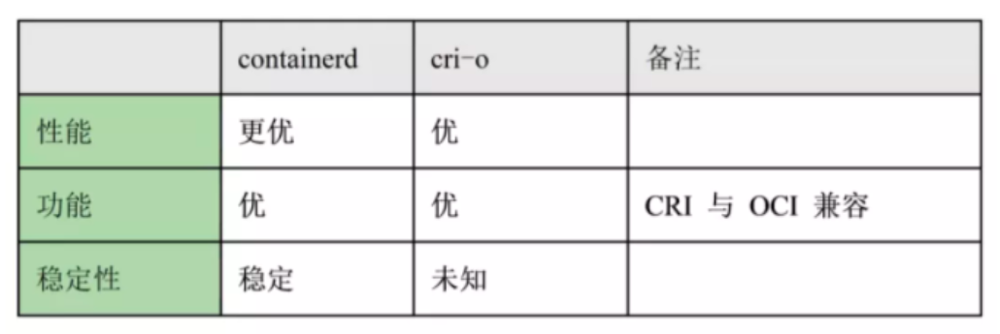

# k8s

[Kubernetes弃用Docker后怎么办？](https://www.infoq.cn/article/47HcIxefRy1cETbZuGWd)

[容器运行时](https://kubernetes.io/zh/docs/setup/production-environment/container-runtimes/)

## [containerd](https://containerd.io/)

[github](https://github.com/containerd/containerd)

[Containerd 简介](https://www.cnblogs.com/sparkdev/p/9063042.html)

[如何选择 Containerd 和 Docker](https://cloud.tencent.com/document/product/457/35747)

## [cri-o](https://cri-o.io/)

https://github.com/cri-o/cri-o

## k8s
我的两年Kubernetes使用经验总结
https://www.infoq.cn/article/LxLEO1J772DKdx5Z6mef
指标 Prometheus
日志 Grafana 的 Loki 简单，而且具有我们团队所需的必要功能 PromQL 对 Grafana 非常友好
    ELK 构建了一个稳定的日志平台。我们发现 ELK 有很多我们团队用不到的功能，而这些功能是有代价的。
配置和 Secret 管理
  configmap 和 secret
    另外，配置或 secret 的更改意味着您必须重新部署应用使其生效
  为了避免这一切，我们决定使用 Consul、Vault 和 Consul 模板进行配置管理
  将 Consul 模板作为初始化容器（init container）运行
持续集成和持续部署
  Jenkins
  Jenkins 并不是使用云原生基础设施的最佳解决方案
  正在探索使用 Tekton 和 Argo Workflows 作为我们新的 CI/CD 平台
 
 Docker 的第二次死亡
https://www.infoq.cn/article/x14tVB7izIDJpJHeoEuJ
podman
moby

## k0s
https://www.mirantis.com/blog/how-to-set-up-k0s-kubernetes-a-quick-and-dirty-guide/
https://github.com/k0sproject/k0s/blob/main/docs/create-cluster.md
https://github.com/k0sproject/k0s
https://gitee.com/mirrors/k0s