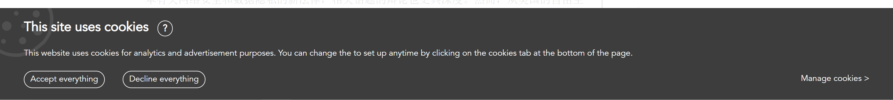
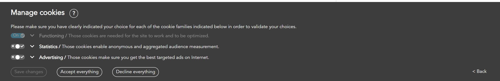
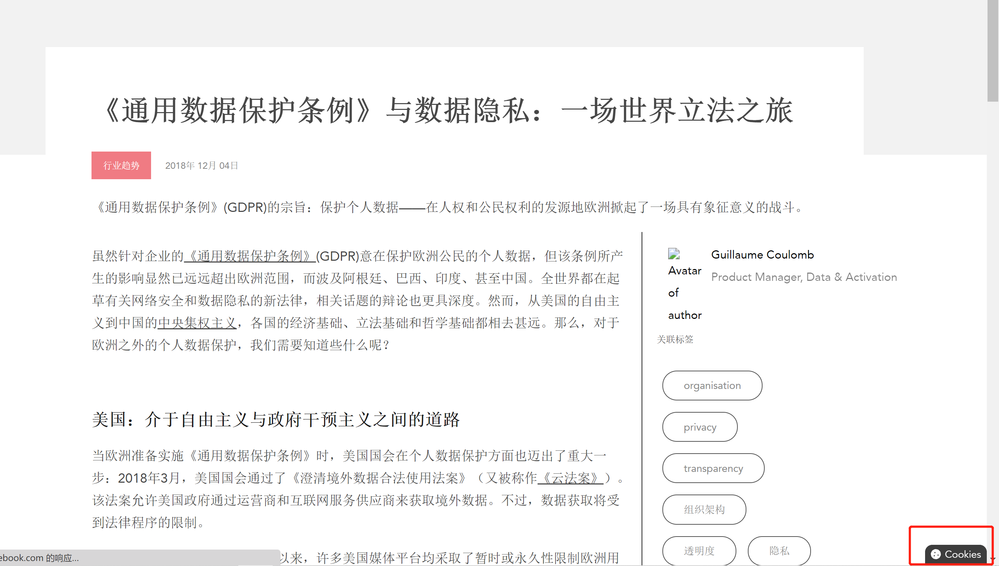

# 数据保护法规

## 国内

盘点2020年上半年个人信息保护重大事件
https://www.freebuf.com/articles/neopoints/242861.html

关于印发《App违法违规收集使用个人信息行为认定方法》的通知  http://www.cac.gov.cn/2019-12/27/c_1578986455686625.htm

《个人金融信息保护技术规范》发布，附全文最全信息
http://www.sinotf.com/GB/News/1002/2020-02-24/wNMDAwMDM0MTIwNA.html

关于《个人金融信息保护技术规范》的相关解读
https://www.secrss.com/articles/17921

## [GDPR](https://gdpr-info.eu/)

《通用数据保护条例》（General Data Protection Regulation，简称为“GDPR”）

[全球数据及隐私安全立法及实施概览](https://zhuanlan.zhihu.com/p/87010338)

### 信息安全技术 数据安全能力成熟度模型
国家标准GB/T 37988-2019《信息安全技术 数据安全能力成熟度模型》
http://c.gb688.cn/bzgk/gb/showGb?type=online&hcno=3CFD5E5A14C24D303EA1E139E6EB75C8
https://dsmm.cesidsat.com/assets/file/standard.pdf
数据安全能力成熟度评估
https://dsmm.cesidsat.com/home

《数据安全能力成熟度模型》实践指南：数据源鉴别及记录
https://cloud.tencent.com/developer/article/1690317

国家标准《数据安全能力成熟度模型》明年3月起实施 (附文件)
https://www.secrss.com/articles/13518

## 法规.国内.隐私

数据已成为当前企业乃至国家重要的战略资源，个人信息作为个人的数据资产受到了越来越广泛的关注。

01. 《App违法违规收集使用个人信息行为认定方法》发布
关于印发《App违法违规收集使用个人信息行为认定方法》的通知  http://www.cac.gov.cn/2019-12/27/c_1578986455686625.htm

2019年12月底，根据《关于开展App违法违规收集使用个人信息专项治理的公告》，为监督管理部门认定App违法违规收集使用个人信息行为提供参考，为App运营者自查自纠和网民社会监督提供指引，落实《网络安全法》等法律法规，国家互联网信息办公室、工业和信息化部、公安部、市场监管总局联合制定了《App违法违规收集使用个人信息行为认定方法》。

02.金融行业标准《个人金融信息保护技术规范》正式发布 
2020年2月，中国人民银行发布了金融行业标准《个人金融信息保护技术规范》，从安全技术和安全管理两个方面规定了个人金融信息在收集、传输、存储、使用、删除、销毁等生命周期环节的安全防护要求。

《个人金融信息保护技术规范》发布，附全文最全信息
http://www.sinotf.com/GB/News/1002/2020-02-24/wNMDAwMDM0MTIwNA.html

关于《个人金融信息保护技术规范》的相关解读
https://www.secrss.com/articles/17921

03.新版《个人信息安全规范》正式发布 
信息安全技术 个人信息安全规范|国家标准全文公开系统
http://openstd.samr.gov.cn/bzgk/gb/newGbInfo?hcno=4568F276E0F8346EB0FBA097AA0CE05E

2020年3月，GB/T 35273-2020《信息安全技术 个人信息安全规范》正式发布，并将于2020年10月1日实施。规范对个人信息收集、储存、使用做出了明确规定，并规定了个人信息主体具有查询、更正、删除、撤回授权、注销账户、获取个人信息副本等权力。

参考：

[盘点2020年上半年个人信息保护重大事件](https://www.freebuf.com/articles/neopoints/242861.html)

[企业合规视角下的《个人信息保护法 (草案) 》解读](https://www.freebuf.com/articles/neopoints/253546.html)

样例
https://teahouse.fifty-five.com/zh-hans/gdpr-and-data-privacy-a-legislative-world-tour/

[全球最严个人数据保护法GDPR实施之后| 腾讯研究院](https://www.tisi.org/5055)

## 产品

### Microsoft 365 合规中心

合规中国向用户展示自己有哪些合规的相关法律法规

[Microsoft 365 合规中心](https://docs.microsoft.com/zh-cn/microsoft-365/compliance/?view=o365-worldwide)

#### 欧盟美国隐私盾

[欧盟-美国及瑞士-美国隐私保护框架](https://docs.microsoft.com/zh-cn/microsoft-365/compliance/offering-eu-us-privacy-shield?view=o365-worldwide)

#### 中国相关

等保

https://www.trustcenter.cn/compliance/default.html#DJCP
2008年11月1日 - ICS 35.040. L 80. 中华人民共和国国家标准. GB/T 22240—2008. 信息安全技术. 信息系统安全等级保护定级指南. Information security technology-.

Information System Classified Security Protection (DJCP)
According to GBT 22240-2008 Information Security Technology—Classification Guide for Classified Protection of Information System Security, the evaluation organizations authorized by the Ministry of Public Security (MPS) evaluate Microsoft Azure and Office 365 operated by 21Vianet based on GB/T 22239-2008 Information Security Technology—Basic Requirements for Classified Protection of Information System Security, and rate both Azure and Office 365 to Level 3 in terms of information security protection classification. Registration certifications are issued to Azure and Office 365.

https://www.trustcenter.cn/compliance/default.html#GB18030
GB 18030 Information Technology — Chinese Coded Character Set
GB 18030 is the Chinese ideographic character set and encoding standard mandated by the Chinese government. Microsoft Azure and Office 365 operated by 21Vianet are certified as compliant with the mandatory part of this standard by the China Electronics Standardization Institute (CESI).
GB 18030，全称《信息技术 中文编码字符集》，是中华人民共和国国家标准所规定的变长多字节字符集。其对GB 2312-1980完全向后兼容，与GBK基本向后兼容，并支持Unicode的所有码位。GB 18030共收录汉字70,244个。 GB 18030主要有以下特点： 维基百科

https://www.trustcenter.cn/compliance/default.html#TCS
这个就是可信云了， 官网应该是这个：http://www.kexinyun.org.cn/
Trusted Cloud Service Certification
21Vianet adopts cutting-edge Azure and Office 365 technologies and has successfully obtained multiple Trusted Cloud Service Certifications with powerful localized operation capabilities, open platform, high-quality SLA, powerful data recovery capability and best customer returns.

Trusted Cloud Service Certification is a cloud service quality evaluation system organized by the Trusted Cloud Service working group of Data Center Alliance (DCA) under the guide of MIIT. This certification aims to cultivate the Chinese public cloud service market, enhance users’ confidence on cloud services, protect certified cloud service providers and promote sound development of the market.

Microsoft Azure operated by 21Vianet has passed audits and obtained Trusted Cloud Service Certifications of Virtual Machine, Cloud Storage, Cloud Database, Load Balancing, Cloud Engine and Cloud Backup. These services accept the evaluation of total 16 indexes in three classifications—data management, service quality and rights protection--in the SLA framework. With service availability up to 99.99%, the services provide 6 data backups on two datacenters, providing reliable, secure, flexible, efficient, and stable assurance for users.

Office 365 operated by 21Vianet has also obtained Trusted Cloud Service Certifications of Business-Class Email (Exchange Online), File Sharing (SharePoint Online), Shared Calendar and Video Teleconference Service (Skype for Business Online) as well as the certification of “Security” and “User Experience” indexes. Office 365 operated by 21Vianet achieved "Trusted Cloud 2014-2015 Annual Industry Award” for office applications, which proofs Office 365 is providing first-class and reliable technology, safe and stable operations and perfect service system of norms.

The test result is published on the website of Trusted Cloud Service Certification

## 引用

[ISO 29151隐私保护认证心得体会](https://www.freebuf.com/articles/neopoints/250617.html)

[数据安全能力建设思路](https://www.freebuf.com/articles/database/248950.html)