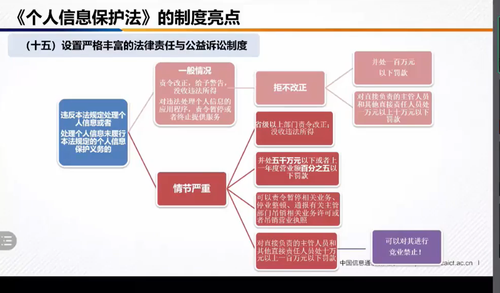
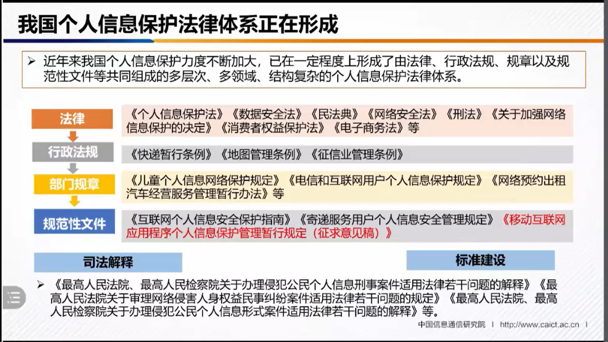

# 个人数据保护法

[TOC]

## 1 概述

2021年11月01日 实施 [**中华人民共和国个人信息保护法**](http://www.npc.gov.cn/npc/c30834/202108/a8c4e3672c74491a80b53a172bb753fe.shtml) 严格规定了处理个人数据活动的规范和处罚方法。被视为中国版GDPR，是国内隐私法案的集成。

本法一共8章74条，和我们产品和技术相关的有 自然人权益，处理者活动规范和义务，这会影响我们的产品功能和特性。

那么我们需要做什么改进以符合保护法要求？

## 2 我们要做哪些调整？

对于从零整改的组织，会涉及 应用开发、内部流程和平台活动 三方面的调整，我们这里主要讲应用开发相关调整任务。

#### 2.1. 应用开发任务

**隐私协议**：

​	**协议文本内容、发布及版本管理**

	+ 公开声明，向客户解释我们最小收集哪些数据，分别用于什么功能
	+ 需要提供一个公开的页面，给供应商引用，给我们程序和SDK引用。
	+ 应商户明确 我们做为平台 和 供应商之类的权益和责任

​	**客户同意**：同意收集哪些信息，并可以撤回。以开关形式提供

​    **客户个人数据中心**：示例：已经收集了哪些信息，并可以修改，删除等。 算是给商户提供一个Demo

**个人数据保护**：

+ 识别、分类系统中的个人数据
+ 标识化数据加密存储 （如customer表）
+ 加密输出前端数据重组
+ 引入文件加密存贮 语音文件，图片
+ 导出加密文件，加密和压缩
+ 去标识化存储
+ 加密传输https

#### 2.2. 内部流程：

制度文档/规程

数据分级分类

培训和培训记录

应急预案，演练记录

应急处理SOP

合规集成和审计

#### 2.3. 平台组织活动：

独立外部成员个人信息保护监督机构

平台规则公告

查处平台的用户/产品

发布个人 信息保护社会责任报告

## 3 架构

隐私平台

- x 隐私协议管理
- V 客户同意 收集开关管理， js ， 功能应该包括如 不允许使用ip时，不获取ip，不允许获得url时不获得url（vistor)
- 客户个人数据修改集成  查看 去标识化 和删除
- 加密套件  xxxxxxxx接口 js 加密解密， ruby / java 加密解密 -> 正常参数
- 去标识化 库 ，如客户或客服点击一下，可以把一个数据变成去标识化的
- js 敏感数据提示

应用层改造

+ 接入客户同意和隐私协议
+ 接入加密组件

## 4 设计TIPS

### 要点：

加密存贮

加密输出

### 流程

敏感用户数据 Customer -> 保存 hook -> 去标识化数据 

### 加密

如果是老系统，应该以老系统做为 去标识化 后的数据存储

+ 比如你现有系统中的 user.name, 现存数据张三丰，处理后，user.name=张先生，然后

将个人信息数据/敏感数据 放到新的加密数据中

？如何支持搜索 

- 只支持去标识化数据

导出加密保护：导出的文件压缩成zip，并加密

API接口加密保护：接口的数据都加密返回

SPA加密保护：

+ 敏感数据提交： 加密了，怎么进行WAF过滤
+ 敏感数据输出加密： 安全header中加入x-sec-token,后端得到后以之加密，强制开关，如果没有这个参数，拒绝返回
+ 前端加密解密组件：

斯坦福大学开源的 JavaScript 加密库。用于 JS 的加密和解密，体积小且支持多种加密算法
https://github.com/bitwiseshiftleft/sjcl

可以用于前端加密和解密
[javascript - 用JavaScript加密AES-GCM，用Java解密](https://www.coder.work/article/5413624)

### 个人信息定义和范围

**从“个人信息”的定义看，**与《中华人民共和国网络安全法》第七十六条第一款第五项（以下简称**“《网络安全法》”**）和《民法典》第一千零三十四条第二款规定的“能够单独或者与其他信息结合识别特定（注：《网络安全法》未规定此处的‘特定’）自然人的各种信息”不同，《个人信息保护法（草案）》采取了与欧盟《通用数据保护条例》（General Data Protection Regulation， “GDPR”）第4条相类似的界定标准，即“与已识别或者可识别的自然人有关的各种信息”。换句话说，《网络安全法》和《民法典》采取了“识别”的路径，《个人信息保护法（草案）》采取了“识别+关联”的路径，一定程度上拓宽了个人信息的范围。此外，本条将“匿名化处理后的信息”排除在“个人信息”的范围之外，也就意味着匿名化信息不需要受到本法的规制。需要强调的是，《个人信息保护法（草案）》第六十九条第一款第四项对“匿名化”进行了定义，满足“无法识别且无法复原”标准的信息才不属于个人信息，否则还是需要受到本法的规制。

 

针对“已识别”和“可识别”的区分问题，我们以身份证上的信息为例，身份证反面包含身份证号、姓名、出生年月日、民族、家庭地址等信息。这些信息里面，身份证号码具有唯一性，单独的身份证号码就是特定自然人的个人信息，这就属于“已识别”的自然人的个人信息；对于“可识别”，只有姓名或者只有家庭住址都无法识别到指定的自然人，因为单独来看，姓名有重名的，一个家庭住址一般来说会有一家好几口人，但是这二者都能够在一定程度上将某些人与其他人区分开，对于识别到特定自然人来说都发挥着一定的作用而非毫无关联。因此，单独来看，姓名和家庭住址均属于“与可识别自然人有关的”个人信息，二者一旦结合就指向了特定的自然人，也就转化成了“已识别”自然人的个人信息。

 

**从“个人信息的处理”的定义看，**不同于《网络安全法》对个人信息不同环节提出分散要求，《个人信息保护法（草案）》基本沿用了《民法典》第一千零三十五条第二款的规定，将个人信息全生命周期的活动纳入到个人信息的处理范围，意味着个人信息全生命周期的处理活动均受到本法的规制。

《个人信息保护法（草案）》全文逐条解读（一）

http://www.zhonglun.com/Content/2020/10-23/1502201640.html

### 隐私声明

示例 zendesk

## 引用

全景解构《个人信息保护法》，助力企业进入中国个人信息保护新纪元

http://www.zhonglun.com/Content/2021/08-21/0130117987.html

[十问十答看懂我国个人信息去标识化规则](https://www.secrss.com/articles/31527)

个人数据安全法 11.1 生效

个人信息去标识化，是指个人信息经过处理，使其在不借助额外信息的情况下无法识别特定自然人的过程。去标识化采用假名、加密、哈希函数等技术手段替代对个人信息的标识，但在一定程度上保留了个人信息的颗粒度。个人信息去标识化的目的在于降低信息对个人的识别程度，使得单个信息不能识别到特定个人。

[逃离“告知-同意”：《个人信息去标识化指南》笔记](https://zhuanlan.zhihu.com/p/106983511)

+ 重要概念
+ 去标识化的武器库/工具

[个人信息去标识化框架及标准化](https://blog.51cto.com/u_15127528/2697852)

[全景解构《个人信息保护法》，助力企业进入中国个人信息保护新纪元](http://www.zhonglun.com/Content/2021/08-21/0130117987.html)

《个人信息保护法》强在哪？我们又该如何准备
https://www.freebuf.com/articles/neopoints/286092.html
CCPA(加州消费者保护法案)
GDPR
UPDBA 统一个人数据保护法案
《个人信息保护法》企业侧实用解读指南
https://www.freebuf.com/articles/neopoints/286277.html
落地《个人信息保护法》 直面数字化时代的困难与挑战
https://www.freebuf.com/articles/neopoints/286507.html
国家网信办：算法推荐服务提供者不得利用算法屏蔽信息、过度推荐
https://www.freebuf.com/news/286454.html

网络安全视角下的《个人信息保护法》
https://www.freebuf.com/articles/neopoints/253951.html

数据安全怎么做：个人信息保护法解读
https://www.freebuf.com/articles/compliance/253713.html

好像有一个GDPR服务
https://www.netcraft.com/topics/gdpr/
https://search.bilibili.com/all?keyword=GDPR
https://www.udemy.com/courses/search/?src=ukw&q=GDPR
https://www.youtube.com/results?search_query=GDPR

《中华人民共和国个人信息保护法（草案）》解读|德勤
https://www2.deloitte.com/cn/zh/pages/risk/articles/china-draft-personal-data-protection-law.html
https://search.bilibili.com/all?keyword=个人信息保护法
https://www.bilibili.com/video/BV13D4y1X74B?from=search&seid=6747857310039500278

[盘点2020年上半年个人信息保护重大事件](https://www.freebuf.com/articles/neopoints/242861.html)

[企业合规视角下的《个人信息保护法 (草案) 》解读](https://www.freebuf.com/articles/neopoints/253546.html)

2021第5讲:《个人信息保护法》理解与适用|律师法律相关
https://www.bilibili.com/video/BV1Hb4y1U7uU/?spm_id_from=333.788.recommend_more_video.0
撒回授权
删除个人信息

企业和负责人要做什么：

+ 制定内部管理制度和操作规程
+ 对个人信息实行分类管理
+ 采取相应的加密、去标识化等安全技术措施
+ 合理确定个人信息处理的操作权限，并定期对从业人员进行安全教育和培训
+ 制定并组织实施个人信息安全事件应急预案
+ 发生或者可能发生个人信息泄露、篡改、丢失的，个人信息处理者应当立即采取补救措施，并通知履行个人信息保护职责 的部门和个人
+ 主动定期合规审计
+ 中国境外的个人信息处理者，应当在中国境内设立专门机构或者指定代表
+ 法律、行政法规规定的其他措施

可会对那些活动有影响，和我们大多数系统相关的就是 “处理敏感个人信息”。

平台（如SaaS平台，微信平台）义务：

+ 按照国家规定建立健全个人信息保护合规制度体系，成立主要由外部成功组织的独立机构对个人信息保护情况进行监督。
+ 遵循公开、公平、公正的原则，制定平台规则，明确平台内产品或者服务提供者处理个人信息的规范和保护个人信息的义务。
+ 对严重违反法律、行政法规处理个人微信的平台内的产品或服务提供者，停止提供服务。
+ 定期发布个个信息保护社会责任报告，接受社会监督。

企业处理人脸信息合规建议：

+ 采集消费者信息的，应当将采集相关事宜，包括收集、使用信息的目的、方式和范围告知消费者，可采用以明显标识 公示告知的方式等。
+ 收集、使用人脸识别信息的，应当取得自然人或其监护人的单独同意，且建议信息处理者留存取得消费者同意的证明记录，比如消费者的知情同意书等，防止发生产生诉讼时被 法院要求承担举证责任。
+ 经营者应当遵守所公开的处理人脸信息的规则以及告诉的目的、方式和范围，不得违反约定。
+ 人脸信息具有强人身性和被侵犯后的难以救济性，除非得到自然人或其监护 人的明确、单独的同意，否则经营者不应向第三方提供所收集的人脸信息。
+ 如果企业借助用户协议、服务协议的格式条款，要求消费者授予关于处理人脸信息的“无期限制、不可撤销、可任意转授权”等权利，消费者有权向法院请求确认格式条款无效。
+ 此外，企业应当注意《民法典》规定的格式条规 无效的其他情形，如果存在免除或者减轻企业责任、加重消费者责任、限制消费者关于人脸信息主要权限的其他条款，也有可能在判决中被法院认定为无效。

处理者应当主动采取相关的方式方法和相关措施，以避免对个人权益造成的影响。因为认定行为承担责任时行为人的目的、方式、范围等均是考量因素之一，本法在此也明确提出最小影响的要求和处理规则 。国家网信办公布查处APP中大部分是违反必要原则收集与其提供服务无关的个人信息。

收集个人信息，应当限于 实现处理目的的最小范围，不得过度收集个人信息。

实践中，企业应制定个人信息保护政策；所告知的信息应真实、准确、完整，包括但不限于 产品运营者基本情况、个人信息收集、使用目的、范围及场景、个人信息处理方式及规则、对外共享及披露情形、个人信息主体权利保障机制、投诉处理渠道等；

个人信息保护政策应当公开发布且易于访问，例如，在网站主页、移动互联网应程序安装页，以交互界面或设计等显著位置设置链接；

个人信息保护政策应逐一送达个人信息主体；例如用户注册或首次运行产品时需要主动提示用户阅读并勾选同意后才可继续使用。

APP

+ 应对自身APP的合规状况进行评估，仅收集“保障APP基本功能服务正常运行所必需、缺少该信息App即无法实现基本功能服务”的个人信息。
+ 在显著位置标识 App 运行所需获取的用户终端权限列表和个人信息收集的类型、内容、目的、范围、方式、用途及处理等相关信息。
+ 被通报App的运营者应当立即开始整改，并建立相应的合规管控机制，避免违规问题重现。

第三方合作

+ 企业在与等三方合作时，应基于合作的目的和方式约定与合作伙伴之间的关系和责任承担。如侵害个人信息利益造成损害的，双方应承担连带责任。
+ 在委托处理的场景下，双方应约定委托处理的目的、期限、处理方式、个人信息的种类、保护措施、双方的权利 和义务等，以及个人信息处理者对受托人的个人信息处理活动进行监督 
+ 在角色判断的过程中，双方的地位，个人信息处理活动的边界与其应承担的权利与义务相对应，双方应妥善
+ 在事前进行个人信息保护影响评估
+ 结合合作关系涉及的个人信息处理活动的风险程序酌情采取审计、持续监控等措施，以避免后续纠纷。

其他：

+ 应对业务现状进行合规评估
+ 采取必要的业务改进举措，加强对个人信息，特别是敏感个人信息的保护；
+ 赋予信息主体查询权、知情权，并合规回应信息主体获得自身信息的归集、采集、披露、撤回、删除和应用情况的权利行使要求。
+ 在欧盟境内开展相关业务的中国企业：如涉及收集或处理个人数据，应迟早梳理并评估有关个人数据的处理与传输情况，完善合规措施，建立相应的合规管理体系，防范因违规处理数据而造成业务中断或商业模式不可持续 。
+ 企业需要在个人信息处理活动的开端，即界定个人信息处理的目的，并依据目的厘清是否存在个人信息存储的法律要求及对应的时间段，如不存在，则应在目的实现时改造删除或者匿名化处理义务。

如果是SDK，列出所要求的权限和收集的数据

Guy-HW

活动作品个人信息保护法的理解与展望——前网信办工作人员解读， 中国信息通信研究院，算半官方解释
https://www.bilibili.com/video/BV1AM4y157ZF?from=search&seid=5030832091563850512&spm_id_from=333.337.0.0

TODO：平台应该增加要求数据所有权的商户义务描述，如对未满14岁的个人数据，做为处理方的平台无法甄别，应由商户解释相关政策

处罚的规定:

活动作品《数据安全保护法》和《个人信息保护法》解读与合规应对思路——环球律师事务所合伙人孟洁律师
https://www.bilibili.com/video/BV1XA411F71x/?spm_id_from=333.788.recommend_more_video.2

活动作品个人信息保护法立法执法态势与企业合规——上海锦天城合伙人解读
https://www.bilibili.com/video/BV1K64y1Y7vQ?from=search&seid=5030832091563850512&spm_id_from=333.337.0.0

个人信息安全法律保护伞｜《中华人民共和国个人信息保护法》解读
http://www7.zzu.edu.cn/aqz/nry.jsp?urltype=news.NewsContentUrl&wbtreeid=1046&wbnewsid=1174

### 主体同意

参考德勤的设计
https://www2.deloitte.com/cn/zh/pages/risk/articles/personal-information-protection-law-analysis.html
使用 https://www.onetrust.com/ 服务，隐私平台

阿里云 OSS 的服务端加密有什么意义？

https://www.v2ex.com/t/684228

客户端加密
https://help.aliyun.com/document_detail/73332.html
https://developer.alibaba.com/docs/doc.htm?treeId=620&articleId=115812&docType=1

企业微信稳私声明，包含

https://work.weixin.qq.com/nl/privacy?version=3.1.18.6007&platform=win

避免发送个人身份信息 (PII) 的最佳做法

https://support.google.com/analytics/answer/6366371?hl=zh-Hans#zippy=%2C%E6%9C%AC%E6%96%87%E5%8C%85%E5%90%AB%E7%9A%84%E4%B8%BB%E9%A2%98

个人识别信息（PII）
http://abcexchange.io/terms/p/personally-identifiable-information-pii.asp

个人身份信息(PII)是什么?会被恶意使用吗？如何保护它？ 
https://www.sohu.com/a/412407360_442599
Personally identifiable information ,PII

多因素认证提供商Okta在其《2020年隐私成本报告》中列出了13类可被视为PII的数据:

用户名和密码
电子邮件和已发送消息
输入到在线表单中的数据
网络配置文件
网络浏览历史
在线时的物理位置
网上购买记录
搜索历史记录
社交媒体帖子
使用的设备
在线完成的工作
在线视频观看记录
在线音乐播放列表

2009 年，Johnson 诉 Microsoft 案的裁决发现 IP 地址不是 PII，因为 IP 地址标识的是计算机，而不是人。这与 2008 年新泽西州的一宗案件有冲突，该法院认为客户对 IP 地址的隐私有合理的期望。它还与将 IP 地址描述为 PII 的 NIST 指南冲突。

