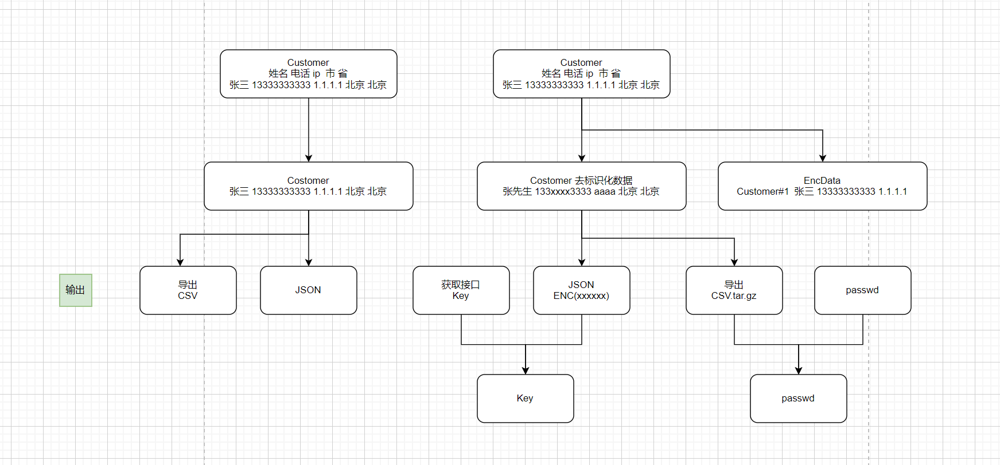
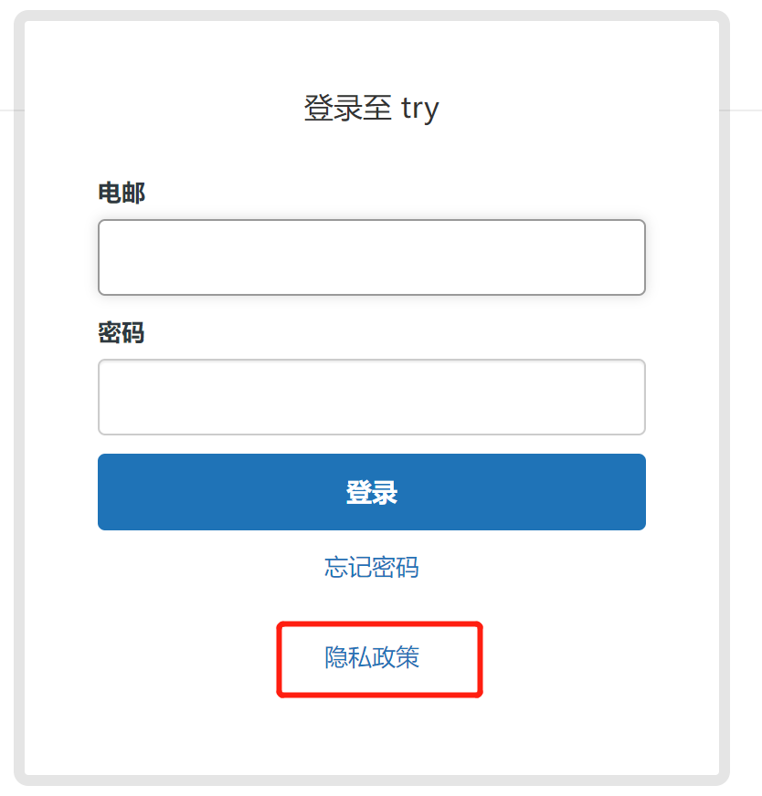
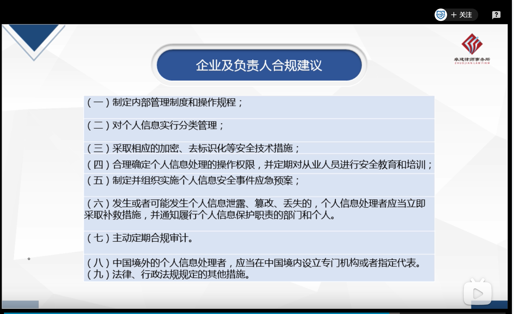
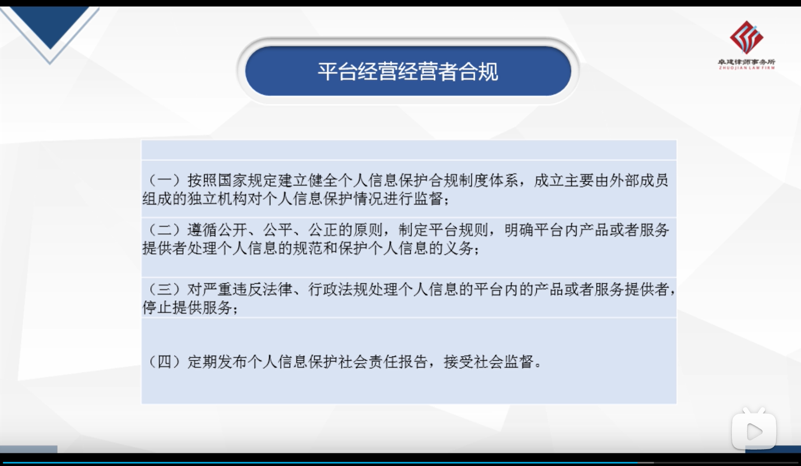
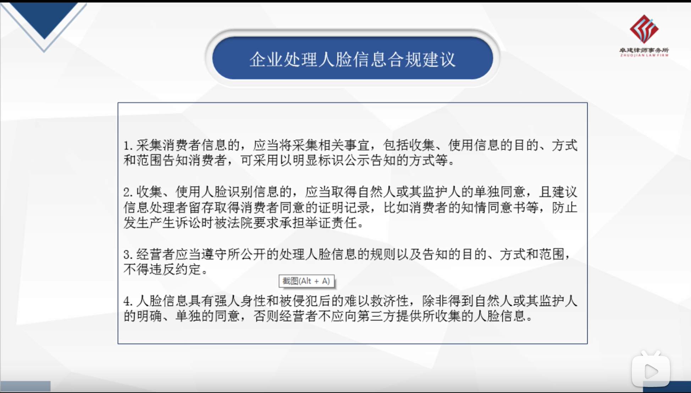
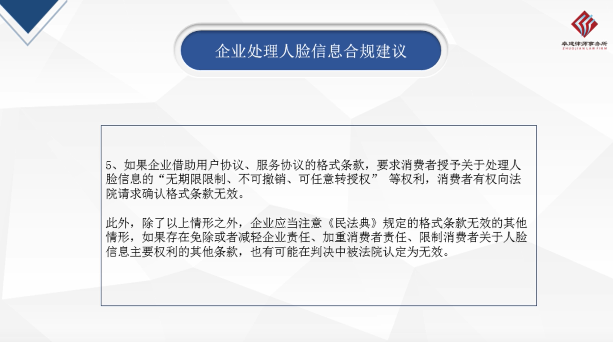
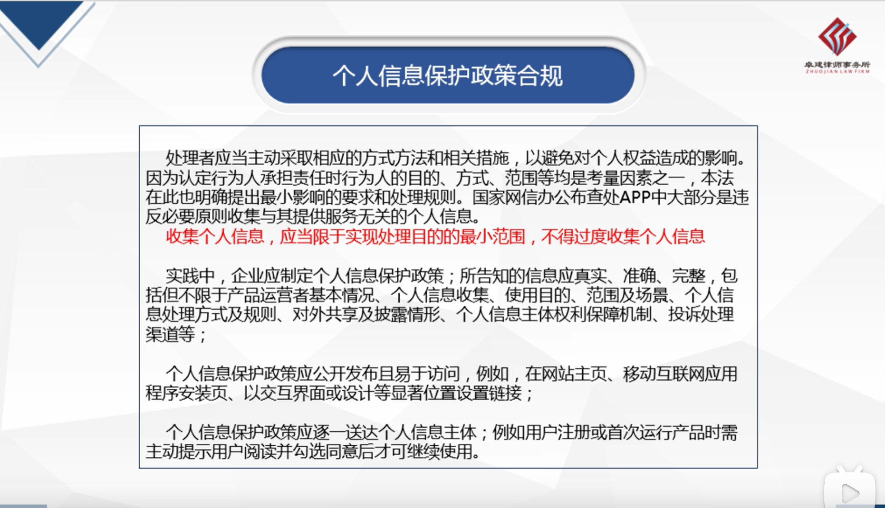
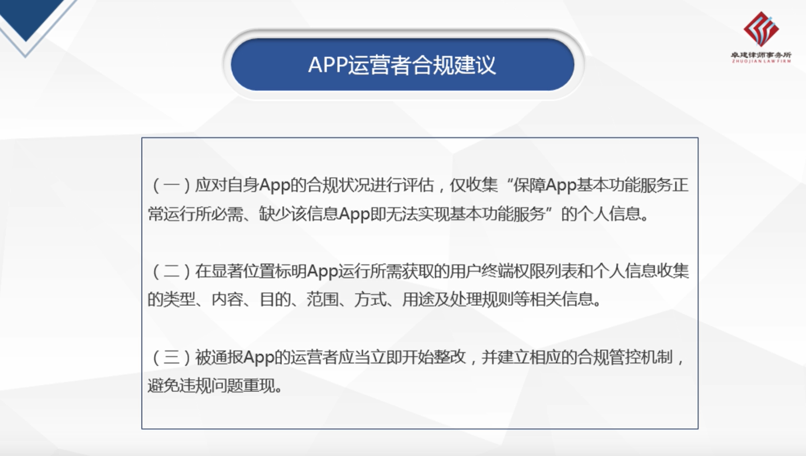
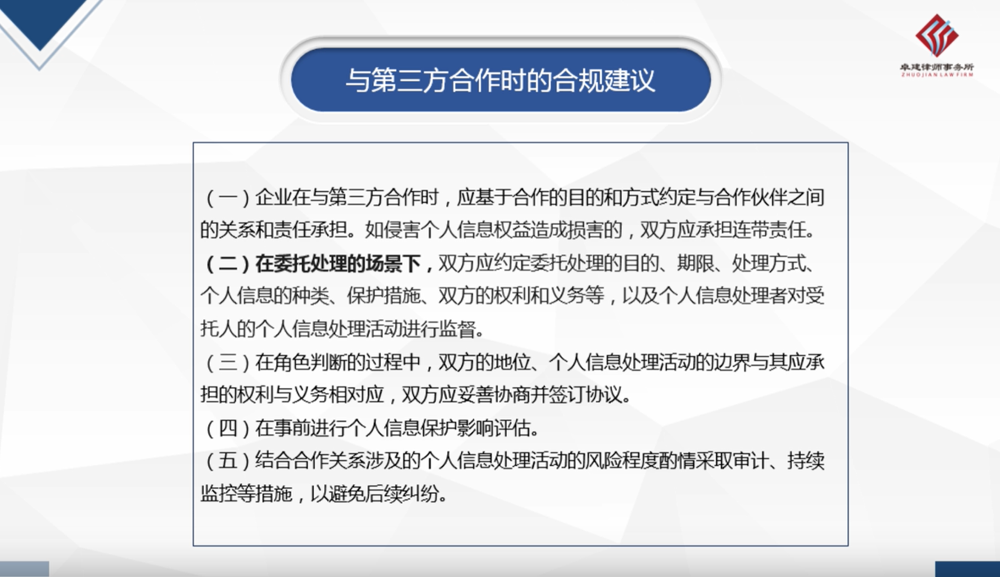
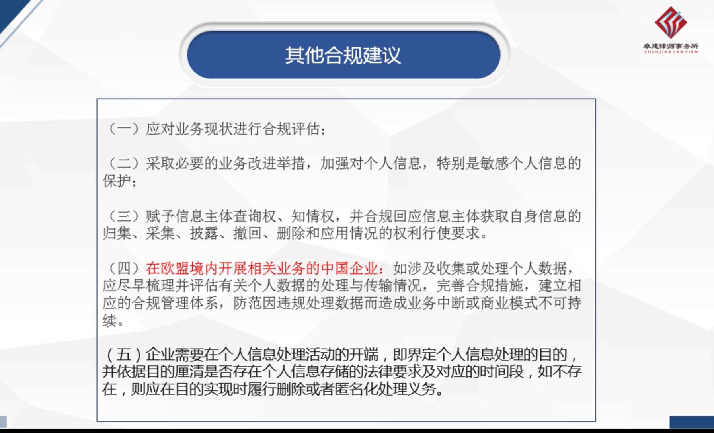

# 个人数据保护法

[TOC]

## 1 概述

2021年11月01日 实施 [**中华人民共和国个人信息保护法**](http://www.npc.gov.cn/npc/c30834/202108/a8c4e3672c74491a80b53a172bb753fe.shtml) 严格规定了处理个人数据活动的规范和处罚方法。被视为中国版GDPR，是国内隐私法案的集成。

本法一共8章74条，和我们产品和技术相关的有 自然人权益，处理者活动规范和义务，这会影响我们的产品功能和特性。

那么我们需要做什么改进以符合保护法要求？

## 2 我们要做哪些调整？

对于从零整改的组织，会涉及 应用开发、内部流程和平台活动 三方面的调整，我们这里主要讲应用开发相关调整任务。

#### 2.1. 应用开发任务

**隐私协议**：

​	**协议文本内容、发布及版本管理**

	+ 公开声明，向客户解释我们最小收集哪些数据，分别用于什么功能
	+ 需要提供一个公开的页面，给供应商引用，给我们程序和SDK引用。
	+ 应商户明确 我们做为平台 和 供应商之类的权益和责任

​	**客户同意**：同意收集哪些信息，并可以撤回。以开关形式提供

​    **客户个人数据中心**：示例：已经收集了哪些信息，并可以修改，删除等。 算是给商户提供一个Demo

**个人数据保护**：

+ 识别、分类系统中的个人数据
+ 标识化数据加密存储 （如customer表）
+ 加密输出前端数据重组
+ 引入文件加密存贮 语音文件，图片
+ 导出加密文件，加密和压缩
+ 去标识化存储
+ 加密传输https

#### 2.2. 内部流程：

制度文档/规程

数据分级分类

培训和培训记录

应急预案，演练记录

应急处理SOP

合规集成和审计

#### 2.3. 平台组织活动：

独立外部成员个人信息保护监督机构

平台规则公告

查处平台的用户/产品

发布个人 信息保护社会责任报告

## 3 架构

隐私平台

- 隐私协议管理
- 客户同意 收集开关管理， js ， 功能应该包括如 不允许使用ip时，不获取ip，不允许获得url时不获得url（vistor)
- 客户个人数据修改集成  查看 去标识化 和删除
- 加密套件  接口 js 加密解密， ruby / java 加密解密 -> 正常参数
- 去标识化 库 ，如客户或客服点击一下，可以把一个数据变成去标识化的
- js 敏感数据提示

应用层改造

+ 接入客户同意和隐私协议
+ 接入加密组件

## 4 设计TIPS

### 要点：

加密存贮

加密输出

### 流程

敏感用户数据 Customer -> 保存 hook -> 去标识化数据 

### 加密

如果是老系统，应该以老系统做为 去标识化 后的数据存储

+ 比如你现有系统中的 user.name, 现存数据张三丰，处理后，user.name=张先生，然后

将个人信息数据/敏感数据 放到新的加密数据中

？如何支持搜索 

- 只支持去标识化数据

导出加密保护：导出的文件压缩成zip，并加密

API接口加密保护：接口的数据都加密返回

SPA加密保护：

+ 敏感数据提交： 加密了，怎么进行WAF过滤
+ 敏感数据输出加密： 安全header中加入x-sec-token,后端得到后以之加密，强制开关，如果没有这个参数，拒绝返回
+ 前端加密解密组件：

### 个人信息定义和范围

### 隐私声明

示例 zendesk

## 引用

全景解构《个人信息保护法》，助力企业进入中国个人信息保护新纪元

http://www.zhonglun.com/Content/2021/08-21/0130117987.html

[十问十答看懂我国个人信息去标识化规则](https://www.secrss.com/articles/31527)

个人数据安全法 11.1 生效

个人信息去标识化，是指个人信息经过处理，使其在不借助额外信息的情况下无法识别特定自然人的过程。去标识化采用假名、加密、哈希函数等技术手段替代对个人信息的标识，但在一定程度上保留了个人信息的颗粒度。个人信息去标识化的目的在于降低信息对个人的识别程度，使得单个信息不能识别到特定个人。

[逃离“告知-同意”：《个人信息去标识化指南》笔记](https://zhuanlan.zhihu.com/p/106983511)

+ 重要概念
+ 去标识化的武器库/工具

[个人信息去标识化框架及标准化](https://blog.51cto.com/u_15127528/2697852)

[全景解构《个人信息保护法》，助力企业进入中国个人信息保护新纪元](http://www.zhonglun.com/Content/2021/08-21/0130117987.html)

《个人信息保护法》强在哪？我们又该如何准备
https://www.freebuf.com/articles/neopoints/286092.html
CCPA(加州消费者保护法案)
GDPR
UPDBA 统一个人数据保护法案
《个人信息保护法》企业侧实用解读指南
https://www.freebuf.com/articles/neopoints/286277.html
落地《个人信息保护法》 直面数字化时代的困难与挑战
https://www.freebuf.com/articles/neopoints/286507.html
国家网信办：算法推荐服务提供者不得利用算法屏蔽信息、过度推荐
https://www.freebuf.com/news/286454.html

网络安全视角下的《个人信息保护法》
https://www.freebuf.com/articles/neopoints/253951.html

数据安全怎么做：个人信息保护法解读
https://www.freebuf.com/articles/compliance/253713.html

好像有一个GDPR服务
https://www.netcraft.com/topics/gdpr/
https://search.bilibili.com/all?keyword=GDPR
https://www.udemy.com/courses/search/?src=ukw&q=GDPR
https://www.youtube.com/results?search_query=GDPR

《中华人民共和国个人信息保护法（草案）》解读|德勤
https://www2.deloitte.com/cn/zh/pages/risk/articles/china-draft-personal-data-protection-law.html
https://search.bilibili.com/all?keyword=个人信息保护法
https://www.bilibili.com/video/BV13D4y1X74B?from=search&seid=6747857310039500278

[盘点2020年上半年个人信息保护重大事件](https://www.freebuf.com/articles/neopoints/242861.html)

[企业合规视角下的《个人信息保护法 (草案) 》解读](https://www.freebuf.com/articles/neopoints/253546.html)

2021第5讲:《个人信息保护法》理解与适用|律师法律相关
https://www.bilibili.com/video/BV1Hb4y1U7uU/?spm_id_from=333.788.recommend_more_video.0
撒回授权
删除个人信息

企业和负责人要做什么：

如果是SDK，列出所要求的权限和收集的数据

Guy-HW

活动作品《数据安全保护法》和《个人信息保护法》解读与合规应对思路——环球律师事务所合伙人孟洁律师
https://www.bilibili.com/video/BV1XA411F71x/?spm_id_from=333.788.recommend_more_video.2

活动作品个人信息保护法的理解与展望——前网信办工作人员解读
https://www.bilibili.com/video/BV1AM4y157ZF?from=search&seid=5030832091563850512&spm_id_from=333.337.0.0

活动作品个人信息保护法立法执法态势与企业合规——上海锦天城合伙人解读
https://www.bilibili.com/video/BV1K64y1Y7vQ?from=search&seid=5030832091563850512&spm_id_from=333.337.0.0

个人信息安全法律保护伞｜《中华人民共和国个人信息保护法》解读
http://www7.zzu.edu.cn/aqz/nry.jsp?urltype=news.NewsContentUrl&wbtreeid=1046&wbnewsid=1174

### 主体同意

参考德勤的设计
https://www2.deloitte.com/cn/zh/pages/risk/articles/personal-information-protection-law-analysis.html
使用 https://www.onetrust.com/ 服务，隐私平台

阿里云 OSS 的服务端加密有什么意义？

https://www.v2ex.com/t/684228

客户端加密
https://help.aliyun.com/document_detail/73332.html
https://developer.alibaba.com/docs/doc.htm?treeId=620&articleId=115812&docType=1

企业微信稳私声明，包含

https://work.weixin.qq.com/nl/privacy?version=3.1.18.6007&platform=win

