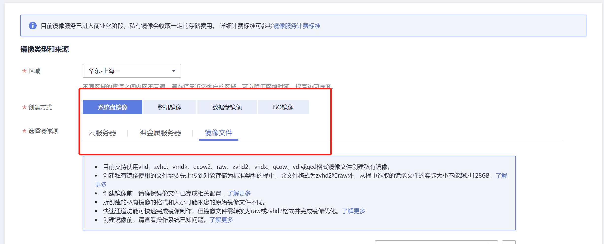
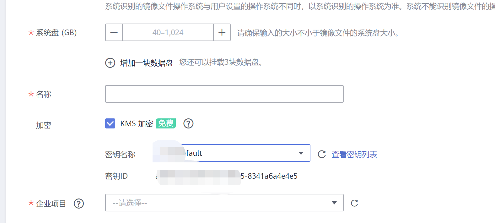
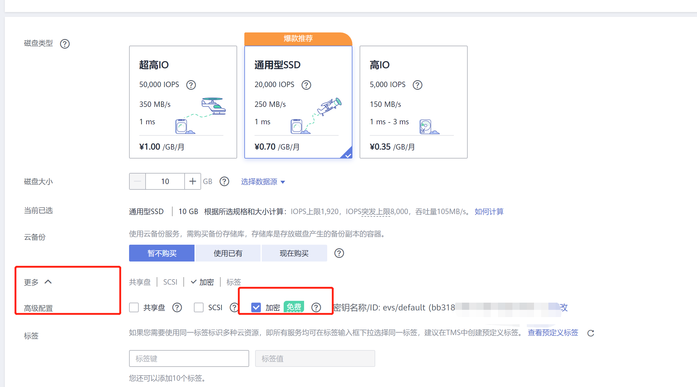
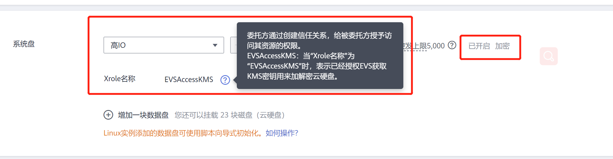
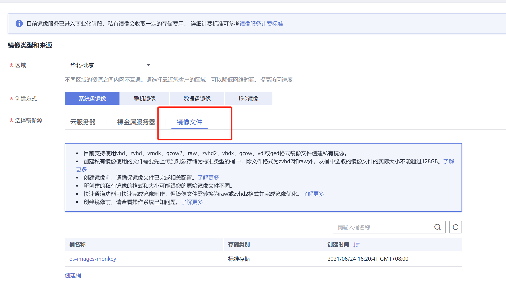
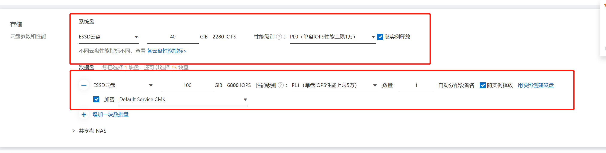

# 云加密

华为云加密

KMS

KMS推广活动：2019年12月12日至2021年12月12日，租户均可免费使用KMS，且创建的KMS密钥实例永久免费。
KMS集成的服务：计算类服务—ECS, IMS, FACS, GACS, CSBS；存储类服务—EVS, VBS, OBS, SFS, SFS Turbo；数据库类服务—MySQL, PostgreSQL, SQL Server, DDS。

https://support.huaweicloud.com/productdesc-ecs/ecs_01_0054.html

云硬盘加密支持系统盘加密和数据盘加密。

1 在创建弹性云服务器时，如果选择的镜像为加密镜像，那么系统盘默认开启加密功能，加密方式与镜像保持一致。
2 在创建弹性云服务器时，您可以对添加的数据盘设置加密。

“镜像服务用户指南 > 管理私有镜像 > 加密镜像” 。

[加密镜像概述](https://support.huaweicloud.com/usermanual-ims/ims_01_0329.html)
[创建加密镜像](https://support.huaweicloud.com/usermanual-ims/ims_01_0330.html)

通过
1 加密弹性云服务器创建加密镜像  即对已经加密的系统制作镜像
2 外部镜像文件创建加密镜像 要上传ISO

 

注意：

如果加密云硬盘使用的CMK被执行禁用或计划删除操作，操作生效后，使用该CMK加密的云硬盘仍然可以正常使用，
但是，当该云硬盘被卸载并重新挂载至弹性云服务器时，由于无法正常获取密钥，会导致挂载失败，云硬盘不可用。

其实就是说加密盘在载入的时候访问CMK，但使用过程中并不使用

云硬盘 EVS

https://console.huaweicloud.com/ecm/?region=cn-south-1#/evs/createvolume

管理加密云硬盘

https://support.huaweicloud.com/usermanual-evs/evs_01_0009.html

流程：

创建一个服务器
制作镜像
导出镜像到OBS对象存储
然后再创建加密镜像
  创建私有镜像，然后在选 系统盘镜像/镜像文件，从上面 OBS存储的地方获取
  选 硬盘加密
制作加密硬盘系统

## 阿里云

ECS
数据盘才能加密

阿里的KMS空跑每月大约需要 14/15元左右