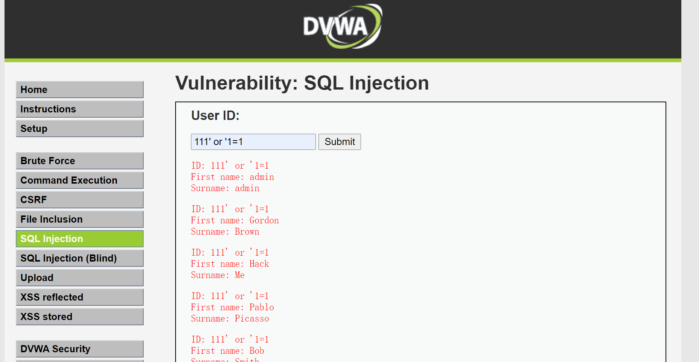

# sql 注入

## 内容

https://www.youtube.com/watch?v=1nJgupaUPEQ
SQL Injection | Complete Guide
Win和Print Screen 会直接放在图片里

1 什么是
2 怎么发现
3 怎么利用
4 如何保护

做为 [OWASP TOP10-A1](https://owasp.org/www-project-top-ten/2017/A1_2017-Injection) 第一个介绍的漏洞风险，特别需要我们关注。

### 什么是SQL注入

    所谓SQL注入，就是通过把SQL命令插入到Web表单提交或输入域名或页面请求的查询字符串，最终达到欺骗服务器执行恶意的SQL命令。

### 产生原因

- 一个是没有对输入的数据进行过滤（过滤输入）
- 二是没有对发送到数据库的数据进行转义（转义输出）

### 手动发现漏洞(测试)

#### 万能钥匙 `xxx' or '1'='1` 或 `1 or 1=1`
Name/token等字符串时
```sql
name=xxx
select * from users name='xxx';
name="xxx' or '1'='1"
select * from users name='xxx' or '1'='1';
```
id等数字时
```sql
id=123
select * from users id=123;
id='123 or 1=1'
select * from users id=123 or 1=1;
```

最古老的方法
```sql
  and 1=1 -- 页面正常
  and 1=2 -- 页面不正常
```

        最简单的方法

页面后加`'`，看是否报错
如果是数字型传参，可以尝试 -1
例如：

http://www.xxx.com/new.php?id=1 页面显示id=1的新闻
http://www.xxx.com/new.php?id=2-1 页面显示id=1的新闻

and 1=1 and 1=2 被拦截的可能性太高了，可以尝试 and -1=-1 and -1=-2 and 1>0 or 1=1。

或者直接 or sleep(5)

    https://owasp.org/www-project-web-security-testing-guide/stable/4-Web_Application_Security_Testing/07-Input_Validation_Testing/05-Testing_for_SQL_Injection.html
    
    工具扫描 sqlmap
        sqlmap -u http://xxxx/?username=xxx
    代码静态扫描
        soanrqube
        fortify
    代码评审


如何防御
    预编译
        使用参数化查询（PreparedStatement），避免将未经过滤的输入直接拼接到SQL查询语句中。
    入参过滤
        对用户输入的特殊字符进行严格过滤，如’、”、<、>、/、*、;、+、-、&、|、(、)、and、or、select、union。
        替换和过滤
        OWASP 组件
    嵌入式应用层防火墙RASP
        嵌入spring boot
        嵌入 容器Tomcat 或 jetty
    [WAF 开源 waf](/doc/sec/sec.arch.oswaf.md)
攻防实验室
    靶场
    [metasploitable2](https://docs.rapid7.com/metasploit/metasploitable-2/)
    [metasploitable2-手册](https://docs.rapid7.com/metasploit/metasploitable-2-exploitability-guide)
    [下载地址](https://sourceforge.net/projects/metasploitable/files/Metasploitable2/)

​    msfadmin:msfadmin
​    vbox ->管理->虚拟介质管理->注册,把解压的 VMware 虚拟盘文件注册到vbox
​    vbox ->新建虚拟机->linux -> 使用现有介质,选择上面的介质
​    vbox -> metasploitable虚拟机 -> 设置 -> 网络 -> 添加网卡 仅主机 (host only)

    sudo dbclient
    sudo ifconfig eth1 up
    
    http://192.168.56.116/dvwa
    user: admin
    password: password
    
    [python](/dev/python/python.install.md)
    
    [sqlmap](/doc/sec/sec.scan.sqlmap.md)
    
    [burp suite ce](https://portswigger.net/burp/communitydownload)
    
    java
    
    [Amazon Corretto | 开放 Java 开发工具包 (OpenJDK) 的免费、多平台、生产就绪型发行版 | 推荐](https://aws.amazon.com/cn/corretto/)
    
    最简单的例子
    1 万能“钥匙” `11' or '1'='1`
    

防御
    java SQL预编译
    java 组件过滤
    引入RASp
    引入开源WAF

加固:
    Web应用中用于连接数据库的用户与数据库的系统管理员用户的权限有严格的区分（如不能执行drop等），
    并设置Web应用中用于连接数据库的用户不允许操作其他数据库。
    设置Web应用中用于连接数据库的用户对Web目录不允许有写权限。

## 发现、测试和工具

[高级的MSSQL注入技巧](https://xz.aliyun.com/t/8513)
[数据库：从注入到提权的全家桶套餐](https://www.freebuf.com/articles/database/270106.html)
[Mssql手工注入执行命令小记](https://www.anquanke.com/post/id/237031)
[SQL注入漏洞详解](https://www.anquanke.com/post/id/235970)
[梨子带你刷burpsuite官方网络安全学院靶场(练兵场)系列之服务器端漏洞篇 - Sql注入专题](https://www.anquanke.com/post/id/245532)

### [SQLmap](./sec.scan.sqlmap.md)

## 高级hack技术 上有对策,下有绕过

[记一次Fuzz绕WAF实现SQL 注入](https://www.freebuf.com/articles/web/274492.html)

[SQL注入一些过滤及绕过总结](https://blog.csdn.net/devil8123665/article/details/108746947)

1.绕过空格（注释符/* */，%a0）：
9.绕过union，select，where等：
U/**/NION/**/SE/**/LECT/**/user，pwd from user

## 处理 最佳实践

https://cheatsheetseries.owasp.org/cheatsheets/SQL_Injection_Prevention_Cheat_Sheet.html

Option 1: Use of Prepared Statements (with Parameterized Queries) 使用**预处理**语句(使用参数化查询)
    [mysql预编译](https://www.cnblogs.com/qiumingcheng/p/8060471.html)
    [PreparedStatement实现原理](https://blog.csdn.net/weixin_38937840/article/details/120932252)
    [JDBC PreparedStatement 实现原理【推荐阅读】](http://www.javashuo.com/article/p-hofejqlk-bw.html)
    PreparedStatement 可能认为是使用数据库server 的 预编译 功能，来防止SQL注入和优化访问功能
    
Option 2: Use of Stored Procedures 使用**存储过程**
Option 3: Allow-list Input Validation 白名单列表输入验证 (输入白名单)
Option 4: Escaping All User Supplied Input 转义所有用户输入 (输入转义) https://owasp.org/www-project-enterprise-security-api/
    https://github.com/ESAPI/esapi-java
    https://mvnrepository.com/artifact/org.owasp.esapi/esapi
Also: Enforcing Least Privilege 强制最小权限
Also: Performing Allow-list Input Validation as a Secondary Defense 执行允许列表输入验证作为辅助防御

### Option 1: Use of Prepared Statements (with Parameterized Queries) 使用**预处理**语句(使用参数化查询)
### [MySQL 存储过程](https://www.runoob.com/w3cnote/mysql-stored-procedure.html)
### Option 3: Allow-list Input Validation 白名单列表输入验证 (输入白名单)

[使用Filter过滤器解决XSS跨脚本攻击和SQL注入问题](https://segmentfault.com/a/1190000039088447)

这个比较合理,替换一些关键的字符
```java
escapeXSS(String value){
   if (value == null || value.isEmpty()) {
       return value;
   }
   value = StringEscapeUtils.escapeXml(value);
   value = StringEscapeUtils.escapeJavaScript(value);
   value = StringEscapeUtils.escapeSql(value);
   value = value.replaceAll("<", "＜");
   value = value.replaceAll(">", "＞");
   value = value.replaceAll("'", "＇");
   value = value.replaceAll(";", "﹔");
   value = value.replaceAll("&", "＆");
   value = value.replaceAll("%", "﹪");
   value = value.replaceAll("#", "＃");
   value = value.replaceAll("sleep", " ");
   value = value.replaceAll("select", "select");// "c"→"ᴄ"
```

[Java SQL 注入学习笔记](https://b1ngz.github.io/java-sql-injection-note/)

Mybatis

因此 #{} 可以有效防止 SQL 注入，详细可参考 http://www.mybatis.org/mybatis-3/sqlmap-xml.html String Substitution 部分
而使用 ${} 语法时，MyBatis 会直接注入原始字符串，即相当于拼接字符串，因而会导致 SQL 注入，如

[SQL Injection in Java: Practices to Avoid](https://sec.okta.com/articles/2020/12/sql-injection-java-practices-avoid)
有漏洞的java的例子
Set Up the Exploitable Java Application
git clone https://github.com/gauravkohli/sqlinjection.git

[Java anti-SQL injection Filter (Interceptor) code](https://topic.alibabacloud.com/a/java-anti-sql-injection-filter-interceptor-code_1_27_30008276.html)

sqlInjectStrList
             <param-value>‘|or|and|;|-|--|+|,|like|//|/|*|%|#</param-value>
doFilter

[SQL盲注、SQL注入 - SpringBoot配置SQL注入过滤器](https://www.cnblogs.com/cao-lei/p/13691468.html)

```bash
private Pattern sqlPattern = Pattern.compile(
			"(?:')|(?:--)|(/\\*(?:.|[\\n\\r])*?\\*/)|(\\b(select|update|and|or|delete|insert|trancate|char|into|substr|ascii|declare|exec|count|master|into|drop|execute)\\b)",

			Pattern.CASE_INSENSITIVE);
```

[mybatis注解动态sql注入map和list（防sql注入攻击）](https://blog.csdn.net/daodfs111/article/details/105630711)


## Ruby 代码审计

Where(" name = #{name} ")

https://rails-sqli.org/
https://www.stackhawk.com/blog/sql-injection-prevention-rails/

## golang 代码审计

https://astaxie.gitbooks.io/build-web-application-with-golang/content/en/09.4.html
https://stackoverflow.com/questions/26345318/how-can-i-prevent-sql-injection-attacks-in-go-while-using-database-sql
https://www.calhoun.io/what-is-sql-injection-and-how-do-i-avoid-it-in-go/

## java 代码审计

[Mybatis框架下SQL注入审计分析](https://www.freebuf.com/vuls/240578.html)

[Java安全编码之SQL注入](https://www.freebuf.com/articles/web/245851.html)

[某租车系统Java代码审计之后台注入漏洞分析](https://www.freebuf.com/vuls/238175.html)

[java项目中如何防止sql注入？](https://blog.csdn.net/alan_liuyue/article/details/88314299)

## 参考

[新手入门：显错型SQL注入](https://www.freebuf.com/vuls/237550.html)

[减轻对旧版Web应用程序的SQL注入攻击|过期,SQLBlock已经不在了](https://www.anquanke.com/post/id/209772)

[Java安全编码之sql注入](https://www.anquanke.com/post/id/212897)

## 漏洞实例

[Apache SkyWalking SQL注入漏洞（CVE-2020-9483）](http://www.nsfocus.net/vulndb/49473)
> 不影响，我们都是 8.0
[WordPress Email Subscribers & Newsletters SQL注入漏洞（CVE-2020-5768）](http://www.nsfocus.net/vulndb/49449)

[Mybatis 框架下 SQL 注入攻击的 3 种方式，真是防不胜防](https://segmentfault.com/a/1190000040272091)

2021年1月23日，蚂蚁安全非攻实验室 @fatansyC4t 向Apache官方报告了Apache Skywalking SQL注入与远程代码执行漏洞。2021年2月7日，阿里云应急响应中心监测到 Apache Skywalking 官方发布安全更新修复该漏洞。

漏洞详情：https://help.aliyun.com/noticelist/articleid/1060803348.html

详情
Apache SkyWalking是一款开源的应用性能监控系统，包括指标监控，分布式追踪，分布式系统性能诊断。Apache SkyWalking的某GraphQL功能存在SQL注入漏洞，攻击者可以构造恶意请求查询数据库敏感信息，或利用H2数据路特性进一步造成远程代码执行漏洞。阿里云应急响应中心提醒  Apache Skywalking 用户尽快采取安全措施阻止漏洞攻击。
​
修复建议
安全版本
Apache Skywalking < v8.4.0

安全建议
1、升级Apache Skywalking 到最新的 v8.4.0 版本。
2、将默认h2数据库替换为其它支持的数据库。

Nacos

https://github.com/alibaba/nacos/issues/3382

Yes, it is. But I think we have pre-check for the tenant and namesapceId, it can't include special characters except -,_.

and use PrepareStatement is better
https://github.com/alibaba/nacos/pull/3393/files/8d9ac590f0bbeac74eadcb29e64da4e80b8eedb8

```java
// String sql = " SELECT COUNT(ID) FROM config_info where tenant_id like '" + tenant + "'";
String sql = " SELECT COUNT(ID) FROM config_info where tenant_id like ?";
Integer result = databaseOperate.queryOne(sql, new Object[] {tenant}, Integer.class);
```

https://github.com/alibaba/nacos/pull/3393

config/src/main/java/com/alibaba/nacos/config/server/service/repository/embedded/EmbeddedStoragePersistServiceImpl.java

## NOSQL 注入

[CockpitCMS NoSQL注入漏洞分析](https://www.anquanke.com/post/id/241113)
[Nosqli：一款功能强大的NoSql注入命令行接口工具](https://www.freebuf.com/articles/database/256392.html)
[如何使用N1QLMap来利用N1QL注入漏洞并从Couchbase数据库中提取数据](https://www.freebuf.com/articles/database/257101.html)
[NOSQL注入|Rocket.Chat 远程命令执行漏洞分析](https://paper.seebug.org/1652/)
[Rocket.Chat 3.12.1 - NoSQL Injection to RCE (Unauthenticated) (2)](https://www.exploit-db.com/exploits/50108)
怎么注入NoSQL

## 相关

[命令注入](/doc/sec/sec.hack.web.inject.cmd.md)

[系统注入](/doc/sec/sec.hack.web.inject.sys.md)

[Blind SQL Injection](https://owasp.org/www-community/attacks/Blind_SQL_Injection)

https://resources.infosecinstitute.com/topic/dumping-a-database-using-sql-injection/

利用WebSocket接口中转注入渗透实战
https://www.freebuf.com/articles/web/281451.html


[SQL注入原理及分析](https://paper.seebug.org/1665/)

dvwa
/var/www/dvwa/config/config.inc.php
/var/www/phpMyAdmin/setup/frames/config.inc.php
/var/www/tikiwiki-old/lib/sheet/conf/config.inc.php
/var/www/tikiwiki/lib/sheet/conf/config.inc.php

数据位置
cd /var/lib/mysql

root@metasploitable:/# find . -name "mysql"
./usr/bin/mysql
./usr/share/mysql
./usr/lib/perl5/DBD/mysql
./usr/lib/perl5/auto/DBD/mysql
./etc/mysql
./etc/apparmor.d/abstractions/mysql
./etc/init.d/mysql
./var/log/mysql
./var/lib/mysql
./var/lib/mysql/mysql

mysql -u root
Server version: 5.0.51a-3ubuntu5 (Ubuntu)
MySQL中的参数general_log用来控制开启、关闭MySQL查询日志,
参数general_log_file用来控制查询日志的位置。
general_log为ON表示开启查询日志，OFF表示关闭查询日志。

log [= file] 把所有的连接以及所有的SQL命令记入日志(通用查询日志); 
如果没有给出file参数，MySQL将在数据库目录里创建一个hostname.log文件作为这种日志文件(hostname是服务器的主机名)。

log-slow-queries [= file] 把执行用时超过long_query_time变量值的查询命令记入日志(慢查询日志); 如果没有给出file参数，MySQL将在数据库目录里创建一个hostname-slow.log文件作为这种日志文件(hostname是服务器主机 名)。

```bash
#log            = /var/log/mysql/mysql.log
```

## [security-spring](https://www.baeldung.com/security-spring)

https://www.baeldung.com/spring-prevent-xss

## esapi-java-legacy

https://owasp.org/www-project-enterprise-security-api/

https://github.com/ESAPI/esapi-java-legacy
https://github1s.com/ESAPI/esapi-java-legacy
\src\main\java\org\owasp\esapi\Encoder.java
    String encodeForSQL(Codec codec, String input);
\src\main\java\org\owasp\esapi\reference\DefaultEncoder.java
    public String encodeForSQL(Codec codec, String input)
\src\main\java\org\owasp\esapi\codecs\AbstractCodec.java
    	public String encode(char[] immune, String input)
\src\main\java\org\owasp\esapi\codecs\MySQLCodec.java
    

https://github.com/search?q=esapi&ref=opensearch

但这篇里提示：
https://owasp.org/www-project-enterprise-security-api/#div-shouldiuseesapi

好像作者自己都不怎么推荐这个组件，并建议使用下面的组件
Output encoding: [OWASP Java Encoder Project](https://owasp.org/www-project-java-encoder)
  https://github.com/OWASP/owasp-java-encoder/
  https://mvnrepository.com/artifact/org.owasp.encoder/encoder/1.2.3
  这个是针对xss的
  但好像也包含了 esapi
  https://github.com/OWASP/owasp-java-encoder/blob/main/esapi/src/main/java/org/owasp/encoder/esapi/ESAPIEncoder.java
  可以看这个：每一个encoder都包含了什么过滤功能
    https://github.com/find-sec-bugs/find-sec-bugs/blob/fa7f7c4d43f178bf8e2062a35d5d66214fe88965/findsecbugs-plugin/src/main/resources/safe-encoders/owasp.txt
General HTML sanitization: [OWASP Java HTML Sanitizer](https://owasp.org/www-project-java-html-sanitizer/)
  https://github.com/owasp/java-html-sanitizer
Validation: [JSR-303/JSR-349 Bean Validation](https://beanvalidation.org/)
Strong cryptography: [Google Tink](https://github.com/google/tink), Keyczar
    Important note: Keyczar is deprecated. The Keyczar developers recommend Tink.
Authentication / authorization: [Apache Shiro](https://shiro.apache.org/), Authentication using Spring Security
CSRF protection: [OWASP CSRFGuard Project](https://owasp.org/www-project-csrfguard/) or [OWASP CSRFProtector Project](https://owasp.org/www-project-csrfprotector/)

```bash
mvn clean package -Dmaven.test.skip=true
git clone git@gitee.com:mirrors/esapi-java-legacy.git
```

这篇也说得很明白，过时了
https://security.stackexchange.com/questions/170523/is-owasp-esapi-still-the-recommended-way-to-secure-jsp-pages

这个也算一个示例
https://github.com/yiminyangguang520/spring-boot-tutorials/blob/master/core-java/src/main/resources/ESAPI.properties

spring-security-esapi
https://github1s.com/rbwildchild/esapi-spring
git@github.com:rbwildchild/esapi-spring.git

Salesforce对esapi的使用示例
https://github.com/forcedotcom/force-dot-com-esapi

https://github.com/OWASP/EJSF
git@github.com:OWASP/EJSF.git

ruby 但2011年就不更新了 Ruby-ESAPI
https://github.com/thesp0nge/owasp-esapi-ruby

Java MySQLCodec類代碼示例
https://vimsky.com/zh-tw/examples/detail/java-class-org.owasp.esapi.codecs.MySQLCodec.html

http://localhost:8080/hello?name=abc
http://localhost:8080/hello?in_name=abc' or '1' = '1
http://localhost:8080/hello?es_name=abc
http://localhost:8080/hello?es_name=abc' or '1' = '1

2022-01-19 11:05:02.194 DEBUG 19908 --- [nio-8080-exec-2] o.s.jdbc.core.JdbcTemplate               : Executing SQL query [Select * from users where fullname = 'abc\' or \'1\' \= \'1' limit 1;]

esapi 配置问题
https://github.com/yiminyangguang520/spring-boot-tutorials/blob/master/core-java/src/main/resources/ESAPI.properties

https://stackoverflow.com/questions/34295088/esapi-getting-noclassdeffounderror-loggerfactory-with-banned-dependency

```properties
ESAPI.Logger=org.owasp.esapi.logging.slf4j.Slf4JLogFactory
Logger.UserInfo=false
Logger.ClientInfo=false
```

```java
Codec MYSQL_CODEC = new MySQLCodec(MySQLCodec.Mode.STANDARD);
es_name = ESAPI.encoder().encodeForSQL( MYSQL_CODEC, es_name);

String sql = "Select * from users where fullname = '"+ es_name + "' limit 1;";
Map result  = jdbcTemplate.queryForMap(sql);
String fullName = String.valueOf(result.get("fullname"));
return "Hello " + fullName;
```

https://github.com/ESAPI/esapi-java-legacy/blob/develop/documentation/esapi4java-core-2.2.1.1-release-notes.txt

NoClassDefFoundError: org/apache/log4j/spi/LoggerFactory ESAPI 问题排查笔记
https://blog.csdn.net/TimerBin/article/details/86499716

https://github.com/find-sec-bugs/find-sec-bugs/blob/fa7f7c4d43f178bf8e2062a35d5d66214fe88965/findsecbugs-plugin/src/main/resources/safe-encoders/apache-commons.txt
apache 还提供了一个方法，StringEscapeUtils.escapeSql
org/apache/commons/lang/StringEscapeUtils.escapeSql(Ljava/lang/String;)Ljava/lang/String;:0|+SQL_INJECTION_SAFE

但他现只做一个事，就是把 ' 转成 ''

https://commons.apache.org/proper/commons-lang/javadocs/api-2.6/org/apache/commons/lang/StringEscapeUtils.html#escapeSql%28java.lang.String%29
[StringEscapeUtils.escapeSql](https://www.cnblogs.com/smallfa/p/6116754.html)
[Java StringEscapeUtils.escapeSql方法代码示例](https://vimsky.com/examples/detail/java-method-org.apache.commons.lang.StringEscapeUtils.escapeSql.html)

包括
https://github.com/find-sec-bugs/find-sec-bugs/blob/fa7f7c4d43f178bf8e2062a35d5d66214fe88965/findsecbugs-plugin/src/main/resources/safe-encoders/other.txt
在内，基本上都是XSS的多
--Spring Framework，如：
org/springframework/web/util/HtmlUtils.htmlEscape(Ljava/lang/String;)Ljava/lang/String;:0|+XSS_SAFE
org/springframework/web/util/HtmlUtils.htmlEscape(Ljava/lang/String;Ljava/lang/String;)Ljava/lang/String;:1|+XSS_SAFE
org/springframework/web/util/HtmlUtils.htmlUnescape(Ljava/lang/String;)Ljava/lang/String;:0|-XSS_SAFE
org/springframework/web/util/HtmlUtils.htmlEscapeDecimal(Ljava/lang/String;)Ljava/lang/String;:0|+XSS_SAFE
org/springframework/web/util/HtmlUtils.htmlEscapeDecimal(Ljava/lang/String;Ljava/lang/String;)Ljava/lang/String;:1|+XSS_SAFE
org/springframework/web/util/HtmlUtils.htmlEscapeHex(Ljava/lang/String;)Ljava/lang/String;:0|+XSS_SAFE
org/springframework/web/util/HtmlUtils.htmlEscapeHex(Ljava/lang/String;Ljava/lang/String;)Ljava/lang/String;:1|+XSS_SAFE
org/springframework/web/util/JavaScriptUtils.javaScriptEscape(Ljava/lang/String;)Ljava/lang/String;:0|+XSS_SAFE

org/springframework/util/StringUtils.getFilename(Ljava/lang/String;)Ljava/lang/String;:SAFE
org/springframework/util/StringUtils.getFilenameExtension(Ljava/lang/String;)Ljava/lang/String;:SAFE