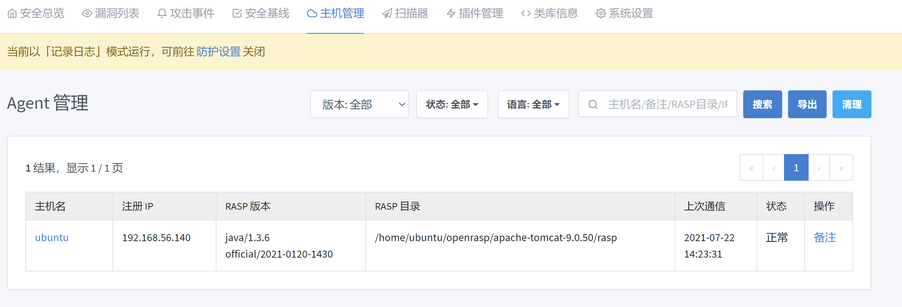
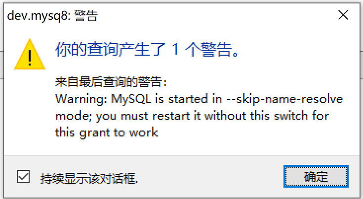

# OpenRASP

[RASP关键技术与相关产品调研](https://mp.weixin.qq.com/s/juEPju1Qx7Wdt0akDz9BsA)

[开源应用运行时自我保护解决方案 - OpenRASP](https://rasp.baidu.com/)

[OpenRASP学习笔记](https://www.anquanke.com/post/id/216886)

[OpenRASP xss算法的几种绕过方法](https://www.anquanke.com/post/id/247612)

[OpenRASP](https://rasp.baidu.com/) |
[OpenRASP github](https://github.com/baidu/openrasp)

## 安装

### [安装 管理后台](https://rasp.baidu.com/doc/install/panel.html)

```bash
docker pull elasticsearch:6.8.17
docker save elasticsearch:6.8.17 -o elasticsearch-6.8.17.tar
docker load --input elasticsearch-6.8.17.tar
```

启动 `elasticsearch`

https://www.elastic.co/guide/en/elasticsearch/reference/6.8/docker.html

```bash
grep vm.max_map_count /etc/sysctl.conf
vm.max_map_count=262144
sysctl -w vm.max_map_count=262144

# 官方
docker run -d --name elasticsearch --net somenetwork -p 9200:9200 -p 9300:9300 -e "discovery.type=single-node" elasticsearch:tag

docker run --name elasticsearch -d -p 9200:9200 -p 9300:9300 elasticsearch:6.8.17
```

docker-compose
```yaml
version: '3.1'
services:
  elasticsearch:
    image: elasticsearch:6.8.17
    restart: always
    environment:
      - "ES_JAVA_OPTS=-Xms512m -Xmx512m"
      # - cluster.name=docker-cluster
      # - bootstrap.memory_lock=true
    expose:
      - 5432
    ports:
      - 9200:9200
      - 9300:9300
    volumes:
      - ./tools/:/srv/tools
      - esdata:/usr/share/elasticsearch/data
volumes:
  esdata:
    driver: local
```

不要设置：`bootstrap.memory_lock=true`

不然会报： `memory locking requested for elasticsearch process but memory is not locked`

安装mongo

```bash
docker pull mongo:4.4.7
docker save mongo:4.4.7 -o mongo-4.4.7.tar 
docker load --input mongo-4.4.7.tar
```

```YAML
version: '3.1'
services:
  mongo:
    image: mongo:4.4.7
    restart: always
    environment:
      MONGO_INITDB_ROOT_USERNAME: root
      MONGO_INITDB_ROOT_PASSWORD: example
    expose:
      - 27017
    ports:
      - 27017:27017
    volumes:
      - mongodb:/data/db
      - ./tools/:/srv/tools
volumes:
  mongodb:
    driver: local
```

```bash
use openrasp
db.createUser( { user: "openraspuser",
                 pwd: "xxx",
                 roles: ["readWrite"] },
               { w: "majority" , wtimeout: 5000 } )
```

启动后端管理平台

```bash
wget https://packages.baidu.com/app/openrasp/release/latest/rasp-cloud.tar.gz
gzip -d rasp-cloud.tar.gz
tar xvf rasp-cloud.tar 
vim conf/app.conf
./rasp-cloud -d
```

http://192.168.56.140:8086

默认账号密码： openrasp admin@123321

启动 tomcat

https://tomcat.apache.org/download-90.cgi

http://192.168.56.140:8080/


下载 java agent

```bash
curl https://packages.baidu.com/app/openrasp/release/1.3.6/rasp-java.tar.gz -o rasp-java.tar.gz
tar -xvf rasp-java.tar.gz
cd rasp-*/

# heartbeat 决定客户端会多久拉取新的配置
java -jar RaspInstall.jar -heartbeat 90 -appid 66ce24d42bf4a488da0aecf32c4708a6edca825b -appsecret jtamD1gULeAt6NjIq4bxqh1BapAaDTj65gGVokhE1D4 -backendurl http://192.168.56.140:8086/ -install /home/ubuntu/openrasp/apache-tomcat-9.0.50

# Duplicating "rasp" directory
# - /home/ubuntu/openrasp/apache-tomcat-9.0.50/rasp
# Make "rasp" directory writable

# Generating "openrasp.yml"
# - /home/ubuntu/openrasp/apache-tomcat-9.0.50/rasp/conf/openrasp.yml
# - Create /home/ubuntu/openrasp/apache-tomcat-9.0.50/rasp/conf/openrasp.yml
# Updating startup script
# - /home/ubuntu/openrasp/apache-tomcat-9.0.50/bin/catalina.sh
# Installation completed without errors.

/home/ubuntu/openrasp/apache-tomcat-9.0.50/bin/shutdown.sh
/home/ubuntu/openrasp/apache-tomcat-9.0.50/bin/startup.sh
```

在后台主机管理中可以看到



[安装测试用例](https://rasp.baidu.com/doc/install/testcase.html)

下载: https://packages.baidu.com/app/openrasp/testcases/vulns.war

放在 apache-tomcat-9.0.50/webapps

启动tomcat

http://192.168.56.140:8080/vulns/

http://192.168.56.140:8080/vulns/012-jdbc-mysql.jsp

bat 012-jdbc-mysql.jsp
conn = DriverManager.getConnection("jdbc:mysql://localhost:3306/test", "test", "test");  

```sql
DROP DATABASE IF EXISTS test;
CREATE DATABASE test;         
CREATE TABLE test.vuln (id INT, name text);
INSERT INTO test.vuln values (0, "openrasp");
INSERT INTO test.vuln values (1, "rocks");
-- 原文档应该先加用户
CREATE USER 'test'@'%' IDENTIFIED BY 'test';
grant all privileges on test.* to 'test'@'%' identified by 'test';
grant all privileges on test.* to 'test'@'localhost' identified by 'test';

-- 如果是 mysql8,应该用:
-- https://dev.mysql.com/doc/refman/8.0/en/grant.html grant 语法已经没有 identified by 语法了

grant all privileges on test.* to 'test'@'%';
grant all privileges on test.* to 'test'@'localhost';
```

ERROR: mysql is started in --skip-name-resolve mode


[优化MySQL开启skip-name-resolve参数时显示“ignored in --skip-name-resolve mode.”Warning解决方法](https://developer.aliyun.com/article/475220)

原因分析：
“--skip-name-resolvemode”是禁用dns解析，避免网络DNS解析服务引发访问MYSQL的错误，一般应当启用。
启用“--skip-name-resolvemode”后，在MySQL的授权表中就不能使用主机名了，只能使用IP，出现此警告是由于mysql表中已经存在有localhost.localdomain帐号信息。

TIPs:可以忽略



攻击 Payload `111 or  1=1` 可以看到能查到两个,注入成功

如果打开拦截


则会被跳转到 拦截跳转页面 

## iast

https://github.com/baidu-security/openrasp-iast
openrasp-iast config -o /path/to/config.yaml -a X -b Y -c Z -m mysql://xxx

https://rasp.baidu.com/doc/install/iast.html
https://rasp.baidu.com/doc/hacking/architect/iast.html

php:7.2-apache
elasticsearch:6.8.17
mongo:3.6
python:3.7.11-slim-stretch

openjdk:8-stretch
debian:stretch-slim
tomcat:8.5.69-jdk8-openjdk

## confluence  和防护配置项的影响

如果需要对confluence进行防护，使用springboot的jar模式
- 安装服务后台管理端
- 下载rasp agent,配置
- 把 -javaagent= 加入到confluence启动命令中
- 调整 rasp 的防护配置

### 安装服务后台管理端 见上面
### 下载rasp agent和配置

```bash
curl https://packages.baidu.com/app/openrasp/release/1.3.6/rasp-java.tar.gz -o rasp-java.tar.gz
tar -xvf rasp-java.tar.gz
cd rasp-*/
sudo mv rasp /rasp
sudo vim /rasp/conf/openrasp.yml
# 如果confluence是用confluence用户启动，需要
sudo chown confluence -R /rasp
```

openrasp.yml 添加的配置

```yml
cloud.enable: true
cloud.backend_url: http://rasp.domain.com/
cloud.app_id: xxx
cloud.app_secret: xxx
cloud.heartbeat_interval: 90
```

### 
```bash
~$ sudo -i
~# /etc/init.d/confluence restart
```

## TODO

+ 商业版: 没有看到
+ 扫描 上线前的应⽤安全测试（IAST 模式）
+ PHP的容器有什么用: 加到wordpress里

## 参考

[IAST: 一文洞悉DAST、SAST、IAST ](https://www.aqniu.com/learn/46910.html) 

[RASP实践分析](https://segmentfault.com/a/1190000039683378)

[daxia/websafe 使用docker快速搭建Permeate渗透测试系统实践](https://segmentfault.com/a/1190000017151621)

[IAST 灰盒扫描工具](https://github.com/baidu-security/openrasp-iast)

[大规模部署](https://rasp.baidu.com/doc/install/deploy.html)

[OpenRasp xxe算法的几种绕过方式](https://www.anquanke.com/post/id/241107)

[如何使用Django开发OpenRASP报警接收Web应用](https://www.freebuf.com/articles/web/253832.html)


https://lucifaer.com/2019/09/25/浅谈RASP/

http://images.china-pub.com/ebook7730001-7735000/7731482/ch02.pdf
企业安全建设入门