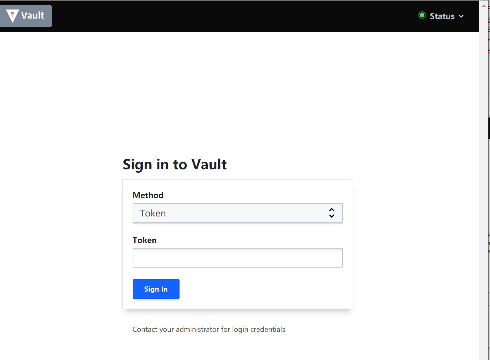

# Vault for development security

## **What**: 什么是 `vault`

KMS 开源版本，用于管理密钥

主页 https://www.vaultproject.io/


主要功能：**密钥管理**和**敏感数据保护**


由传统静态基础设施架构向动态基础设施架构变更的重要元素


对标商业产品: 

阿里 KMS 


华为 KMS


## **Why**: 为什么要使用 `vault` 

解决了哪些痛点问题

### 明文密码密钥

- 密码密钥泄露
- 合规要求 如华为严选 等都要求

### 密钥应该存储在哪里

- 代码：硬编码问题
- 配置文件：数据泄露
- 应用数据库：不同应用间密钥同步
  
### 密钥轮换

- 合规
- 离职员工

### 解决

- 集中管理
- 加密密码密钥
- 轮换密码密钥

`Bad` 明文配置架构和威胁建模


`GOOD` Vault KMS 密钥管理架构和威胁建模


### 为什么不是 Nacos

- 明文存储，支持密文需要自己开发
- 合规不认可，一些合规就要求使用 `KMS`

## **How**：怎么使用 `vault`

使用 Vault的KV Secrets Engine 做密码密钥的密文存储，并集中存储

### 安装下载

[Vault](https://www.vaultproject.io/) 为golang 开发，提供跨平台支持，服务端和客户端为同一个程序。

当前版本为 `1.7.3`

下载地址 <https://www.vaultproject.io/downloads>


```bash
# 启动
./vault.exe server -dev
```


### 客户端连接

windows powershell
```bash
$env:VAULT_ADDR="http://127.0.0.1:8200"
$env:VAULT_TOKEN="s.SA76ixfnrudARmjf1BJhLdsG"
./vault.exe status
```


### docker 模式

```bash
docker pull vault:1.7.3
docker run --cap-add=IPC_LOCK -d --name=dev-vault -p 8200:8200 vault:1.7.3
docker logs dev-vault
```


```bash
docker cp dev-vault:/bin/vault ./
export VAULT_ADDR='http://127.0.0.1:8200'
export VAULT_TOKEN='s.p9QZL59xvPyy0Xu7S2Fl4SL8'
./vault status
```


### 生产模式

环境： LINUX + Mysql

相关概念
- config.hcl 配置文件
- UI 模式
- CAP_IPC_LOCK: 允许锁定共享内存片段
- 启封 `unseal`


mysql 建库表

```sql
create database vault default character set utf8mb4 collate utf8mb4_unicode_ci;
```

config.hcl 配置文件

```bash
# 打开UI界面
ui = true
# 使用mysql进行数据存储
storage "mysql" {
  address = "127.0.0.1"
  username = "root"
  password = "PRma-qmLnWf-Q90dA-V91La"
  database = "vault"
}

listener "tcp" {
  tls_disable = "true"
  address = "0.0.0.0:8200"
}

api_addr = "http://127.0.0.1:8200"
cluster_addr = "https://127.0.0.1:8201"
```

```bash
./vault server -config=./config.hcl
```

`ERROR`:  Error initializing core: Failed to lock memory: cannot allocate memory


`fixed`

```bash
sudo setcap cap_ipc_lock=+ep $(readlink -f /mnt/d/dev/docker/docker-compose/vault/vault)
./vault server -config=./config.hcl
```


访问： http://localhost:8200/


状态为 密封sealed，需要提供共享启封密钥的数据和启封密钥阀值，一般为5/3，即生产5个密钥，输入其中3个就可以启封vault实例

点击 initialize 后生成 root token 和 unseal-key


直接点击查看，或是下载为json保存

```json
// vault-cluster-vault-2021-07-27T08_16_41.406Z.json
{
  "keys": [
    "1e621235ff53e2fd748f643a31fe69419791bddc6ed01919cc6982113e2a18581c",
    "b3d70a0a913b8e56d32667f88147c13f0ac9864c421b4c94f550271cf926660449",
    "efe3197078ead1a0739a0e3f9ff99c4a12faf16d0cfe38f8a19985df28fa841b0c",
    "731b6797cd8bfa28eed67ba6dc3bfc0c552977d9149135caf657e0a5754e35809f",
    "ae98a675400da5ad4b2f40eaf079259b1e28da99014a6838cc7df27981c239ee48"
  ],
  "keys_base64": [
    "HmISNf9T4v10j2Q6Mf5pQZeRvdxu0BkZzGmCET4qGFgc",
    "s9cKCpE7jlbTJmf4gUfBPwrJhkxCG0yU9VAnHPkmZgRJ",
    "7+MZcHjq0aBzmg4/n/mcShL68W0M/jj4oZmF3yj6hBsM",
    "cxtnl82L+iju1num3Dv8DFUpd9kUkTXK9lfgpXVONYCf",
    "rpimdUANpa1LL0Dq8Hklmx4o2pkBSmg4zH3yeYHCOe5I"
  ],
  "root_token": "s.DKQhp0qzjeSKUlHrhaq7IMlt"
}
```

输入其中3个key启封


启封成功后稍等片刻，即可输入 root_token 进入管理界面：




如果报错，说明启封没有完成，再稍等一下

查看数据表和内容，可能看到都是加密的数据


### KV_v2 密钥引擎

术语
- [Secrets Engine](https://www.vaultproject.io/docs/secrets) 
- kv_v2 密钥引擎： kv key value, v2: 相比v1,增加了版本控制，默认v2

使用UI创建一个kv_v2引擎 secret

`TIPS`: secret/app_name 是java vault sdk的默认取值路径


创建一个叫 secret 的kv_v2引擎


使用客户端创建一个 kv_v2 引擎 kv_v2

```bash
export VAULT_ADDR='http://127.0.0.1:8200'
export VAULT_TOKEN='s.DKQhp0qzjeSKUlHrhaq7IMlt'
./vault status
./vault secrets enable -path=kv kv-v2
```


插入数据
```bash
./vault kv put kv/main_mysql host=localhost username=my-app-user password=my-app-pwd
./vault kv get kv/main_mysql
./vault kv get --format=json kv/main_mysql
```


### 使用 curl 做为客户端

```bash
export VAULT_ADDR='http://127.0.0.1:8200'
export VAULT_TOKEN='s.DKQhp0qzjeSKUlHrhaq7IMlt'

curl -H "X-Vault-Token: $VAULT_TOKEN" -X GET http://127.0.0.1:8200/v1/kv/data/main_mysql

# 可以取以前的版本，但vault只能保存一定版本的历史
curl -H "X-Vault-Token: $VAULT_TOKEN" -X GET http://127.0.0.1:8200/v1/kv/data/main_mysql?version=1
```

### 应用对接 java

vault 的 java SDK `spring-cloud-starter-vault-config` 实现了透明接入vault的最佳实践

官方教程详见： <https://spring.io/projects/spring-cloud-vault>

#### 原理

​    原理是通过 bootstrap.yml 获取 vault配置，读取到vault KV值后，将之转成

`org.springframework.core.env.Environmen`可直接读取，或在application.properties 使用 `${dbpassword} `来使用


参考这篇文章： https://www.baeldung.com/spring-cloud-vault

  In general, migrating to Vault is a very simple process: just add the required libraries and add a few extra configuration properties to our project and we should be good to go. No code changes are required!

   通常，迁移到vault过程很简单：只要引入库并添加几个多余的配置到项目中即可，**不需要改代码**

  This is possible because it acts as a high priority PropertySource registered in the current Environment.

   之所以能这样，因为它运行在高优先级PropertySource，并注册到当前环境。

   As such, Spring will use it whenever a property is required. Examples include DataSource properties, ConfigurationProperties, and so on.

​    这样，Spring 可以在任何时间使用他的属性，示例包括DataSource属性、ConfigurationProperties等

#### java vault demo

- 加入 `spring-cloud-starter-vault-config` 使用 Environment 读取vault中KV信息
- spring-boot-starter-jdbc 实现接口，访问数据，增加随机用户和显示用户信息
- 使用 vault中的 `spring.datasource.password` 代替 application.properties 中的 `spring.datasource.password`

   示例代码见：<https://github.com/azhao1981/vault_demo>

idea 新建项目 vault_demo

选择： web/spring web


1. pom.xml

   ```xml
           <dependency>
   			<groupId>org.springframework.cloud</groupId>
   			<artifactId>spring-cloud-starter-vault-config</artifactId>
   			<version>3.0.3</version>
   		</dependency>
   		<dependency>
   			<groupId>org.springframework.cloud</groupId>
   			<artifactId>spring-cloud-starter-bootstrap</artifactId>
   			<version>3.0.3</version>
   		</dependency>
   ```

   如果spring的版本依赖关系要求 Spring Cloud Vault 3.0 和 Spring Boot 2.4 以下，则不需要加入 `spring-cloud-starter-bootstrap`

   参考：https://stackoverflow.com/questions/64994034/bootstrap-yml-configuration-not-processed-anymore-with-spring-cloud-2020-0/

2. boostrap.properties

   ```properties
   spring.cloud.vault.uri=http://127.0.0.1:8200
   spring.cloud.vault.token=s.1N0Kc9ETKql2tRuf0xlcxKTM
   spring.cloud.vault.generic.enabled=true
   spring.cloud.vault.application-name=VaultDemo
   ```

   `application-name ` 对应 vault 中 `secret/VaultDemo` ,如果不存在，则会使用 `spring.application.name`

3. 在 vault 中添加 `secret/VaultDemo` 两个值

   

4. 应用 添加 '/' 接口，返回这两个值 

   ```java
       @Autowired
   	Environment env;
   	@RequestMapping("/")
   	public String home() {
   		String dbusername = env.getProperty("dbusername");
   		String dbpassword = env.getProperty("dbpassword");
   		return "hello world: " + dbusername+":"+dbpassword;
   	}
   ```

   http://localhost:8080/ 返回账号密码，表明vault的kv已经成功注册到env中

   

5. 引入 jdbc 组件

   ```xml
   		<dependency>
   			<groupId>mysql</groupId>
   			<artifactId>mysql-connector-java</artifactId>
   			<scope>runtime</scope>
   		</dependency>
   		<dependency>
   			<groupId>org.springframework.boot</groupId>
   			<artifactId>spring-boot-starter-jdbc</artifactId>
   			<version>2.5.3</version>
   		</dependency>
   
           <!--
   		如果遇到问题 Failed to execute goal org.apache.maven.plugins:maven-resources-plugin:3.2.0:resources
   		为最新版本 maven-resources-plugin 3.2.0 有问题，可以回退到 3.1.0
   		-->
           <plugin>
               <groupId>org.apache.maven.plugins</groupId>
               <artifactId>maven-resources-plugin</artifactId>
               <version>3.1.0</version>
           </plugin>
   ```

   

   appliaction.properites

   ```properties
   spring.datasource.url=jdbc:mysql://127.0.0.1:3306/vault_demo
   spring.datasource.username=root
   spring.datasource.password=PRma-qmLnWf-Q90dA-V91La
   spring.datasource.driver-class-name=com.mysql.cj.jdbc.Driver
   ```

   VaultDemoApplication.java

   ```java
       @Autowired private JdbcTemplate jdbcTemplate;
   	@RequestMapping("/addUser")
   	public Map addUser(){
   		String name = UUID.randomUUID().toString();
   		String pwd = UUID.randomUUID().toString();
   
   		String sql = "INSERT INTO users (fullname, email, password) VALUES (?, ?, ?)";
   		int result = jdbcTemplate.update(sql, name,name+"@temp.com",pwd);
   
   		if (result > 0) {
   			System.out.println("A new row has been inserted.");
   		}
   		Map<String, Object> rtn = new LinkedHashMap<>();
   		rtn.put("status", 200);
   		rtn.put("count", result);
   		rtn.put("username", name);
   		rtn.put("password", pwd);
   		return rtn;
   	}
   
   	@RequestMapping("/users")
   	public Map Users(){
   		String sql = "Select * from users limit 1;";
   		Map result  = jdbcTemplate.queryForMap(sql);
   
   		return result;
   	}
   ```

6. 数据库表

   ```sql
   create database vault_demo default character set utf8mb4 collate utf8mb4_unicode_ci;
   CREATE TABLE `users` (
   	`id` INT(10) NOT NULL AUTO_INCREMENT,
   	`fullname` VARCHAR(225) NULL DEFAULT NULL COLLATE 'utf8mb4_bin',
   	`email` VARCHAR(225) NULL DEFAULT NULL COLLATE 'utf8mb4_bin',
   	`password` VARCHAR(225) NULL DEFAULT NULL COLLATE 'utf8mb4_bin',
   	PRIMARY KEY (`id`) USING BTREE
   )
   COLLATE='utf8mb4_bin'
   ENGINE=InnoDB;
   ```

   

7. 随机插入数据库

   访问 http://localhost:8080/addUser 添加几个随机数据

   访问 http://localhost:8080/users 获取
   
   
   
8. 使用 vault dbusername dbpassword 代替 appliaction.properites 密码明文

   appliaction.properites 

   ```properties
   spring.datasource.url=jdbc:mysql://127.0.0.1:3306/vault_demo
   spring.datasource.username=${dbusername}
   spring.datasource.password=${dbpassword}
   spring.datasource.driver-class-name=com.mysql.cj.jdbc.Driver
   ```

   访问 http://localhost:8080/users 验证

9. 优化：使用 vault 配置代替 appliaction.properites 配置

   vault 添加配置
   

   appliaction.properites 删除配置

   ```properties
   spring.datasource.url=jdbc:mysql://127.0.0.1:3306/vault_demo
   #spring.datasource.username=${dbusername}
   #spring.datasource.password=${dbpassword}
   spring.datasource.driver-class-name=com.mysql.cj.jdbc.Driver
   ```

   启动应用验证：http://localhost:8080/users

### 应用对接 ruby

Ruby gem没有提供像 `spring-cloud-starter-vault-config` 将 vault 配置整合到 项目中的方案

https://github.com/hashicorp/vault-ruby

提供 简单的配置和访问的接口

```bash
gem install vault
```

读取数据

```ruby
# frozen_string_literal: true
require 'vault'

Vault.address = "http://127.0.0.1:8200" # Also reads from ENV["VAULT_ADDR"]
Vault.token   = "s.1N0Kc9ETKql2tRuf0xlcxKTM" # Also reads from ENV["VAULT_TOKEN"]
# Vault.sys.mounts

res = Vault.kv("secret").read("VaultDemo", 1)
puts res.data
res = Vault.kv("secret").read("VaultDemo")
puts res.data
```


https://github.com/hashicorp/vault-rails

提供加密服务对字段进行加密的功能


其它非官方gem，可供参考:

https://github.com/joker1007/yaml_vault

https://github.com/tpickett66/ansible-vault-rb

### 应用对接 Golang

同Ruby，Golang也没有找到像 `spring-cloud-starter-vault-config` 将 vault 配置整合到 项目中的方案


```go
package main

import (
	"fmt"

	"github.com/hashicorp/vault/api"
)

var token = "s.1N0Kc9ETKql2tRuf0xlcxKTM"
var vault_addr = "http://127.0.0.1:8200"

func main() {
	config := &api.Config{
		Address: vault_addr,
	}
	client, err := api.NewClient(config)
	if err != nil {
		fmt.Println(err)
		return
	}
	client.SetToken(token)
	secret, err := client.Logical().Read("secret/data/VaultDemo")
	if err != nil {
		fmt.Println(err)
		return
	}
	m, ok := secret.Data["data"].(map[string]interface{})
	if !ok {
		fmt.Printf("%T %#v\n", secret.Data["data"], secret.Data["data"])
		return
	}
	fmt.Printf("hello: %v\n", m)
}

```


### 安全配置

+ 为UI/API外网提供访问控制
+ 使用 低权限的 mysql 账号密码
+ 为操作员或应用分配合适权限的 token
+ 使用环境变量来代替配置中的 vault_token

### 更多特性

#### 鉴权功能集成

- JWT
- Username&Password
- kubernates
- 企业微信


#### 加密服务(微服务)

官方文档 https://www.vaultproject.io/docs/secrets/transit

用例 https://github.com/hashicorp/vault-rails


#### K8s集成

#### 更多的 [Secrets Engine](https://www.vaultproject.io/docs/secrets)

- Alicloud
- Database


