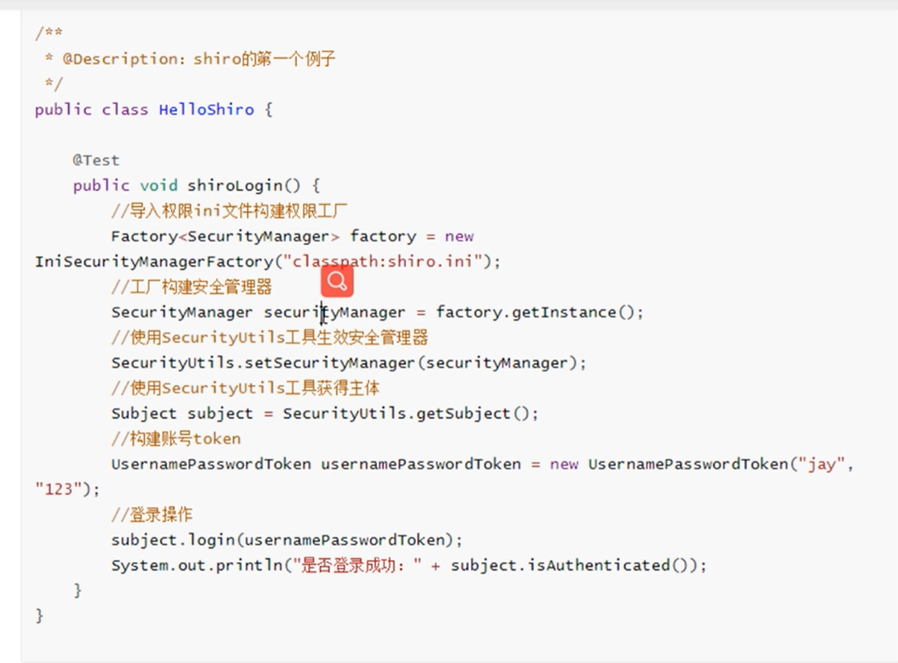
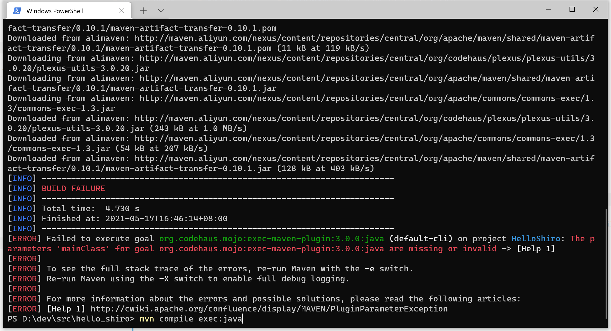
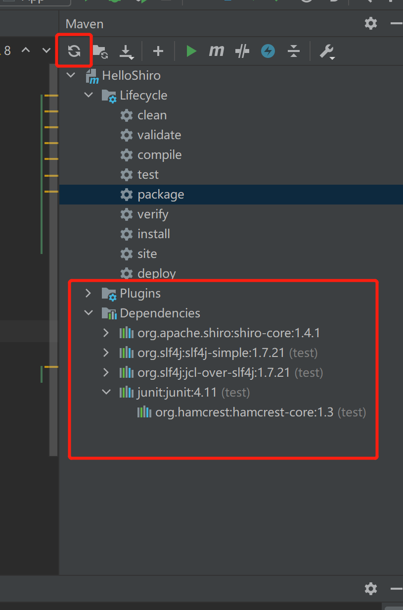

### shiro

最新安全版本： 1.7.1 <https://shiro.apache.org/security-reports.html>

#### 相关学习+开发环境

[shiro从入门-到进阶|视频](https://www.bilibili.com/video/BV1j5411w7Vk?from=search&seid=5458133093332749616)

https://shiro.apache.org/tutorial.html

TODO： mvn compile exec:java 这个应该怎么执行？好像不能直接运行：

ERROR：Incompatible types. Found: 'org.apache.shiro.config.IniSecurityManagerFactory', required: 'org.apache.shiro.util.Factory<java.lang.SecurityManager>'
ERROR： 'org.apache.shiro.config.IniSecurityManagerFactory' is deprecated

原因在：例子是1.3.2的，所以比较旧，而且是 shiro-core

FIX:

[shiro入门](https://blog.csdn.net/weixin_42156742/article/details/82665044)

[IniSecurityManagerFactory过期](https://blog.csdn.net/qq_44892091/article/details/104802398)

重新做一个 maven quickstart 的项目

ERROR： 找不到包

fix: maven 右上角的 圆圈，点一下，看到dependecies的视图里可以看到了

ERROR:　Failed to load class "org.slf4j.impl.StaticLoggerBinder"

FIX： https://stackoverflow.com/questions/7421612/slf4j-failed-to-load-class-org-slf4j-impl-staticloggerbinder
 改为 1.7.30

ERROR:　org.junit.platform.commons.JUnitException: TestEngine with ID 'junit-vintage' failed to discover tests

FIX: 使用默认的AppTest来做，不要加入 org.junit.jupiter 

参考：什么是 org.junit.jupiter [JUnit 5和JUnit 4比较](https://blog.csdn.net/u010675669/article/details/86574956)
> jupiter 是 junit5 才有的，所以上面原来引用了4.11，是没有 jupiter的 

####　spring-boot + shiro

git checkout shiro-root-1.4.1 -b shiro-root-1.4.1

git checkout shiro-root-1.4.2 -b shiro-root-1.4.2

[Shiro安全框架【快速入门】就这一篇！](https://zhuanlan.zhihu.com/p/54176956)

[使用Shiro实现认证和授权(基于SpringBoot)](https://www.cnblogs.com/seve/p/12241197.html)

[Application Security With Apache Shiro](https://www.infoq.com/articles/apache-shiro/)

[Spring Security 实战干货：基于注解的接口角色访问控制](https://zhuanlan.zhihu.com/p/92740636)

#### 漏洞全景

[Shiro 权限绕过的历史线（上）](https://www.anquanke.com/post/id/240033)

[Shiro 权限绕过的历史线（下）](https://www.anquanke.com/post/id/240202)

##### CVE-2020-17523

[Apache Shiro 两种姿势绕过认证分析（CVE-2020-17523）](https://paper.seebug.org/1478/)

[Apache Shiro 认证绕过分析（CVE-2020-17523）](https://www.anquanke.com/post/id/230935)

https://github.com/jweny/shiro-cve-2020-17523
https://gitee.com/azhao-1981/shiro-cve-2020-17523
[CVE-2020-17523 ：Apache Shiro身份认证绕过漏洞通告](https://www.anquanke.com/post/id/230958)

git@gitee.com:azhao-1981/shiro.git
git checkout shiro-root-1.7.0 -b shiro-root-1.7.0
shiro\samples\spring-boot-web
mvn spring-boot:run
可以看到 
 http://127.0.0.1/%20
 http://127.0.0.1/%20/
成功
但 %2e 没有成功

两个密码学的漏洞：[shiro反序列化(shiro-550与shiro-721)](https://const27.com/2021/03/12/shiro%E5%8F%8D%E5%BA%8F%E5%88%97%E5%8C%96/)
 [shiro550漏洞复现与研究](https://www.anquanke.com/post/id/243167)

Shiro [反序列化漏洞利用工具编写思路](https://paper.seebug.org/1503/)

[一道shiro反序列化题目引发的思考](https://www.anquanke.com/post/id/231488)

[从Shiro权限绕过Getshell](https://www.freebuf.com/vuls/260202.html)
swagger 问题

[Shiro反序列化漏洞详细分析](https://www.anquanke.com/post/id/228889)

[Shiro权限绕过漏洞详细分析](https://www.anquanke.com/post/id/226899)

[Shiro反序列化的检测与利用](https://www.anquanke.com/post/id/227090)

[Apache Shiro权限绕过漏洞CVE-2020-11989分析](https://www.anquanke.com/post/id/222489)

[Java安全之Shiro 550反序列化漏洞分析](https://www.anquanke.com/post/id/225442)

[【安全通报】Shiro & Nexus Repository Manger 2/3 权限验证绕过漏洞（CVE-2020-13933）](https://nosec.org/home/detail/4591.html)

[一款检测Shiro反序列化的Burp插件](https://www.freebuf.com/sectool/244886.html)

[shiro < 1.6.0的认证绕过漏洞分析(CVE-2020-13933)](https://www.anquanke.com/post/id/214964)

https://start.spring.io/

[Shiro 权限绕过 CVE-2020-13933分析](https://www.anquanke.com/post/id/216096)

[Apache Shiro 权限绕过漏洞CVE-2020-11989](https://www.freebuf.com/vuls/249380.html)

[Apache Shiro权限绕过漏洞CVE-2020-1957](https://www.freebuf.com/vuls/249112.html)

[Java反序列化：Apache-Shiro复现分析](https://www.freebuf.com/articles/network/245019.html)

[Shiro-550 PoC 编写日记](https://www.anquanke.com/post/id/213751)

[【安全通报】Apache Shiro < 1.6.0 权限绕过漏洞（CVE-2020-13933）](https://nosec.org/home/detail/4531.html)

[【安全风险通告】Shiro又爆高危漏洞，Apache Shiro身份验证绕过漏洞安全风险通告](https://mp.weixin.qq.com/s?__biz=MzU5NDgxODU1MQ==&mid=2247488670&idx=1&sn=e520554f545a6783994a9bc8100249ac)

https://sourcegraph.com/github.com/apache/shiro/-/compare/shiro-root-1.5.3...shiro-root-1.6.0
http://shiro.apache.org/10-minute-tutorial.html
git clone https://github.com/apache/shiro.git
git checkout shiro-root-1.6.0 -b shiro-root-1.6.0

gitee 镜像
https://gitee.com/projects/check_project_duplicate?import_url=https%3A%2F%2Fgithub.com%2Fapache%2Fshiro

需要登录
[shiro < 1.6.0的认证绕过漏洞分析(CVE-2020-13933)](https://www.anquanke.com/post/id/214964)