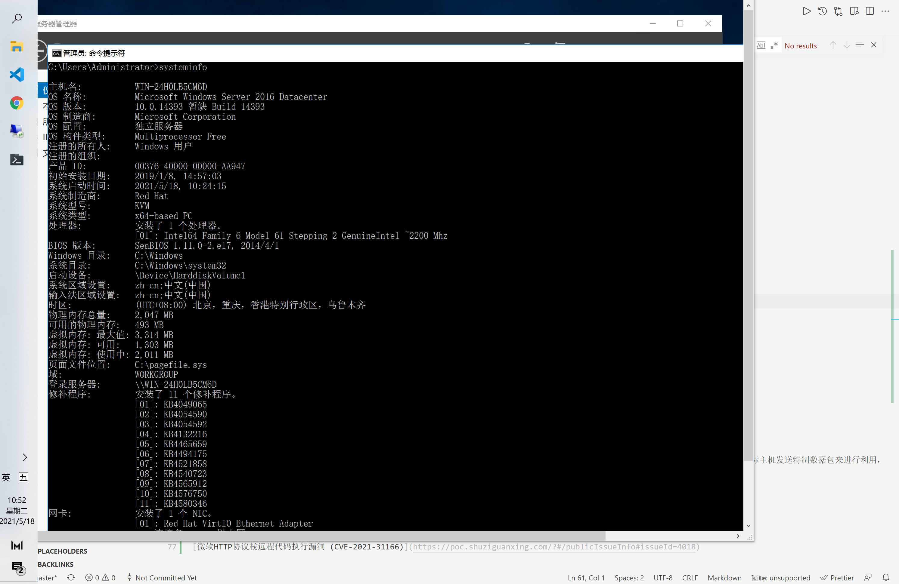
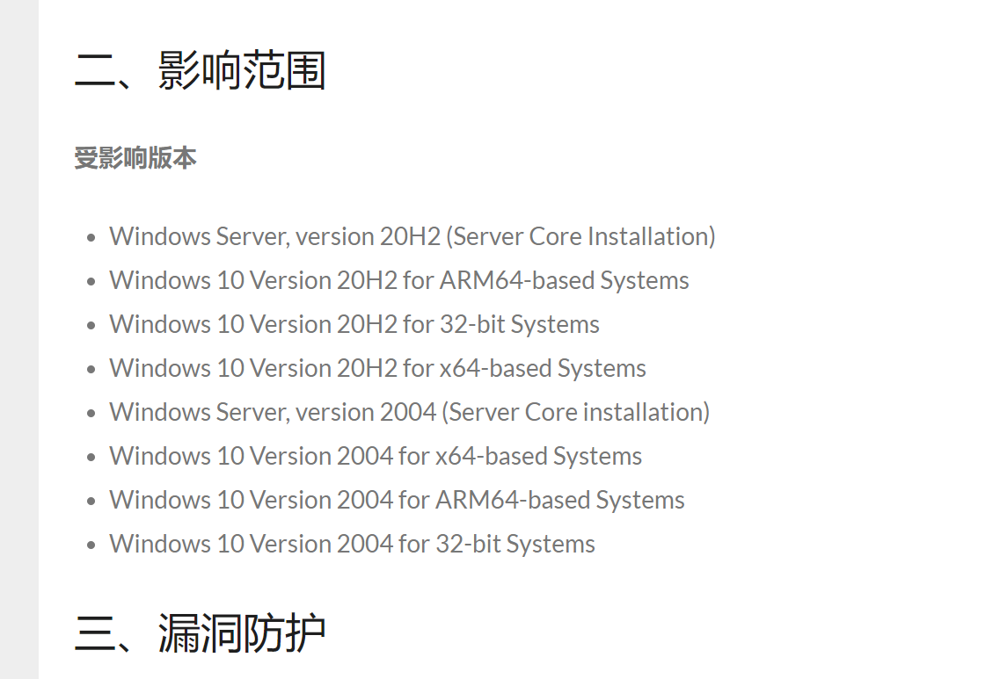

# windows安全

Att&CK 中最多的战术都是Windows的

[Windows横向移动全攻略（二）：DCOM](https://www.anquanke.com/post/id/217928)

[Windows操作系统基线核查](https://www.freebuf.com/articles/system/249783.html)

CVE-2020-16898：Windows TCP/IP远程执行代码漏洞通告
https://www.anquanke.com/post/id/219495

Windows主机漏洞扫描工具
https://www.freebuf.com/sectool/229655.html

## ＭＢＳＡ Microsoft Baseline Security Analyzer

或最常见的MBSA是一种易于使用的工具，可帮助您根据Microsoft安全建议确定计算机的安全状态。
该工具在您的计算机上完成扫描后，您会收到特定的补救建议。
使用MBSA通过检测计算机系统上的常见安全性错误配置和缺少安全更新来改进安全性管理过程。

微软基线安全分析器是微软为旗下的操作系统而设的保安辅助系统，透过找寻电脑系统上未有安装的安全更新及未达标之设定来评估系统的保安状况。

MBSA免费吗？

是。该工具的所有版本都是免费的。

MBSA是否适用于所有操作系统？
它目前适用于MicrostWindows操作系统。

MBSA的典型用途是什么？
为IT专业人员创建的此工具用于确定中小型企业的安全状态。请注意，MBSA仅扫描缺少的安全性udpates，并留下关键或可选更新。

## 内网渗透测试：信息收集与上传下载
https://www.freebuf.com/articles/network/243640.html

windows相关系统命令

## windows.vscode.wsl.java

使用WSL+vscode搭建Java开发环境
https://www.toget.top/views/2020/2020.03/Java%20Env%20Build/

## CVE

### CVE-2021-31166

Windows HTTP协议栈蠕虫级高危漏洞 (CVE-2021-31166) 安全风险通告
https://www.secrss.com/articles/31123

POC https://github.com/0vercl0k/CVE-2021-31166

python cve-2021-31166.py --target=106.75.120.208
好像不行
1 服务器已经打补丁 KB5001402 这个补丁没有打，最新打的在2020年
  

  影响范围好像确实没有
  
  
2 IIS 刚安装，是最新的，没有问题
3 本身就不受影响
4 POC问题
安装
[步骤1：安装 IIS 服务](https://cloud.tencent.com/document/product/213/2755)

可以在Ucloud上按时装一个，0.15元/小时

[IIS安全加固](https://cloud.tencent.com/developer/article/1614131)

[那些年让我们心惊胆战的IIS漏洞](https://www.secpulse.com/archives/82410.html)

[CVE-2021-31166](http://blog.nsfocus.net/cve-2021-31166/)
HTTP协议栈远程代码执行漏洞（CVE-2021-31166），该漏洞存在于HTTP 协议栈 (http.sys) 的处理程序中，未经身份验证的远程攻击者可通过向目标主机发送特制数据包来进行利用，从而在目标系统上以内核身份执行任意代码。
https://msrc.microsoft.com/update-guide/en-us/releaseNote/2021-May

<https://zh-cn.tenable.com/blog/cve-2021-22893-zero-day-vulnerability-in-pulse-connect-secure-exploited-in-the-wild>

[微软HTTP协议栈远程代码执行漏洞 (CVE-2021-31166)](https://poc.shuziguanxing.com/?#/publicIssueInfo#issueId=4018)