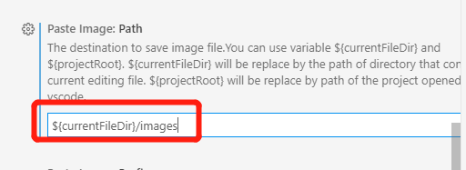

# win10 程序员使用和开发技巧

## 下载 ghost,可以不用 u 盘

## DNS

Windows 10怎么设置IP地址与DNS怎么设置
https://jingyan.baidu.com/article/1612d50058aa86e20e1eee96.html

设置->网络和 internet->状态->更改适配器选项->WLAN->属性->IPv4

## 全屏

电视接主机时会超过屏幕,是因为电视有一个超行扫描,只显示95%,如mooka上的 画面->全真,能解决

为什么以前不用每次都改?

https://www.jdbbs.com/thread-4706251-1-1.html

好像先开电脑后开显示器就可以

## hosts

`c:\windows\System32\drivers\etc\hosts`

## win10安装工具

1 火绒安全  https://www.huorong.cn/

2 xunlei极速 https://dl.pconline.com.cn/download/355664.html

3 360卫士，但不开机启动

4 按键修改
  alt->ctl

5 v2ray： 要下载v2ray-core

6 屏幕测试 https://screen.51240.com/
			
7 默认安装目录
市场安装位置,你并不希望把什么东西都装到 C 盘

https://jingyan.baidu.com/article/ca00d56c501598e99eebcf9a.html
搜索： 保存位置	
菜单->设置->系统设置->系统->存储-> 更改新内容的保存位置

8 安装wsl+linux
https://www.daniao.org/5258.html
控制面板→卸载程序→启用或关闭windows功能→勾选上适用于Linux的windows子系统
商店 搜索linux debian下载

9 改	源
https://mirror.tuna.tsinghua.edu.cn/help/debian/

10 vxbox
VT-x is not available
https://blog.csdn.net/imilano/article/details/83038682
管理员 cmd
bcdedit 
bcdedit /set hypervisorlaunchtype off
重启
11 ubuntu 分辨率
setting/display
华为屏为3：2
vxbox虚拟屏幕为200%
12 win10切屏
http://www.xitongcheng.com/jiaocheng/win10_article_46450.html
任务视图/新建桌面
http://down.52pk.com/zhishi/52202.shtml
win+ctl+d 新建
win+ctl 左右
13 nexus
14 vscode 中文乱码
https://blog.csdn.net/gongxun1994/article/details/80356031
15 vxbox mac,未完成
https://techbland.com/download-macos-catalina-10-15-virtualbox-image-file/

https://www.youtube.com/watch?v=QhwUQ2ydJJw
https://www.intoguide.com/install-macos-catalina-virtualbox-windows-pc/

http://download2158.mediafire.com/avakm97f3uwg/vbd0mu5viuz8htc/macOS+Catalina+Final+Version+by+Geekrar.rar
http://download2338.mediafire.com/fa2g0t77fjjg/hrl9ymq1mz4rlxw/Catalina+Virtual+Disk+Image+by+Intoguide.rar

16 ctrl+c 结束进程问题
https://blog.csdn.net/LEON1741/article/details/78140639
使用 ctrl+z
ctrl+\ 应该也好用

17 下代码
1 vbox 文件夹共享
2 取项目名称
3 下载脚本
4 去重 个人空间和udesk空间一样，用udesk空间

cn.archive.ubuntu.com

18 ubuntu 换源
deb http://mirrors.163.com/ubuntu/ bionic main restricted universe multiverse
deb http://mirrors.163.com/ubuntu/ bionic-security main restricted universe multiverse
deb http://mirrors.163.com/ubuntu/ bionic-updates main restricted universe multiverse
deb http://mirrors.163.com/ubuntu/ bionic-proposed main restricted universe multiverse
deb http://mirrors.163.com/ubuntu/ bionic-backports main restricted universe multiverse
deb-src http://mirrors.163.com/ubuntu/ bionic main restricted universe multiverse
deb-src http://mirrors.163.com/ubuntu/ bionic-security main restricted universe multiverse
deb-src http://mirrors.163.com/ubuntu/ bionic-updates main restricted universe multiverse
deb-src http://mirrors.163.com/ubuntu/ bionic-proposed main restricted universe multiverse
deb-src http://mirrors.163.com/ubuntu/ bionic-backports main restricted universe multiverse

19 vscode 移动到行前行层 Fn + 左右键
上下行交换 alt+上下
windows版本基本常用快捷键
https://www.ucamc.com/e-learning/computer-skills/317-vscode-windows-%E7%89%88%E6%9C%AC%E5%9F%BA%E6%9C%AC%E5%B8%B8%E7%94%A8%E5%BF%AB%E6%8D%B7%E9%8D%B5
复制行  alt+ shift+ 下
万能： keyboard shortcuts,找
打开浏览器
修改系统的默认应用 搜索“默认应用” -> 浏览器

20 ubuntu 时区 右上角，ubuntu->account setting / date&time
21 查看温度
22 x k8s
1 用centos当宿主机
ssh centos@10.0.2.5
2 安装k8s
3 打包等
4 api-gw

23 win10 git vscode
https://blog.csdn.net/toyijiu/article/details/87828373
安装git后重启vscode即可

24 debian buster

```bash
cat >/etc/apt/sources.list<<'EOF'
deb http://mirrors.aliyun.com/debian/ buster main non-free contrib
deb-src http://mirrors.aliyun.com/debian/ buster main non-free contrib
deb http://mirrors.aliyun.com/debian-security buster/updates main
deb-src http://mirrors.aliyun.com/debian-security buster/updates main
deb http://mirrors.aliyun.com/debian/ buster-updates main non-free contrib
deb-src http://mirrors.aliyun.com/debian/ buster-updates main non-free contrib
deb http://mirrors.aliyun.com/debian/ buster-backports main non-free contrib
deb-src http://mirrors.aliyun.com/debian/ buster-backports main non-free contrib
EOF

deb http://deb.debian.org/debian buster main
deb http://deb.debian.org/debian buster-updates main
deb http://security.debian.org/debian-security/ buster/updates main
deb http://ftp.debian.org/debian buster-backports main
```

25 sudo apt install openssh-client

vsbox 需要加 host-only
ssh centos@192.168.56.101
   chmod 600 .ssh/authorized_keys
   chmod 700 .ssh
  https://blog.csdn.net/u011396718/article/details/80976271

centos kubernate
https://www.profiq.com/kubernetes-cluster-setup-using-virtual-machines/

kubernetes安装（国内环境）
https://zhuanlan.zhihu.com/p/46341911
master
etcd-master
kube-apiserver
kube-controller-manager
kube-dns
control plane (calico, fannel)
kube-proxy
kube-scheduler

镜像下载： <https://www.osboxes.org/ubuntu-server/>

桌面版 <https://www.linuxvmimages.com/images/ubuntu-1804/>

导入 .vdi
<https://blog.csdn.net/wh62592855/article/details/6703923>
Username: osboxes
Password: osboxes.org
Root Account Password: osboxes.org
启动网卡：
ls /sys/class/net
看到有lo外的另外一块卡，如 enp0s17
sudo dhclient enp0s17
ifconfig
能看到网卡已经起来
再ping 114.114.114.114 已经成功
ping www.baidu.com 说明dns也已经ok
没有自动启动

apt install network-manager

https://help.ubuntu.com/community/NetworkConfigurationCommandLine/Automatic
Ubuntu 16.04通过网络配置工具NetworkManager设置IP、网关、DNS和查看IP、网关、DNS
https://www.cnblogs.com/EasonJim/p/8072298.html

换源

从光盘安装
https://linuxhint.com/install_ubuntu_virtualbox_2004/

kubeadm kubelet kube-cni
1. 添加源
2. 下 docker,kubeadm,kubelet,kubernetes-cni
3. 关swap
4. 获取镜像列表，从国内获取
5. 初始化环境
6. 配置授权信息，kube-apiserver
7. 添加网络插件
8. 单节点，设置master节点也可以运行pod(默认策略是master不运行)
9. 部署其他插件

2019最新k8s集群搭建教程 (centos k8s 搭建)
https://juejin.im/post/5cb7dde9f265da034d2a0dba
在CentOS上部署kubernetes集群
https://jimmysong.io/kubernetes-handbook/practice/install-kubernetes-on-centos.html
使用kubeadm 部署 Kubernetes(国内环境)
https://juejin.im/post/5b8a4536e51d4538c545645c
安装并设置 kubectl
https://kubernetes.io/zh/docs/tasks/tools/install-kubectl/

26 剪贴板管理
27 vs code支持 ruby
ruby
rails
Solargraph  有问题，wsl无法安装,而且不知道wsl安装完成后有没有用

28 Anaconda python vscode
https://www.zhihu.com/question/58033789/answer/254673663
第一次没有用管理员身份

29 wsl mount u 盘

http://blog.sciencenet.cn/blog-2410131-1094877.html

1. 新建文件夹e
sudo mkdir /mnt/e
2. 挂载盘符e
sudo mount -t drvfs e: /mnt/e

3.大功告成。进入/mnt/e即可与windows下一摸一样。
4.弹出移动硬盘，这样才能在windows下正常弹出，否则是会一直占用的。
sudo umount /mnt/e

30 win10 alt-tab ,改ctl-tab
31 win10.ubuntu.输入法

sudo apt-get install fcitx-table-wubi

32 fish theme

omf install nelsonjchen


33 这个可以研究一下

https://github.com/microsoft/PowerToys

34 win10 wsl ssh-add
error: Could not open a connection to your authentication agent.
eval "$(ssh-agent -s)"
ssh-add
https://github.com/Microsoft/WSL/issues/3183

原因就是ssh-agent 没有开

35. win10.wsl.ping 

error ping: socket: Operation not permitted
sudo chmod u+s /bin/ping

36. win10.virtualbox.centos.hostname

sudo hostname master001
如果只这样，重启就恢复了

sudo hostnamectl set-hostname master001.k8s.local --static

重启就没有问题了
https://www.itcoder.tech/posts/how-to-change-hostname-on-centos-8/

cat <<EOF > /etc/yum.repos.d/kubernetes.repo
[kubernetes]
name=Kubernetes
baseurl=https://mirrors.aliyun.com/kubernetes/yum/repos/kubernetes-el7-x86_64/
enabled=1
gpgcheck=1
repo_gpgcheck=1
gpgkey=https://mirrors.aliyun.com/kubernetes/yum/doc/yum-key.gpg https://mirrors.aliyun.com/kubernetes/yum/doc/rpm-package-key.gpg
EOF

37 win10 快捷键

恢复，然后把win,和ctrl键换一下

38 win10 which node

<https://superuser.com/questions/207707/what-is-windows-equivalent-of-the-which-command-in-unix-is-there-an-equivale>
terminal
where.exe node
gcm node

39 ubuntu vscode 空格

解决VSCODE空格距离极小的方案
https://blog.csdn.net/kellncy/article/details/90345506
https://github.com/tonsky/FiraCode
'Fira Code'

40 ubuntu.vscode tab 长度
tab size

41 ubuntu.ssh-agent

Add user ssh-agent as daemon to Ubuntu 18.04LTS server
https://gist.github.com/magnetikonline/b6255da90606fe9c5c25d3333c98c90d

42. ubuntu.ssh no bash

ssh 执行的是 ~/.bash_profile,需要在里面加：
[[ -f ~/.bashrc ]] && . ~/.bashrc

43. windows.vscode.在新tab中打开

enablePreview: false

44。 windows 应用跑到屏外
桌面->右键->显示管理->显示大小->去设置->修改分辨率，不要保存，能看到这个应用了
http://www.xitongcheng.com/jiaocheng/win10_article_43428.html

45 windows.vscode.多行选择

ctrl+alt 上下
Alt+Shift+I => Ctrl+Shift+L 


46 windows.office.正在更新

https://jingyan.baidu.com/article/1612d500632fcba30e1eeed2.html
开始——运行，输入services.msc——找到将Microsoft Office即点即用服务——禁用——设为自动——重新启动

47 windows.wsl.d盘

[把你的子系统(WSL)搬到非系统盘](https://cloud.tencent.com/developer/article/1594940)	

https://github.com/DDoSolitary/LxRunOffline

[LxRunOffline 使用教程 - WSL 自定义安装、备份](https://p3terx.com/archives/manage-wsl-with-lxrunoffline.html)


```bash
LxRunOffline.exe list
wsl -l --verbose
wsl -t Debian
# 全部关闭
wsl --shutdown
.\LxRunOffline.exe m -n Debian -d D:\os\debian
# 迁移docker-desktop
./LxRunOffline.exe m -n docker-desktop -d D:\os\docker-desktop
./LxRunOffline.exe m -n docker-desktop-data -d D:\os\docker-desktop-data
```

或者看： https://blog.csdn.net/fleaxin/article/details/88587081
安装时不安装在c盘上，但不如安装后再移动

48 windows.vscode.dev.wsl
使用适用于 Linux 的 Windows 子系统的 Visual Studio Code 入门
https://docs.microsoft.com/zh-cn/windows/wsl/tutorials/wsl-vscode
1）安装
2）添加到路径
3）安扩展 
remote development
4) wsl 里安装
   sudo apt-get install wget ca-certificates
5) 
https://code.visualstudio.com/docs/remote/wsl

49 windows.wsl.complete 慢

https://github.com/spencerwooo/dowww/issues/17

关于提升WSL速度——https://gist.github.com/noelbundick/9c804a710eb76e1d6a234b14abf42a52，把*.ps1文本执行一下就好了。

关于WSL2：就算把Windows系统更新到Build 1903，也要等到六月底，需要WSL2在Windows Store上架了才能有的用。

关闭“实时监控”是多大个事儿？
【还没好好尝试】继上面帖子，这个回复看起来靠谱？ ==> 还没进行的尝试——用LxRunOffline来在某个目录下装好另一个WSL，再就比较打开/compile速度了？

50 wsl 默认目录

51 wsl.jupyter

jupyter lab --no-browser
jupyter --no-browser

利器|JupyterLab 数据分析必备IDE完全指南
https://zhuanlan.zhihu.com/p/67959768


52 windows.port.ps
netstat -nao | findstr 3389
-o            显示拥有的与每个连接关联的进程 ID。
-a            显示所有连接和侦听端口。
-n            以数字形式显示地址和端口号。

windows查看进程线程的命令pslist
https://www.cnblogs.com/AmilyWilly/p/9090020.html

  TCP    127.0.0.1:55980        0.0.0.0:0              LISTENING       14356
tasklist | findstr 14356

直接显示: 任务管理器/右键->pid

53 echo %PROCESSOR_ARCHITECTURE%
这个只能在cmd里执行，不能在terminal里

54 net session 发生系统错误5，是因为需要用管理员打开
net start命令发生系统错误5和错误1058的解决方法
https://blog.csdn.net/ymq267/article/details/84885027

55 wmic startup command,caption

56 windows.wsl.git.pull > windows.vsbox.linux.git.pull
使用 vsbox 装Linux pull会有问题，有的文件不能生成，但 wsl 可以

57 windows.vscode.粘贴图片  插件：paste image

安装插件


配置插件




使用：

1) 任意截图软件到剪贴板
2) ctrl+shift+p -> paste Image 或 快捷键 Ctrl+Alt+V

58 win10.版本

CMD/ winver

59 win10.family.sandbox

[win10家庭版如何安装Windows Sandbox](https://blog.csdn.net/ls1300005/article/details/100030720)

[Windows 10 打开Windows Sandbox提示找不到虚拟机监控程序，请启用虚拟机监控程序支持](https://answers.microsoft.com/zh-hans/windows/forum/all/windows-10-%E6%89%93%E5%BC%80windows/286f8a35-6a74-433c-b00f-bcd03812d180)

[Windows 10 打开Windows Sandbox提示找不到虚拟机监控程序，请启用虚拟机监控程序支持](https://blog.csdn.net/qq_37504892/article/details/106827713)


```
我找到也有同样的问题,出现这个问题的时候,我的hyper-v也用不了
1.卸载 windwos Sandbox
2.重启
3.打开命令提示符(管理员) 执行下面
     bcdedit /set hypervisorlaunchtype Auto
4.卸载 hyper-v
5.重启
6.安装 hyper-v
7.重启,发现hyper-v可以运行
8.安装windwos Sandbox
9.重启, 发现可以用Sandbox
```

59 win10.excel.表头

[你会做excel表头吗？Excel表头的7种做法送给你！](https://www.chinaacc.com/kuaijishiwu/zzjn/zh20191218084600.shtml)

[Excel模板](https://ibaotu.com/excle/)

60 win10.system.hyper-v

[Win10家庭版中使用Hyper-V](https://zhuanlan.zhihu.com/p/51939654)

[官方：安装 hyper-v](https://docs.microsoft.com/en-us/virtualization/hyper-v-on-windows/quick-start/enable-hyper-v)

```bash
pushd "%~dp0"
dir /b %SystemRoot%\servicing\Packages\*Hyper-V*.mum >hyper-v.txt
for /f %%i in ('findstr /i . hyper-v.txt 2^>nul') do dism /online /norestart /add-package:"%SystemRoot%\servicing\Packages\%%i"
del hyper-v.txt
Dism /online /enable-feature /featurename:Microsoft-Hyper-V-All /LimitAccess /ALL
```

61 wsl.python.langage-server

https://github.com/microsoft/python-language-server/issues/1698

```
Basically from https://github.com/microsoft/python-language-server/blob/master/CONTRIBUTING.md

Open Python extension sources folder in VS Code (there is Open Extensions Folder command)
Open Python extension folder
Create languageServer folder in the extension folder.
Rename .nupkg to .zip
Unzip contents with folders to languageServer
In VS Code set setting python.downloadLanguageServer to false.
In VS Code set setting python.jediEnabled to false.
```

62 wsl.dev https://dowww.spencerwoo.com/
Dev on Windows with WSL

63 wsl.awesome
https://github.com/sirredbeard/Awesome-WSL
https://awesomeopensource.com/projects/wsl

64 idea
https://tech.souyunku.com/?p=15076

65 win10.terminal.show.var

echo $Env:GOPATH
 load
https://superuser.com/questions/1216658/path-environment-variable-windows-10-echo-path-on-command-prompt-shows-only

66 win10.vscode.java.debug

c:\Users\azhao\.vscode\extensions\vscjava.vscode-java-debug-0.28.0\scripts\launcher.bat "D:\Program Files\jdk11.0.7_10\bin\java.exe" -Dfile.encoding=UTF-8 -cp C:\Users\azhao\AppData\Roaming\Code\User\workspaceStorage\15700788065de6fc84c912303f81579a\redhat.java\jdt_ws\hello_97c407ba\bin Hello 
-bash: c:Usersazhao.vscodeextensionsvscjava.vscode-java-debug-0.28.0scriptslauncher.bat: command not found
原因是用了wsl为默认的terminal
需要改成cmd
https://github.com/microsoft/vscode-java-debug/issues/708

terminal.select debug shell

https://stackoverflow.com/questions/44435697/vscode-change-default-terminal

单独设置
.vscode/settings.json

```json
{
  // wsl
  "terminal.integrated.shell.windows": "C:\\WINDOWS\\System32\\bash.exe",
  // cmd
  "terminal.integrated.shell.windows": "C:\\Windows\\System32\\cmd.exe",
}
```

67 win10.cmd.exit
exit

68 win10.store.代码 0x80131505
可能是开了v2ray之类又没有设置好造成,需要关闭网络代理
设置/网络和internet,代理,都打开再关闭一下

69 win10.wsl.ubuntu.ssh

+ error: could not load host key: /etc/ssh/ssh_host_rsa_key
https://blog.csdn.net/zhangpeterx/article/details/95810789

```bash
sudo apt remove openssh-server
sudo apt install openssh-server
cat xxx > ~/.ssh/authorized_keys
# 这步一定要
chmod 600 ~/.ssh/authorized_keys
```

+ [apt update 163源](https://blog.csdn.net/xiangxianghehe/article/details/80112149)

70 win10.wsl.open.browser
https://xbuba.com/questions/52691835
alias chrome="/mnt/c/Program Files/Google/Chrome/Application/chrome.exe"
但我认为这个更好
alias open='cmd.exe /C start'
71 驱动
360驱动大师

72 exfat 格式，三个系统都支持的格式

sudo apt-get install exfat-utils //亲测有效,不需重启
可以支持 linux的权限

Mac,Windows和Linux系统都能读写移动硬盘的方法
https://blog.csdn.net/shendl/article/details/108996844
Mac Windows Linux大一统文件系统格式：exfat(支持4G以上文件)
https://blog.csdn.net/u010164190/article/details/105704097

73 win10.wsl2.docker

https://blog.imfing.com/2020/05/upgrade-to-windows-wsl-2/
管理员打开 terminal
dism.exe /online /enable-feature /featurename:VirtualMachinePlatform /all /norestart
之后便可以将 WSL 2 设置为默认的版本：
wsl --set-default-version  2
如果你之前安装过了 WSL 1，可以用命令 wsl -l -v 查看所有已安装的发行版，并将它的 WSL 版本切换为 2：
wsl --set-version <distribution name> <versionNumber>

[Win10 WSL2 安装Docker](https://www.jianshu.com/p/a20c2d58eaac)
> 这个好像更细一些
> 更新 Win10 到2004版本

[Windows使用WSL2安装Docker](https://www.jianshu.com/p/c27255ede45f)

wsl --set-default-version 2
WSL 2 需要更新其内核组件。有关信息，请访问 https://aka.ms/wsl2kernel
有关与 WSL 2 的主要区别的信息，请访问 https://aka.ms/wsl2

[更新 WSL 2 Linux 内核](https://docs.microsoft.com/zh-cn/windows/wsl/wsl2-kernel)

74 windows.vscode.terminal 命令行快捷键优化

Terminal > integrated > send key to shell 打开，光标在命令行的时候会先发给命令行

但打开后不能用 Ctrl + c ctrl+ v ,双击选中就是复制，右键粘贴

75 windows.vscode.python.env
 ctrl+shift+p  python select interpreter

76 windows.powershell.script

ERROR: 无法加载文件，因为在此系统上禁止运行脚本

管理员身份打开PowerShell: set-ExecutionPolicy RemoteSigned
https://blog.csdn.net/qq_42572477/article/details/1

77 windows.ports

[Windows下如何查看某个端口被谁占用](https://www.runoob.com/w3cnote/windows-finds-port-usage.html)

netstat -ano | findstr LIST

http://www.nirsoft.net/ | 自由软件的一个网站

[currPort](http://www.nirsoft.net/utils/cports.html#DownloadLinks)
https://docs.microsoft.com/zh-cn/sysinternals/downloads/tcpview

78 缓存
+ 磁盘清理
+ 微软商店 wsreset.ext
+ DNS 管理员cmd ipconfig/flush DNS

79 vs code 插件离线安全

如果在脱机环境中工作或反复看到此错误，请尝试从 https://github.com/microsoft/vscode-cpptools/releases 下载预包含了所有依赖项的扩展版本，然后使用 VS Code 中的“从 VSIX 安装”命令来安装它。

80 win.desktop 桌面切换
ctrl + win+ <- / ->

80 vs code 大小写转换

默认没有快捷键
Transform to Uppercase - editor.action.transformToUppercase
Transform to Lowercase - editor.action.transformToLowercase
修改： file / preference / keyboard shortcuts
Uppercase ctl + k ctl + u
Lowercase ctl + k ctl + l
https://www.zhihu.com/question/48779613

81 MinGW-w64

MinGW 环境变量的配置
https://blog.csdn.net/Flood_Dragon/article/details/12363705

https://zhuanlan.zhihu.com/p/76613134
MinGW-w64安装教程——著名C/C++编译器GCC的Windows版本

http://mingw-w64.org/doku.php

path
2)、新建 LIBRARY_PATH 变量，如果有的话，在值中加入D:\MinGW \lib，这是标准库的位置。
3)、新建 C_INCLUDEDE_PATH 变量，值设为D\MinGW\include。
4)、新建 CPLUS_INCLUDE_PATH 变量，值为
  D:\MinGW\include\c++\3.4.5;
  D:\MinGW\include\c++\3.4.5;
  D:\MinGW\include\c++\3.4.5\backward;
  D:\MinGW\include
  。

https://www.7-zip.org/
https://github.com/cuiocean/ZY-Player/releases
https://github.com/cuiocean/ZY-Player-APP/releases


## 82 sp1 脚本被禁止
PowerShell：因为在此系统上禁止运行脚本，解决方法
https://www.jianshu.com/p/4eaad2163567

## 83 Windows alias给cmd命令起别名
https://www.awaimai.com/2445.html

## 84 WSL 2 需要更新其内核组件

https://blog.csdn.net/littlehaes/article/details/104879476

## 85 wslg

[你管这玩意叫双系统？直接在 Windows 上体验 Linux](https://blog.csdn.net/melody157398/article/details/117376630)

1 windows预览体验计划 需要这个，暂时没有
wsl --update
https://github.com/microsoft/wslg

## 86 vscode `正在下载 C/C++ language components`

vscode 解决正在下载程序包“C/C++ language components (Linux / x86_64)” 失败引起的符号找不到问题
https://blog.csdn.net/chenwr2018/article/details/115774007
cpptools
https://github.com/microsoft/vscode-cpptools/releases

## 86 华为鼠标

找不到鼠标，或希望重新配对：把开关往下按三秒

## 华为鼠标失灵
法1.点击 windows 图标>设置图标，在"设置"的界面中点击"设备>蓝牙和其他设备"，删除已配对的蓝牙鼠标；
接着右键点击 windows 图标,选择"设备管理器"。在"设备管理器"窗口中点击"蓝牙"，右键点击"英特尔( R )无线 Bluetooth ( R )右键"，选择"禁用设备"后再"启动设备"；
最后再次前往"设置"界面重新配对蓝牙鼠标。
法2.电脑完全关机，点开机键后不停按F2进bios，关了蓝牙，保存启动系统，设备管理器刷新，再完全关机，进bios打开蓝牙就好了

https://club.huawei.com/thread-20414891-1-1.html
法3.取消勾选"允许计算机关闭此设备以节约电源( A )"可能可以解决蓝牙鼠标链接中断的问题https://cn.club.vmall.com/forum. ... ge=1&prevpage=1

没有电源管理的问题：

https://consumer.huawei.com/cn/support/content/zh-cn00734699/

[win10新版蓝牙驱动没有电源管理问题](https://bbs.huaweicloud.com/blogs/280117)

priv\win10.蓝牙电源管理.reg

如果还不行按注册表路径比对PID，修正路径。设备管理器/设备/属性/事件 可以查看pid。

最新：2021/7/18 23:42:12
已配置设备 USB\VID_8087&PID_0AAA\5&1cec4248&0&10。

看到： 
  设备 USB\VID_8087&PID_0AAA\5&1cec4248&0&10 需要进一步安装。

如何修理：设备需要进一步安装
http://windowsbulletin.com/zh-CN/%E5%A6%82%E4%BD%95%E4%BF%AE%E5%A4%8D%E8%AE%BE%E5%A4%87%E9%9C%80%E8%A6%81%E8%BF%9B%E4%B8%80%E6%AD%A5%E5%AE%89%E8%A3%85/
结果：不处理，这是很久以前的错误

键盘自己好了，键盘好像也会很快关闭，但点一下就好了

鼠标则是在使用中也会在几秒内停止

蓝牙鼠标发生断开的问题一般都是由于驱动不兼容造成的，建
议您在安全模式中到设备管理器里卸载驱动，然后再重新安装官方的驱动程序进行安装。

安全模式：

将鼠标移动到右下角，呼出超级菜单，点击设置，点击电源，Shift+重启键。
重启后会进入一个新的菜单，点击疑难解答——高级选项——启动设置——重启
重启后按照提示按键盘上的数字进入安全模式。

https://answers.microsoft.com/zh-hans/windows/forum/all/%E8%93%9D%E7%89%99%E9%BC%A0%E6%A0%87%E7%BB%8F/8235611d-7281-49be-97d9-8db1a0561379

## 87 键盘不灵

键盘大回车键不灵解决方法【微软拼音】
https://www.bilibili.com/s/video/BV1hK4y1x7cL

## 88 window powershell 设置环境变量

https://docs.microsoft.com/zh-cn/powershell/module/microsoft.powershell.core/about/about_environment_variables?view=powershell-7.1

$Env:<variable-name>
$Env:path

## 89 win+G 录屏功能
注：没有声音

## Windows 10 中的磁盘清理

https://support.microsoft.com/zh-cn/windows/windows-10-中的磁盘清理-8a96ff42-5751-39ad-23d6-434b4d5b9a68
在“磁盘清理”中，选择“清理系统文件”。

## 免费软件替换
promi pro
final cute pro
达芬奇决心 
onlyoffice
libreoffice
ps vs gimp
录屏 OBS studio
3d blender
视频压缩 handbrake
https://github.com/xiandanin/magnetW
qbtorrent 增强版 github
ventoy 

del.bat
DEL /F /A /Q \\?\%1
RD /s /Q \\?\%1
https://www.youtube.com/watch?v=vfWhWcwgktc


https://www.freedidi.com/1862.html
https://www.freedidi.com/1858.html
https://www.ozabc.com/it/503062.html
https://www.freedidi.com/1865.html
https://www.ozabc.com/it/503068.html

## 90 wsl 慢的问题: 没有解决
git - 对于大型项目，在Debian和Ubuntu上的WSL上运行git命令确实很慢
https://www.coder.work/article/6344091
https://stackoverflow.com/questions/50231989/running-git-commands-on-debian-ubuntu-on-wsl-is-really-slow-for-large-projects

🚀 为什么在 WSL 下项目的编译/运行/git 等等和 IO 相关的操作貌似很慢？ #17
https://github.com/spencerwooo/dowww/issues/17
https://gist.github.com/noelbundick/9c804a710eb76e1d6a234b14abf42a52
https://github.com/microsoft/WSL/issues/4401
https://markentier.tech/posts/2020/10/faster-git-under-wsl2/


## 91 windows vscode python code run 中文乱码
vscode code runner 运行python 中文乱码
https://www.jianshu.com/p/52d95de8aea9
runner settings 中 设置 

```json
"code-runner.executorMap": {
  "python": "set PYTHONIOENCODING=utf8 && python -u",
  }
```

## Vscode 的环境变量

如果win环境变量有改变，run code是不能直接读到的，需要重启一下vscode

```python
env_dist = os.environ
print(env_dist.get('VAULT_ADDR'))
print(env_dist.get('VAULT_TOKEN'))
```